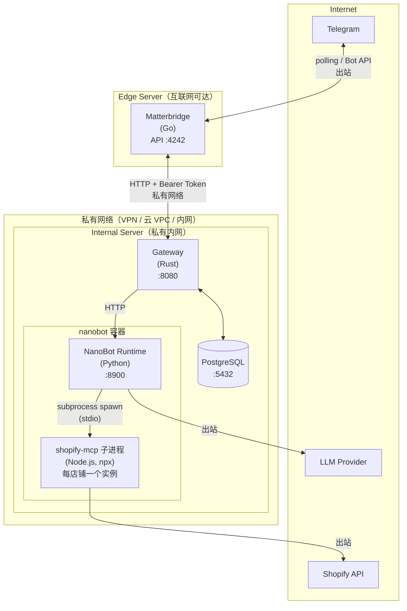

# 部署视图 (Deployment View)

> **Metadata**
> - **Source**: `.context/architecture/source/IM-Agent-Bridge-TAD.md`
> - **Generated At**: `2026-04-15 10:12`
> - **Generator**: `Context-Agent v1.0`

---

## 🗺️ 基础设施映射

| 逻辑服务 | 基础设施节点 | 实例规格 | 服务器 | 网络区域 |
|---------|-------------|---------|--------|---------|
| **Matterbridge** | Docker Container | 轻量 | Edge Server | 互联网可达（出站 polling Telegram，API 口仅私网可访） |
| **Gateway (Rust)** | Docker Container | 中等 | Internal Server | 私有内网 |
| **NanoBot Runtime** | Docker Container | 中等 | Internal Server | 私有内网 |
| **PostgreSQL** | Docker Container / 托管实例 | 按需 | Internal Server | 私有内网 |
| **Shopify MCP** (`shopify-mcp` 子进程) | Node.js subprocess（nanobot 容器内，每店铺一个实例） | - | Internal Server (nanobot 容器内) | 私有内网 |

---

## ☁️ 部署拓扑



---

## 🐳 容器划分

### Edge Server

| 容器名称 | 镜像 | 职责 | 依赖 |
|---------|------|------|------|
| `matterbridge` | `42wim/matterbridge:1.26.0` | Telegram ↔ Gateway 桥接，配置: `matterbridge.toml` (Volume 挂载) | Telegram API（出站） |

### Internal Server

| 容器名称 | 镜像 | 职责 | 依赖 |
|---------|------|------|------|
| `gateway` | 自构建 (Rust) | Core 唯一入口 | PostgreSQL, NanoBot API |
| `nanobot` | 自构建 (Python + Node.js, 基于 [HKUDS/nanobot](https://github.com/HKUDS/nanobot)) | AI Agent Runtime；`~/.nanobot/config.json` 统一管理 LLM providers（模型、API Key）+ `tools.mcpServers`（多店铺 shopify-mcp 子进程）；secret 用 `${VAR}` 语法引用容器内 `.env` 变量；Volume 挂载 `./nanobot-data:/home/nanobot/.nanobot` | LLM Provider API（出站）；Shopify API（出站） |
| `postgres` | `postgres:15+` | 持久化存储 | - |

---

## 🌐 网络分区

| 区域 | 通信对 | 协议 | 安全要求 |
|------|--------|------|----------|
| **出站（外部）** | Matterbridge → Telegram | HTTPS | Telegram Bot Token（出站 polling） |
| **跨服务器（私有网络）** | Matterbridge ↔ Gateway | HTTP + Bearer Token | 私有网络（VPN/云 VPC）；禁止公网暴露；生产环境建议升级 HTTPS（TD-007） |
| **Internal 内部** | Gateway ↔ NanoBot | HTTP | 同一服务器，仅本机可访 |
| **Internal 内部** | Gateway ↔ PostgreSQL | TCP (5432) | 同一服务器，仅本机可访 |
| **容器内进程** | NanoBot → shopify-mcp 子进程 | subprocess stdio | nanobot 容器内部；凭证通过 MCP config.json 传入 |
| **出站（外部）** | NanoBot → LLM Provider | HTTPS | API Key（出站） |
| **出站（外部）** | shopify-mcp 子进程 → Shopify API | HTTPS | Shopify 凭证（出站） |

---

## 🔄 环境分层

| 环境 | 用途 | 部署方式 | 数据策略 |
|------|------|---------|----------|
| **Development** | 本地开发测试 | Docker Compose 单机（仅开发用） | 测试数据 |
| **Production** | 正式环境 | 多服务器（Edge Server + Internal Server） | 真实数据 |

> MVP 阶段不区分 Staging 环境。Edge Server 与 Internal Server 通过私有网络（VPN / 云 VPC / LAN）互联。

---

## 📁 部署目录结构

```text
deploy/
├── edge-server/                      # Edge Server 部署配置（Matterbridge）
│   ├── docker-compose.yml            # Edge Server 服务编排（matterbridge）
│   ├── matterbridge/
│   │   └── matterbridge.toml         # Matterbridge 配置（Volume 挂载）
│   └── .env.example                  # Edge Server 环境变量（TELEGRAM_BOT_TOKEN, TELEGRAM_CHAT_ID_PRIVATE, TELEGRAM_CHAT_ID_GROUP, GATEWAY_BEARER_TOKEN, EDGE_PRIVATE_IP）
└── internal-server/                  # Internal Server 部署配置
    ├── gateway/                      # Gateway + PostgreSQL 编排
    │   ├── docker-compose.yml        # 服务编排（gateway + postgres）
    │   └── .env.example              # GATEWAY_BEARER_TOKEN, DATABASE_URL, BRIDGE_URL
    └── nanobot/                      # NanoBot（包含 shopify-mcp 子进程）编排
        ├── docker-compose.yml        # 服务编排（nanobot，volume 挂载 ./nanobot-data:/home/nanobot/.nanobot）
        ├── config.json.example       # NanoBot 完整配置模板（providers/LLM + tools.mcpServers/多店铺 shopify-mcp，secret 用 ${VAR} 引用）
        └── .env.example              # config.json 中 ${VAR} 引用的 secret（LLM_API_KEY、SHOPIFY_STORE1_CLIENT_ID 等）
```

---

## 📝 Matterbridge 配置说明

> **参考**: [42wim/matterbridge API Wiki](https://github.com/42wim/matterbridge/wiki/API) · [OpenAPI Spec](https://app.swaggerhub.com/apis-docs/matterbridge/matterbridge-api/0.1.0-oas3)
>
> 以下配置和端点信息来自 Matterbridge 官方文档，**非 TAD 原文定义**，以实际 Matterbridge 版本文档为准。

Matterbridge 使用 `matterbridge.toml` 配置文件，通过 Docker Volume 挂载到容器内。

```toml
# === Telegram 配置 ===
[telegram.mytelegram]
Token="${TELEGRAM_BOT_TOKEN}"   # 通过容器 .env 注入，禁止硬编码
RemoteNickFormat="{NICK}"

# === API 模式配置 ===
[api.myapi]
BindAddress="0.0.0.0:4242"     # 容器内全网卡监听；宿主机通过 ${EDGE_PRIVATE_IP}:4242:4242 仅绑私网
Buffer=1000                     # 消息缓冲区大小
RemoteNickFormat="{NICK}"
# Token 建议启用（推荐；作为 Bridge API 的认证边界）

# === 网关配置 ===
# 每个 Telegram chat 独立 gateway，避免 Matterbridge intra-gateway 广播（BR-012）

# 私聊
[[gateway]]
name="CBECOpsBot-private"
enable=true

[[gateway.inout]]
account="telegram.mytelegram"
channel="${TELEGRAM_CHAT_ID_PRIVATE}"  # 私聊 chat ID（正整数），通过 .env 注入

[[gateway.inout]]
account="api.myapi"
channel="api"

# 群聊
[[gateway]]
name="CBECOpsBot-group"
enable=true

[[gateway.inout]]
account="telegram.mytelegram"
channel="${TELEGRAM_CHAT_ID_GROUP}"  # 群组/超级群 chat ID（负整数，-100...），通过 .env 注入

[[gateway.inout]]
account="api.myapi"
channel="api"
```

> **运维约束**：每新增一个 `[[gateway]] name`（如 `CBECOpsBot-group`），必须在数据库 `channel_bindings` 表中同步新增一条对应记录（`bridge_gateway_name = gateway.name`），指向目标 `bot_id`。缺少记录将导致该 gateway 所有入站消息被 Gateway 以 404 拒绝。`bridge_channel_name` 可为 NULL（退化匹配）。

### Matterbridge API 端点

所有端点监听在 `BindAddress` 指定的地址（默认 `127.0.0.1:4242`）。

| 端点 | 方法 | 用途 | 说明 |
|------|------|------|------|
| `/api/messages` | GET | 获取消息缓冲区 | 返回 JSON 数组，读取后清空缓冲区 |
| `/api/stream` | GET | 实时消息流 | HTTP 长连接，首条消息为 `api_connected` 事件 |
| `/api/message` | POST | 发送消息到网关 | JSON body，`channel` MUST 等于来源 `chat_id`（语义标注/与 inout 配置一致性）；E2E 验证确认 Matterbridge 1.26 intra-gateway 路由对来自 `api.*` 的消息会广播至同一 gateway 下所有 telegram inout，隔离需通过分 gateway 实现（BR-012） |

### 消息体 Schema (Message)

```json
{
  "text": "消息内容",
  "username": "发送者昵称",
  "gateway": "CBECOpsBot-group",  // 或 CBECOpsBot-private，取决于来源 chat
  "channel": "<chat_id>",   // 出站时必须等于来源 BridgeReplyPayload.chat_id，如 "-1001234567890"
  "userid": "",
  "avatar": "",
  "account": "api.myapi",
  "event": "",
  "protocol": "api",
  "parent_id": "",
  "timestamp": "2026-04-13T14:00:00+08:00",
  "id": "",
  "Extra": null
}
```

> **Gateway 集成要点 (TAD §9.1 + 实际实现)**:
> - **入站**: Gateway 内建 `adapters::matterbridge` 模块（`tokio::spawn` 后台任务）定期轮询 `GET {BRIDGE_URL}/api/messages`，将消息构造为 `InboundRequest` 后内部调用 `POST /gateway/inbound`；过滤 `api.` 协议消息防止回环
> - **出站**: Gateway 直接调用 `POST {BRIDGE_URL}/api/message` 将回复转发到 Matterbridge，再转发到 Telegram（SSoT 内部契约保留为 `POST /bridge/reply`）
> - **Matterbridge 原生 API**（`GET /api/stream`、`GET /api/messages`、`POST /api/message`）为 Gateway 直接调用的底层接口，不再需要独立适配器进程

### API 认证 (Token)

在 `[api.myapi]` 中添加 `Token` 字段启用 Bearer Token 认证：

```toml
[api.myapi]
BindAddress="127.0.0.1:4242"
Buffer=1000
Token="verys3cret"
```

启用后所有 API 请求必须携带 `Authorization: Bearer <token>` 头：

```bash
# 轮询接收消息（带认证）
curl -H "Authorization: Bearer verys3cret" http://localhost:4242/api/messages

# 发送消息（带认证）
curl -XPOST \
  -H "Content-Type: application/json" \
  -H "Authorization: Bearer verys3cret" \
  -d '{"text":"Hello from Gateway","username":"gateway","gateway":"CBECOpsBot-group","channel":"-1001234567890"}' \
  http://localhost:4242/api/message
```

---

## 📝 NanoBot config.json 配置说明

> **参考**: [HKUDS/nanobot 配置文档](https://github.com/HKUDS/nanobot/tree/main#%EF%B8%8F-configuration)
>
> `config.json` 是 NanoBot 的单一配置源，存放于 `./nanobot-data/`（volume 挂载到容器内 `~/.nanobot/`）。支持 `${VAR_NAME}` 语法从 Docker Compose `.env` 引用 secret，**`config.json.example` 可安全提交仓库，实际 `config.json` 须加入 `.gitignore`**。

```json
{
  "providers": {
    "openai": {
      "apiKey": "${LLM_API_KEY}"
    }
  },
  "agents": {
    "defaults": {
      "model": "openai/gpt-4o"
    }
  },
  "tools": {
    "mcpServers": {
      "shopify-store1": {
        "command": "npx",
        "args": [
          "shopify-mcp",
          "--clientId",   "${SHOPIFY_STORE1_CLIENT_ID}",
          "--clientSecret", "${SHOPIFY_STORE1_CLIENT_SECRET}",
          "--domain",     "store1.myshopify.com"
        ],
        "toolTimeout": 10
      },
      "shopify-store2": {
        "command": "npx",
        "args": [
          "shopify-mcp",
          "--clientId",   "${SHOPIFY_STORE2_CLIENT_ID}",
          "--clientSecret", "${SHOPIFY_STORE2_CLIENT_SECRET}",
          "--domain",     "store2.myshopify.com"
        ],
        "toolTimeout": 10
      }
    }
  }
}
```

对应的 `nanobot/.env.example`（Docker Compose 加载，值被 `${VAR}` 语法注入 config.json）：

```env
# LLM Provider
LLM_API_KEY=sk-your-openai-api-key

# Shopify Store 1
SHOPIFY_STORE1_CLIENT_ID=your-store1-client-id
SHOPIFY_STORE1_CLIENT_SECRET=your-store1-client-secret

# Shopify Store 2（多店铺按此格式追加）
SHOPIFY_STORE2_CLIENT_ID=your-store2-client-id
SHOPIFY_STORE2_CLIENT_SECRET=your-store2-client-secret
```

> **注意**：
> - 每增加一个 Shopify 店铺，在 `tools.mcpServers` 中新增一个具名条目（如 `shopify-store3`），并在 `.env` 中追加对应 secret 变量
> - `toolTimeout: 10` 对应 BR-052（MCP 调用 10s 超时）
> - NanoBot 启动时自动发现并注册所有 `mcpServers` 中声明的子进程作为可用工具

---

## ⚠️ 部署约束

| 约束 | 说明 |
|------|------|
| Bridge API 禁止公网暴露 | Matterbridge API 端口（:4242）仅对 Internal Server 私有网络可达 |
| Gateway 禁止公网暴露 | Gateway 端口（:8080）仅在 Internal Server 内网监听，不对外开放 |
| Edge ↔ Internal 通信走私有网络 | 通过 VPN / 云 VPC / 内网专线互联，禁止跨公网明文通信 |
| 凭证通过 `.env` 注入 | 禁止硬编码到镜像或代码仓库 |

---

## AI 引用指南

当 AI 编写部署配置时：
1. Matterbridge 部署在 Edge Server（独立 Docker 容器），通过私有网络 HTTP + Bearer Token 调用 Internal Server 上的 Gateway；每个 Telegram chat（私聊/群聊）对应独立 gateway，避免 intra-gateway 广播（BR-012 隔离要求）
2. Gateway / NanoBot / PostgreSQL / Shopify MCP 全部部署在 Internal Server，不暴露公网端口
3. Internal Server 拆分为两个 compose：`deploy/internal-server/gateway/docker-compose.yml`（gateway + postgres）和 `deploy/internal-server/nanobot/docker-compose.yml`（nanobot）
4. Edge Server 使用 `deploy/edge-server/docker-compose.yml` 编排 Matterbridge（Volume 挂载、`.env` 注入、`restart: unless-stopped`）
5. 凭证通过 `.env` 文件注入，禁止硬编码
6. NanoBot 的 `config.json`（volume 挂载 `./nanobot-data:/home/nanobot/.nanobot`）是单一配置源：`providers` 节配置 LLM（模型、API Key），`tools.mcpServers` 节配置多店铺 shopify-mcp 子进程；secret 使用 `${VAR}` 语法引用 Docker Compose `.env` 中的实际值；nanobot 容器需包含 Python + Node.js 运行时
7. 生产环境 Bridge ↔ Gateway 应升级为 HTTPS（参见 TD-007）
