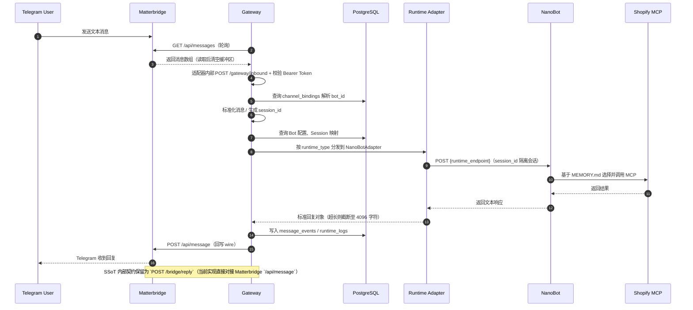
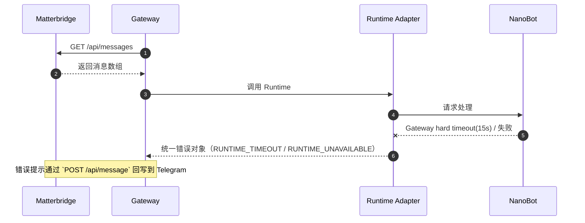
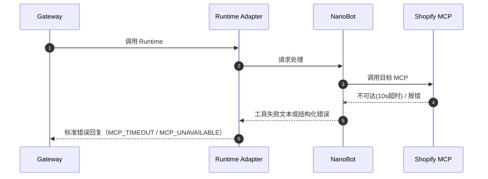
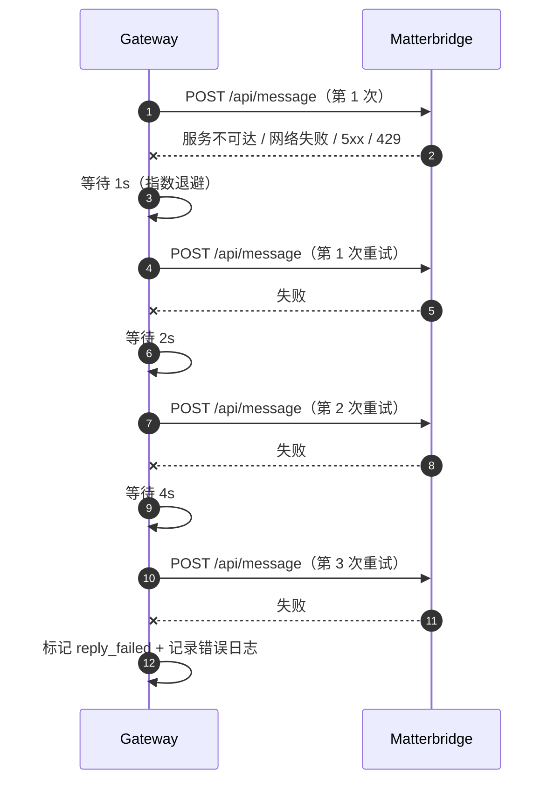
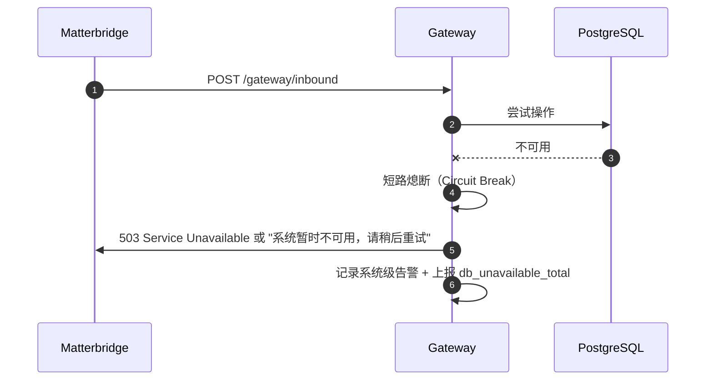
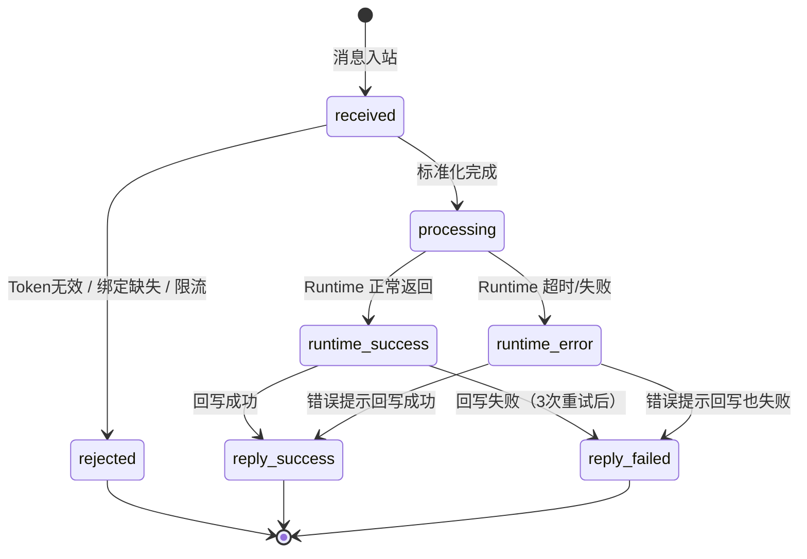

# 运行时视图 (Runtime View)

> **Metadata**
> - **Source**: `.context/architecture/source/IM-Agent-Bridge-TAD.md`
> - **Generated At**: `2026-04-13 13:52`
> - **Generator**: `Context-Agent v1.0`

---

## 🎯 场景选择原则

仅记录具有**架构显著性**的运行时场景：
- 核心业务链路（消息接入主链路）
- 异常与恢复流程（Runtime 异常、MCP 失败、回写失败、DB 不可用）
- 超时预算链路

---

## 📊 场景 1: 消息接入主链路

### 序列图

### 关键决策点

| 步骤 | 决策 | 失败处理 |
|------|------|---------|
| 3 | Bearer Token 校验 | 无效 → 401 |
| 4 | `channel_bindings` 查找 | 未找到 → 404，拒绝处理 |
| 4 | 幂等去重检查 | 重复 → 200 + `ignored_duplicate` |
| 5 | 限流检查 (5 msg/sec/chat_id) | 超限 → 429 |
| 7 | Runtime 超时 (Gateway hard timeout: 15s) | 超时 → 错误回写（NanoBot 服务端自身超时为 120s） |
| 12 | 回写能力 | 回写失败 → 指数退避重试（1s/2s/4s）后标记 reply_failed |

---

## 📊 场景 2: Runtime 异常

### 序列图

### 关键决策点

| 步骤 | 决策 | 失败处理 |
|------|------|---------|
| 4 | Gateway 侧 NanoBot 超时 (15s hard timeout，NanoBot 内部为 120s) | 统一返回“抱歉，当前无法处理您的请求，请稍后再试。” |
| 4 | Runtime 不可达 | `RUNTIME_UNAVAILABLE` 错误码 |
| 4 | Runtime 响应格式异常 | `RUNTIME_BAD_RESPONSE` 错误码 |

---

## 场景 3: MCP 调用失败

### 序列图

---

## 📊 场景 4: 回写失败

### 序列图

### 重试策略

| 参数 | 值 |
|------|-----|
| 最大重试次数 | 3 次（重试；总尝试最多 4 次） |
| 退避策略 | 指数退避（1s / 2s / 4s） |
| 终态标记 | `reply_failed` |
| 幂等保证 | `reply_id`（SSoT 内部契约；Matterbridge `/api/message` 不识别该字段） |
| 409 语义 | 视为"回写已完成"的成功状态（契约；当前 wire 端点通常不返回 409） |

---

## 📊 场景 5: PostgreSQL 不可用

> **设计原则**: 宁可报错不可错乱 — 绝对禁止在无 DB 时向 Runtime 传递上下文或推进业务状态。

---

## ⏱️ 超时预算链路

| 阶段 | 超时上限 | 说明 |
|------|---------|------|
| Gateway poller 拉取 + Token 校验 + bot_id 解析 | ~200ms | 本地/内网通信 |
| Gateway → Runtime HTTP 调用 | ≤ 15s | hard timeout，含 Runtime 内部 MCP 调用 |
| Runtime → MCP 工具调用 | ≤ 10s | 嵌套在 Runtime 超时内 |
| Gateway 回写到 Bridge | ~500ms | 本地/内网通信 |
| **端到端 P95 目标** | **≤ 5s** | 正常场景的响应时间目标 |

### 约束关系

- 5s 为正常 P95 目标，15s 为极端 hard timeout
- 超过 5s 应上报慢响应指标
- MCP 10s 超时嵌套在 Runtime 15s 超时内
- 超时后 Gateway 不取消下游请求（MVP 简化）

---

## 🔄 状态机: 消息处理状态

### 状态机 → message_events 字段映射

| 架构态（状态机） | `message_events.status` 写入值 | `message_events.reply_status` 写入值 | 写入时点 |
|----------------|-------------------------------|--------------------------------------|---------|
| `received` | `pending` | —（未写入） | 消息通过 Bearer Token 校验、幂等检查后落库 |
| `processing` | `processing` | —（未写入） | 开始调用 Runtime Adapter 时更新 |
| `runtime_success` | `done` | —（未写入） | Runtime 正常返回后更新 |
| `runtime_error` | `error` | —（未写入） | Runtime 超时/失败后更新 |
| `reply_success` | —（保持 `done`/`error`） | `success` | 回写 Bridge 成功后更新 |
| `reply_failed` | —（保持 `done`/`error`） | `reply_failed` | 回写能力落地后，3次重试均失败时更新 |
| `rejected` | 不写入 `message_events` | —（不写入） | 前置拒绝（限流/Token无效/绑定缺失）不产生事件记录 |

---

## AI 引用指南

当 AI 实现运行时场景时：
1. 主链路必须覆盖完整的 5 个场景
2. 超时预算必须严格遵循（P95 ≤ 5s, hard 15s, MCP 10s）
3. DB 不可用必须短路熄断，不得降级处理
4. 回写失败必须实现 3 次指数退避重试
5. 409 必须视为成功语义
