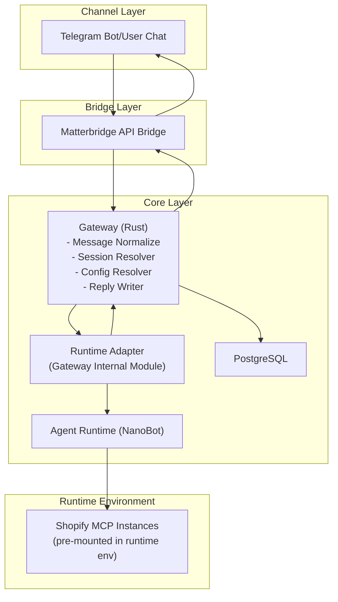
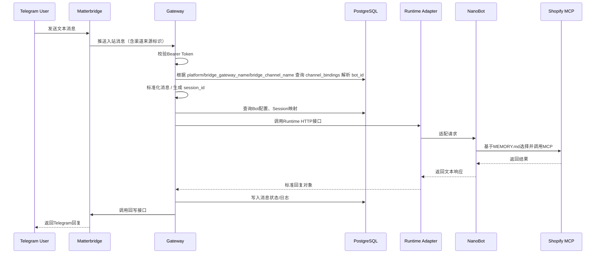
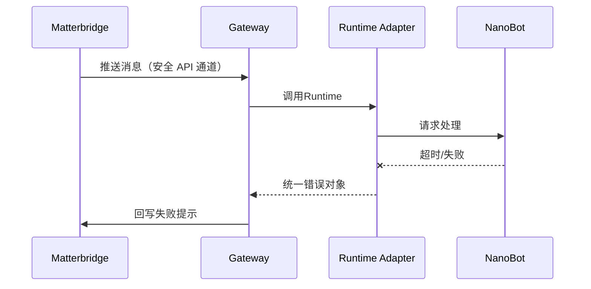
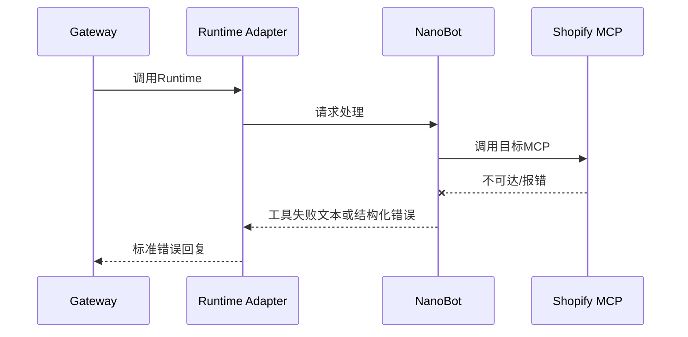
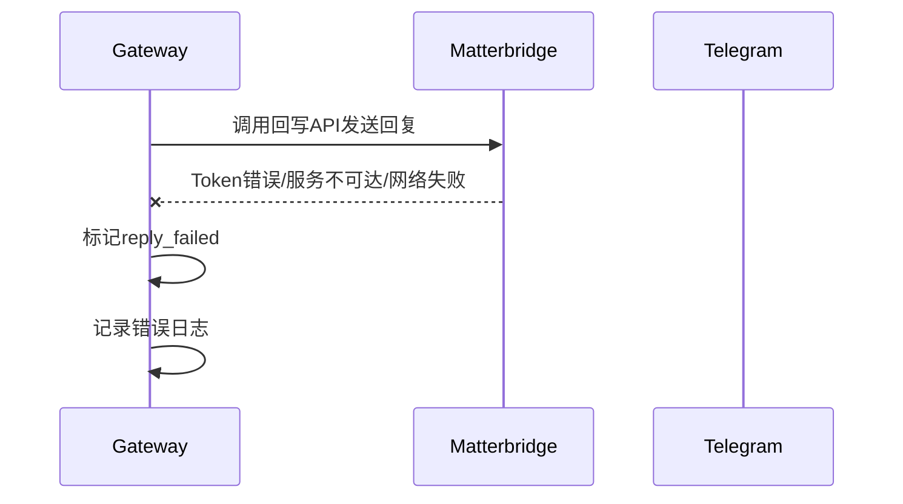
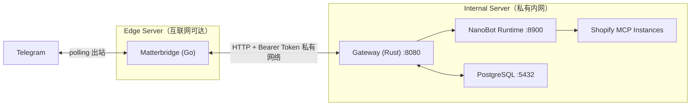

# IM Agent Bridge

## 技术架构设计文档（TAD）

**文档类型：** 技术架构设计文档
**版本：** TAD v1.1
**对应 PRD：** IM Agent Bridge PRD MVP v1.1
**作者：** nurn
**创建日期：** 2026-04-12
**最后更新：** 2026-04-12
**文档状态：** 可评审版 / 最终收敛版

---

## 修订记录

| 版本   | 日期         | 修改人 | 修改内容                                                                                                                     |
| ---- | ---------- | --- | ------------------------------------------------------------------------------------------------------------------------ |
| v0.1 | 2026-04-12 | nurn | 初稿创建                                                                                                                     |
| v1.0 | 2026-04-12 | nurn | 完成首版架构设计                                                                                                                 |
| v1.1 | 2026-04-12 | nurn | 删除 MCP Router、删除 MCP 配置持久化、固定 Gateway ↔ Runtime 为独立 HTTP 接口、固定 Bridge 认证为 Bearer Token、明确 Runtime 基于 `MEMORY.md` 自主选择 MCP |

---

## 1. 文档目标

本文档用于定义 IM Agent Bridge MVP 的技术实现方案，覆盖以下内容：

1. 系统总体架构与模块边界
2. Channel / Bridge / Core 三层职责划分
3. Bridge、Gateway、Runtime、PostgreSQL 的交互方式
4. 标准消息模型、会话模型、持久化模型
5. 安全、可观测性、异常处理与部署建议
6. MVP 实施顺序与架构决策依据

本文档回答“怎么实现”，不重复 PRD 中“做什么”的产品定义。PRD 已明确本项目为通用多 IM AI 接入骨架，MVP 第一版仅支持 Telegram、文本消息、NanoBot 为默认 Runtime、Gateway ↔ Runtime 使用独立 HTTP 接口、群聊共享 `session_id`、私聊独立 `session_id`，并采用 PostgreSQL 做 session 与系统配置持久化。

---

## 2. 设计目标与非目标

### 2.1 设计目标

本架构需要满足以下目标：

* 支持 Telegram 文本消息接入、`Runtime` 调用、Shopify MCP 工具调用与回复回写的完整闭环。
* 固定三层架构：Channel Layer、Bridge Layer、Core Layer。
* 保证 Bridge 仅对接 Gateway，Runtime 不直接对接 `Telegram` 主入口。
* Gateway ↔ Runtime 使用独立 HTTP 接口，便于替换 Runtime。
* 通过 PostgreSQL 持久化 session 映射、Bot 配置、Channel 绑定与消息状态。
* Runtime 基于 `MEMORY.md` 和当前运行环境中已挂载的 MCP 自主选择工具，不由 Gateway 路由 MCP。
* 提供最小安全通信、日志、错误追踪与故障退化能力。

### 2.2 非目标

MVP 阶段不包含以下内容：

* 多 IM 同时接入
* 图片、文件、语音、视频等富媒体消息
* 群聊内按用户拆分上下文
* 独立管理后台
* 复杂多租户权限体系
* Shopify MCP 工具权限由 Shopify 侧配置管理
* MCP 实例配置持久化表
* Gateway 侧 MCP 选择逻辑
* 独立长期记忆系统

这些边界与 PRD 一致。

---

## 3. 总体架构

### 3.1 分层结构

系统采用三层架构：

```text id="ckojw3"
Channel Layer
    Telegram

        ↓

Bridge Layer
    Matterbridge

        ↓

Core Layer
    Gateway
    Runtime Adapter
    Agent Runtime (NanoBot)
    PostgreSQL
```

其中：

* **Channel Layer**：只负责消息入口与消息出口
* **Bridge Layer**：只负责 Telegram 与 Core 的桥接
* **Core Layer**：负责消息标准化、会话管理、Runtime 调用、持久化与回写控制

### 3.2 总体架构图



### 3.3 核心设计原则

系统遵循以下原则：

* **单一入口原则**：Core 对外只有 Gateway 一个入口。
* **桥接与业务分离原则**：Matterbridge 只负责桥接，不承担业务语义。
* **Runtime 可替换原则**：Gateway 不依赖 Runtime 具体实现。
* **上下文归属显式化原则**：`session_id` 由 Gateway 生成并管理。
* **Runtime 自主工具选择原则**：Runtime 基于 `MEMORY.md` 与运行环境自主选择 MCP。
* **安全默认原则**：Bridge ↔ Gateway 使用 HTTPS + Bearer Token。
* **MVP 简化原则**：不引入 MCP 配置持久化。

---

## 4. 模块设计

### 4.1 Channel Layer

#### 4.1.1 Telegram

职责：

* 承载最终用户发送与接收消息
* 不包含业务逻辑
* 不直接连接 Runtime
* 只作为消息来源和回复目标

MVP 第一版只支持 Telegram 文本消息。非文本消息在 Gateway 层进行忽略或返回“当前仅支持文本消息”。

---

### 4.2 Bridge Layer

#### 4.2.1 Matterbridge

职责：

* 作为 Telegram 与 Gateway 之间的桥接器
* 接收 Telegram 消息
* 通过安全 API 通道主动推送消息到 Gateway
* 接收 Gateway 回写，并转发回 Telegram

#### 4.2.2 交互模式

MVP 采用 Matterbridge API 模式，Matterbridge 收到 Telegram 消息后通过安全 API 通道主动推送到 Gateway。

交互方式：

* Matterbridge 在收到 Telegram 消息后，通过 Bridge ↔ Gateway 的安全 API 通道将消息推送到 Gateway
* Gateway 通过 Bridge API 回写消息到 Matterbridge
* Bridge 不直接调用 Runtime
* Bridge 不直接访问数据库

#### 4.2.3 Bridge API 设计要求

* Bridge ↔ Gateway 使用 HTTPS
* 认证方案固定为 `Authorization: Bearer <token>`
* API 仅暴露在 localhost 或受控内网
* 仅 Gateway 允许访问 Bridge API
* Bridge 不负责 session 管理

---

### 4.3 Core Layer

Core Layer 是系统主控层，包含 Gateway、Runtime Adapter、Agent Runtime（NanoBot）与 PostgreSQL。

#### 4.3.1 Gateway

Gateway 是 Core 的唯一对外入口。

**职责：**

* 接收来自 Bridge 的原始消息
* 校验 Bearer Token 与来源合法性
* 根据 Bridge 入站消息中的渠道来源标识（`platform` / `bridge_gateway_name` / `bridge_channel_name`）查询 `channel_bindings` 解析出 `bot_id`
* 执行消息标准化
* 生成并维护 `session_id`
* 读取 Bot 配置、Session 映射
* 调用 Runtime Adapter
* 对 Runtime 返回结果进行统一组织
* 调用 Bridge API 完成消息回写
* 写入消息状态、错误日志与链路日志

**边界：**

* Gateway 不承担模型推理能力
* Gateway 不做 MCP 选择
* Gateway 不直接决定调用哪个工具
* Gateway 不保存 MCP 凭证和 MCP 实例明细

#### 4.3.2 Runtime Adapter

Runtime Adapter 是 **Gateway 内部模块**，不是独立部署服务。

**职责：**

* 将 Gateway 的标准请求转换为 Runtime 可接受的 HTTP 请求格式
* 将 Runtime 的输出转换为标准回复对象
* 将 `session_id / chat_id / chat_type / user_id` 映射到 Runtime 侧请求字段
* 屏蔽 NanoBot 与未来其他 Runtime 的差异
* **负责处理 Runtime 返回的超长文本**：执行 4096 字符硬截断，并主动追加“当前内容已被截断”提示，再组装为标准回复对象交给 Gateway

**边界：**

* 不直接访问 Bridge
* 不直接访问 Telegram
* 不承担持久化职责
* 不承担 MCP 路由职责

#### 4.3.3 Agent Runtime（NanoBot）

NanoBot 作为 MVP 第一版默认 Runtime。

**职责：**

* 管理最小上下文记忆
* 读取 `MEMORY.md`
* 基于当前上下文与运行环境中已挂载的 MCP 自主选择工具
* 直接调用对应 Shopify MCP
* 整理工具结果并返回文本响应

**边界：**

* 不作为 Telegram 主入口
* 不接管 Bridge 能力
* 不承担 Gateway 的消息标准化和回写职责
* 不依赖数据库来选择 MCP

#### 4.3.4 PostgreSQL

PostgreSQL 作为 Core Layer 持久化存储。

**职责：**

* 存储 session 映射
* 存储 Bot 配置
* 存储 Channel 绑定
* 存储消息状态与错误索引
* 存储必要上下文元数据

**访问原则：**

* MVP 阶段主要由 Gateway 访问
* Runtime 不强依赖数据库
* PostgreSQL 不存 MCP 实例配置，不存密钥引用

---

## 5. 核心时序设计

### 5.1 消息接入主链路



### 5.2 Runtime 异常时序



### 5.3 MCP 调用失败时序



### 5.4 回写失败时序

“回写失败”指的是：Gateway 已经拿到 Runtime 的回复，但最终把消息发回 Matterbridge / Telegram 时失败。



---

## 6. 消息模型设计

### 6.1 标准输入消息模型

> **消息长度约束：** Telegram 单条消息上限为 4096 字符。Gateway 在标准化阶段应校验输入长度，超过上限时截断并记录日志。回复消息同样不得超过 4096 字符，超长时应截断并附加截断提示。

```json
{
  "event_id": "evt_20260412_xxx",
  "platform": "telegram",
  "chat_id": "123456789",
  "chat_type": "private",
  "user_id": "99887766",
  "session_id": "telegram:private:123456789",
  "text": "今天订单多少？",
  "timestamp": "2026-04-12T16:10:00Z",
  "bot_id": "550e8400-e29b-41d4-a716-446655440000",
  "metadata": {
    "bridge_message_id": "mb_xxx",
    "raw_sender_name": "alice"
  }
}
```

> 其中 `bot_id` 为 Gateway 根据 Bridge 来源标识和 `channel_bindings` 解析出的内部 Bot 标识，并非由外部请求直接传入，也不由 Runtime 推断。

### 6.1.1 `bot_id` 解析逻辑

**`bot_id` 不由外部请求直接指定。**

Gateway 在接收到 Bridge 入站消息后，应根据以下来源字段解析 `bot_id`：

* `platform`
* `bridge_gateway_name`
* `bridge_channel_name`（或等效 Bridge 来源标识）

Gateway 使用上述字段查询 `channel_bindings` 表，找到对应的绑定记录，并取出其关联的 `bot_id`。之后，Gateway 再将 `bot_id` 写入标准输入消息模型，用于后续的 session 管理、Runtime 调用与消息状态持久化。

**匹配规则：**

1. 优先按 `platform + bridge_gateway_name + bridge_channel_name` 组合查找
2. 若 `bridge_channel_name` 为空，则退化为 `platform + bridge_gateway_name` 查找
3. 若仍找不到，则拒绝处理该消息并记录绑定缺失错误日志

**设计理由：**

* 避免外部伪造 `bot_id` 导致安全风险
* 避免 Runtime 承担渠道解析职责，保持职责边界清晰

### 6.2 标准输出回复模型

```json
{
  "reply_id": "rep_20260412_xxx",
  "bot_id": "550e8400-e29b-41d4-a716-446655440000",
  "platform": "telegram",
  "chat_id": "123456789",
  "reply_type": "text",
  "text": "今天共有 23 单，销售额为 1,250 USD。",
  "session_id": "telegram:private:123456789",
  "status": "success",
  "metadata": {
    "runtime": "nanobot"
  }
}
```

### 6.3 session_id 生成规则

### 私聊

```text
telegram:private:{chat_id}
```

### 群聊

```text
telegram:group:{chat_id}
```

MVP 阶段不支持：

* `thread_id`
* `group_id`
* 群聊内按用户拆分上下文

这些约束与 PRD 一致。

---

## 7. 配置模型设计

### 7.1 Bot 配置模型

一个 Bot 对应一个系统内运行单元。

建议字段：

* `id`（UUID，内部主键，在接口与 DB 中作为 `bot_id` 传递）
* `bot_name`（人类可读标识符，如 `bot_main`，用于日志与配置显示）
* `name`
* `runtime_type`
* `runtime_endpoint`
* `is_enabled`
* `created_at`
* `updated_at`

### 7.2 Channel Binding 模型

Bot 与渠道入口的绑定关系单独建模，不直接塞进 `bots` 表。

建议字段：

* `bot_id`
* `platform`
* `bridge_gateway_name`
* `bridge_channel_name`
* `is_enabled`
* `created_at`
* `updated_at`

说明：

* `bots` 表表示系统内部 bot 实例
* `channel_bindings` 表表示 bot 与 Telegram / Bridge 的入口绑定关系

### 7.3 Session 映射模型

建议字段：

* `session_id`
* `bot_id`
* `platform`
* `chat_id`
* `chat_type`
* `last_user_id`
* `runtime_session_key`
* `created_at`
* `updated_at`

#### 7.3.1 `runtime_session_key` 生命周期规则

`runtime_session_key` 是 Gateway 与 Runtime 之间的会话映射标识，用于将 `session_id` 关联到 Runtime 侧的具体会话。

**通用规则：**

* **生成：** 首次收到某 `session_id` 的消息时，Gateway 调用 Runtime 后，将 Runtime 返回的会话标识存入 `runtime_session_key`
* **更新：** 每次处理该 `session_id` 的消息时，Gateway 应更新 `sessions.updated_at` 与 `sessions.last_user_id`；若 Runtime 返回了新的会话标识（例如重建/迁移），Gateway 以返回值覆盖更新 `runtime_session_key`
* **失效：** 若 Runtime 返回“会话不存在/会话已失效”类错误（需在 §9.2 约定具体 `error_code`），Gateway 应清空 `runtime_session_key` 并尝试重新创建一次；若仍失败则回写统一错误提示
* **回收（建议）：** 可按 `sessions.updated_at` 清理长期不活跃会话（例如 30/90 天），避免映射无限增长（MVP 阶段可先手工清理）
* **DB 不可用退化：** 与 PRD 场景 I、TAD §12.4 对齐，PostgreSQL 不可用时 Gateway **不得继续处理**（避免写入不一致会话/事件），应短路返回统一错误提示并记录系统级告警；不在 DB 不可用时执行“无上下文单轮处理”

**NanoBot 特化策略：**

HKUDS/nanobot 的 OpenAI-compatible API 接受一个 `session_id` 参数实现服务端会话隔离（概念上等效于旧版 NanoBot 的 `state` 参数），由调用方完全控制，NanoBot 本身不生成会话 ID。因此：

* `runtime_session_key` **直接等于 `session_id`**，NanoBotAdapter 将 Gateway 生成的 `session_id` 直接作为 NanoBot HTTP API 的 `session_id` 字段传入
* NanoBot 使用该值在服务端隔离对话历史，相同 `session_id` 值自动恢复之前的对话上下文
* 不需要 Runtime 侧返回独立的会话标识，"生成"与"更新"规则退化为等值复制

> **前向兼容：** 若未来替换为有独立会话标识的 Runtime（如 OpenAI Assistants API 的 `thread_id`），`runtime_session_key` 将存储该 Runtime 返回的独立标识，与 `session_id` 形成真正的双主键映射。

---

## 8. PostgreSQL 数据模型

### 8.1 表设计

### `bots`

存储 Bot 基础配置。

### `channel_bindings`

存储 Bot 与渠道入口的绑定关系。

### `sessions`

存储 session 映射关系。

### `message_events`

存储接入事件、处理状态与回写状态。

### `runtime_logs`

存储 Runtime 调用索引与错误日志索引。

### 8.2 建表示例

```sql
CREATE TABLE bots (
    id UUID PRIMARY KEY,
    bot_name VARCHAR(64) UNIQUE NOT NULL,
    name VARCHAR(128) NOT NULL,
    runtime_type VARCHAR(32) NOT NULL,
    runtime_endpoint TEXT NOT NULL,
    is_enabled BOOLEAN NOT NULL DEFAULT TRUE,
    created_at TIMESTAMPTZ NOT NULL DEFAULT NOW(),
    updated_at TIMESTAMPTZ NOT NULL DEFAULT NOW()
);

CREATE TABLE channel_bindings (
    id UUID PRIMARY KEY,
    bot_id UUID NOT NULL REFERENCES bots(id),
    platform VARCHAR(32) NOT NULL,
    bridge_gateway_name VARCHAR(128) NOT NULL,
    bridge_channel_name VARCHAR(128),
    is_enabled BOOLEAN NOT NULL DEFAULT TRUE,
    created_at TIMESTAMPTZ NOT NULL DEFAULT NOW(),
    updated_at TIMESTAMPTZ NOT NULL DEFAULT NOW()
);

CREATE TABLE sessions (
    id UUID PRIMARY KEY,
    session_id VARCHAR(256) UNIQUE NOT NULL,
    bot_id UUID NOT NULL REFERENCES bots(id),
    platform VARCHAR(32) NOT NULL,
    chat_id VARCHAR(128) NOT NULL,
    chat_type VARCHAR(32) NOT NULL,
    last_user_id VARCHAR(128),
    runtime_session_key VARCHAR(256),
    created_at TIMESTAMPTZ NOT NULL DEFAULT NOW(),
    updated_at TIMESTAMPTZ NOT NULL DEFAULT NOW()
);

CREATE TABLE message_events (
    id UUID PRIMARY KEY,
    event_id VARCHAR(128) UNIQUE NOT NULL,
    bot_id UUID NOT NULL REFERENCES bots(id),
    session_id VARCHAR(256) NOT NULL,
    platform VARCHAR(32) NOT NULL,
    bridge_gateway_name VARCHAR(128) NOT NULL,
    bridge_channel_name VARCHAR(128),
    bridge_message_id VARCHAR(128) NOT NULL,
    reply_id VARCHAR(128) UNIQUE NOT NULL,
    chat_id VARCHAR(128) NOT NULL,
    chat_type VARCHAR(32) NOT NULL,    
    user_id VARCHAR(128),
    input_text TEXT,
    output_text TEXT,
    status VARCHAR(32) NOT NULL,
    reply_status VARCHAR(32),
    reply_error_code VARCHAR(64),
    reply_error_message TEXT,
    error_code VARCHAR(64),
    error_message TEXT,
    created_at TIMESTAMPTZ NOT NULL DEFAULT NOW()
);

CREATE TABLE runtime_logs (
    id UUID PRIMARY KEY,
    event_id VARCHAR(128) NOT NULL REFERENCES message_events(event_id),
    bot_id UUID NOT NULL REFERENCES bots(id),
    runtime_type VARCHAR(32) NOT NULL,
    request_payload JSONB,
    response_payload JSONB,
    status VARCHAR(32) NOT NULL,
    error_code VARCHAR(64),
    error_message TEXT,
    latency_ms INTEGER,
    created_at TIMESTAMPTZ NOT NULL DEFAULT NOW()
);
```

### 8.3 索引设计

```sql
-- sessions 高频查询：按 bot + platform + chat_id 查找 session
CREATE INDEX idx_sessions_bot_platform_chat ON sessions (bot_id, platform, chat_id);

-- message_events 入站幂等：同一来源的同一 message_id 只处理一次（NULL channel_name 视为 ""）
CREATE UNIQUE INDEX uq_message_events_inbound_dedup
    ON message_events (platform, bridge_gateway_name, COALESCE(bridge_channel_name, ''), bridge_message_id);

-- message_events 回写幂等：同一 reply_id 只回写一次
CREATE UNIQUE INDEX uq_message_events_reply_id ON message_events (reply_id);

-- message_events 高频查询：按 session + 时间排序
CREATE INDEX idx_message_events_session_created ON message_events (session_id, created_at);

-- message_events 按 bot 查询
CREATE INDEX idx_message_events_bot ON message_events (bot_id);

-- channel_bindings 按 bot + platform 查询
CREATE INDEX idx_channel_bindings_bot_platform ON channel_bindings (bot_id, platform);

-- runtime_logs 按 event_id 查询
CREATE INDEX idx_runtime_logs_event ON runtime_logs (event_id);

-- runtime_logs 按 bot + 时间查询
CREATE INDEX idx_runtime_logs_bot_created ON runtime_logs (bot_id, created_at);
```

---

## 9. 接口设计

### 9.1 Bridge ↔ Gateway

#### 入站接口

**`POST /gateway/inbound`**

Matterbridge 在收到 Telegram 消息后，通过安全 API 通道主动推送到 Gateway。入站消息必须包含渠道来源标识：

```json
{
  "platform": "telegram",
  "bridge_gateway_name": "tg-main-gateway",
  "bridge_channel_name": "telegram.mybot.main",
  "raw_message": {
    "chat_id": "123456789",
    "chat_type": "private",
    "user_id": "99887766",
    "text": "今天订单多少？",
    "timestamp": "2026-04-12T16:10:00Z",
    "message_id": "mb_xxx",
    "sender_name": "alice"
  }
}
```

**响应状态码：**

| 状态码 | 语义 |
|--------|------|
| `200 OK` | 消息已接收并开始处理，或重复消息已被识别并跳过（见 Response Body `status` 字段） |
| `400 Bad Request` | 请求格式错误或缺少必要字段 |
| `401 Unauthorized` | Bearer Token 无效 |
| `404 Not Found` | 未找到匹配的 channel_binding |
| `409 Conflict` | 重复的 message_id（严格幂等模式，可选） |
| `429 Too Many Requests` | 超过限流阈值，请稍后重试 |
| `500 Internal Server Error` | 服务器内部错误 |
| `502 Bad Gateway` | 关键下游依赖不可用（如 Runtime 不可达），Gateway 暂拒处理 |
| `503 Service Unavailable` | PostgreSQL 不可用，服务暂时熄断 |

**幂等策略：**

* 幂等键：`(platform, bridge_gateway_name, bridge_channel_name, message_id)`，其中 `message_id` 由 Bridge 生成
* 落地方式：Gateway 持久化 `bridge_message_id` 到 `message_events` 并通过唯一索引实现去重（见 §8.3）
* 返回语义：当判定为重复推送时，为避免 Matterbridge 将非 2xx 视为异常而触发重试风暴，Gateway 默认返回 `200 OK`，并在 Response Body 中标注 `status: "ignored_duplicate"`；如 Bridge 明确支持将 `409` 视为终态成功，可切换为返回 `409 Conflict`

**成功响应示例：**

```json
{ "status": "accepted" }
```

**重复响应示例：**

```json
{ "status": "ignored_duplicate" }
```

> Gateway 根据 `platform` / `bridge_gateway_name` / `bridge_channel_name` 查询 `channel_bindings` 解析 `bot_id`，然后将原始消息转化为标准输入消息模型（见 §6.1）。

#### 回写接口

**`POST /bridge/reply`**

Gateway 调用 Bridge API 将文本消息发回 Telegram。

```json
{
  "reply_id": "rep_20260412_xxx",
  "chat_id": "123456789",
  "platform": "telegram",
  "text": "今天共有 23 单，销售额为 1,250 USD。",
  "bridge_gateway_name": "tg-main-gateway",
  "bridge_channel_name": "telegram.mybot.main"
}
```

**响应状态码：**

| 状态码 | 语义 |
|--------|------|
| `200 OK` | 回写成功 |
| `400 Bad Request` | 请求格式错误 |
| `401 Unauthorized` | Bearer Token 无效 |
| `404 Not Found` | Bridge 无法定位投递目标（会话/频道不可用或已失效） |
| `409 Conflict` | 重复的 reply_id（幂等冲突） |
| `500 Internal Server Error` | Bridge 内部错误 |
| `502 Bad Gateway` | Bridge 无法将消息发送到 Telegram |

**幂等策略：**

* 幂等键：`reply_id`（由 Gateway 生成）
* 行为要求：Bridge 对同一 `reply_id` 的重复回写请求应跳过重复投递，避免用户收到重复消息
* 返回语义：当判定为重复回写时，Bridge 推荐返回 `200 OK`；如返回 `409 Conflict`，Gateway 必须将 `409` 视为“回写已完成/无需重试”的成功语义

#### 鉴权要求

* 认证方式固定为 Bearer Token
* 使用 `Authorization: Bearer <token>`
* 白名单来源限制
* 内网或受控网络访问
* 禁止公网裸露

### 9.2 Gateway ↔ Runtime

Gateway 通过 `bots.runtime_type` 和 `bots.runtime_endpoint` **直接调用 Runtime 原生 HTTP 接口**，无中间抽象端点。

**调度机制（Strategy Pattern）：**

Gateway 内部实现 `RuntimeAdapter` trait，按 `runtime_type` 分发到对应的 Adapter 实现：

```rust
// runtime_adapter.rs — trait 定义
trait RuntimeAdapter {
    async fn process(&self, endpoint: &str, text: &str, session_id: &str) -> Result<RuntimeResponse>;
}

// nanobot_adapter.rs — NanoBot 实现
struct NanoBotAdapter;
impl RuntimeAdapter for NanoBotAdapter { ... }

// 未来扩展：zeroclaw_adapter.rs 等

// 路由分发
fn get_adapter(runtime_type: &str) -> Result<Box<dyn RuntimeAdapter>> {
    match runtime_type {
        "nanobot" => Ok(Box::new(NanoBotAdapter)),
        _ => Err("unsupported runtime type")
    }
}
```

**Gateway 调用流程：**

1. 从 `bots` 表读取 `runtime_type` 和 `runtime_endpoint`
2. 按 `runtime_type` 获取对应的 `RuntimeAdapter` 实现
3. 调用 `adapter.process(runtime_endpoint, text, session_id)`
4. Adapter 使用 `runtime_endpoint` 调用 Runtime 原生 API
5. Adapter 将 Runtime 原生响应转换为标准回复对象

**标准回复对象 Schema：**

无论使用哪种 `runtime_type`，Adapter 必须将 Runtime 原生响应统一转换为以下格式：

```json
{
  "reply_id": "rep_20260412_xxx",
  "bot_id": "550e8400-e29b-41d4-a716-446655440000",
  "platform": "telegram",
  "chat_id": "123456789",
  "reply_type": "text",
  "text": "今天共有 23 单，销售额为 1,250 USD。",
  "session_id": "telegram:private:123456789",
  "status": "success",
  "metadata": {
    "runtime": "nanobot"
  }
}
```

**错误响应 Schema：**

```json
{
  "reply_id": "rep_20260412_xxx",
  "bot_id": "550e8400-e29b-41d4-a716-446655440000",
  "platform": "telegram",
  "chat_id": "123456789",
  "reply_type": "text",
  "text": "抱歉，当前无法处理您的请求，请稍后再试。",
  "session_id": "telegram:private:123456789",
  "status": "error",
  "metadata": {
    "runtime": "nanobot",
    "error_code": "RUNTIME_TIMEOUT",
    "error_message": "Runtime did not respond within 15s"
  }
}
```

**`error_code` 建议枚举（MVP）：**

* `RUNTIME_TIMEOUT`：Gateway → Runtime 超时（见 §12.2）
* `RUNTIME_UNAVAILABLE`：Runtime 不可达/拒绝连接
* `RUNTIME_BAD_RESPONSE`：Runtime 响应格式不符合 Schema
* `RUNTIME_SESSION_NOT_FOUND`：Runtime 侧会话不存在/已失效。Gateway 应按 §7.3.1 清空 `runtime_session_key` 并重建一次
* `MCP_TIMEOUT`：Runtime → MCP 超时（见 §12.3）
* `MCP_UNAVAILABLE`：MCP 不可达/报错

### 9.3 NanoBotAdapter 实现（MVP 默认）

`NanoBotAdapter` 调用 [HKUDS/nanobot](https://github.com/HKUDS/nanobot) 的 OpenAI-compatible API（`nanobot serve`，默认端口 8900）。

**协议适配：**

| Gateway 内部字段 | NanoBot API 映射 |
|----------------|-----------------|
| `text` | → `messages: [{"role": "user", "content": text}]` |
| `session_id` | → `session_id`（NanoBot 用于服务端会话隔离） |
| 响应 | ← `choices[0].message.content` 提取为回复文本 |

**调用示例：**

```rust
// nanobot_adapter.rs
impl RuntimeAdapter for NanoBotAdapter {
    async fn process(&self, endpoint: &str, text: &str, session_id: &str) -> Result<RuntimeResponse> {
        let resp = reqwest::Client::new()
            .post(endpoint)  // e.g. "http://nanobot:8900/v1/chat/completions"
            .json(&json!({
                "messages": [{"role": "user", "content": text}],
                "session_id": session_id
            }))
            .timeout(Duration::from_secs(15))
            .send().await?;

        let body: serde_json::Value = resp.json().await?;
        let reply_text = body["choices"][0]["message"]["content"].as_str().unwrap_or("");
        Ok(RuntimeResponse { text: reply_text.to_string(), status: "success" })
    }
}
```

> NanoBot 的 `session_id` 实现服务端会话隔离：不同 `session_id` 获得独立对话历史，Gateway 无需维护上下文。


### 9.4 Runtime ↔ Shopify MCP

Shopify MCP 由 Runtime 直接调用，不单独引入 MCP Router。

要求：

* Runtime 在启动时通过 `MEMORY.md` 知道当前环境中可用的 MCP
* 各 MCP 实例通过 `.env` 或等效运行环境注入方式加载 `client_id / client_secret / domain`
* Gateway 不选择 MCP，也不传递目标 MCP 实例
* PostgreSQL 不存 MCP 配置和密钥引用
* Runtime 基于上下文自主选择工具
* MVP 阶段默认当前环境中可用的 Shopify MCP 工具全部开启，但前提是实例本身暴露的是可接受工具

#### 9.4.1 多店铺 MCP 命名与使用规范

`MEMORY.md` 中应按以下格式声明可用的 Shopify MCP 实例：

```text
=== 可访问的 Shopify 店铺 ===
MCP Server: shopify-cool-gadgets | 显示名称: 酷玩小屋 | 品类: 电子产品 | 地区: 美国(US) | 币种: USD | 时区: America/New_York | 备注：xxxx
MCP Server: shopify-trendy-fashion | 显示名称: 潮流时尚 | 品类: 服饰 | 地区: 欧洲(EU) | 币种: EUR | 时区: Europe/Paris | 备注：xxxx
```

**命名规则：**

* MCP Server 名称采用 `shopify-{store-slug}` 格式
* 每个实例必须标注显示名称、品类、地区、币种、时区
* `备注` 字段用于记录店铺特殊说明

**多店铺路由规则：**

* 当用户消息明确指定店铺时，Runtime 直接调用对应 MCP 实例
* 当用户未指定店铺且存在多个 MCP 实例时，Runtime 应反问用户确认目标店铺
* 当仅有一个 MCP 实例时，默认使用该实例

---

## 10. 安全架构

### 10.1 凭据管理

敏感信息不得进入代码仓库，不得明文入库。

推荐做法：

* Telegram Token：环境变量或 Secret Manager
* Bridge Bearer Token：环境变量
* PostgreSQL 密码：环境变量
* Shopify MCP 的 `client_id / client_secret / domain`：由对应 MCP 实例在 `.env` 或 Secret 中加载

说明：

* PostgreSQL 不存 `client_id_ref / client_secret_ref`
* Gateway 不在每次请求中下发长期密钥
* 密钥跟随 Runtime / MCP 运行环境管理

### 10.5 数据治理与隐私保护

本节与 PRD §6.3 的数据与隐私约束对齐。

#### 数据最小化策略

* `message_events.input_text` / `output_text`：只用于 **短期排障**，不作为业务数据源。存储时截断至最多 512 字符，超出部分不落库。
* `runtime_logs.request_payload` / `response_payload`：仅在 `status = 'error'` 时写入，正常响应不落库 payload。写入时应脱敏或移除涉及 PII 的字段（如 user_id、原文消息内容）。

#### 数据保留期

* `message_events`：保留 **30 天**，过期后自动清理（建议通过定时任务或 PostgreSQL 分区实现）
* `runtime_logs`：保留 **14 天**，仅用于错误排查
* `sessions`：无自动过期，但可按 `updated_at` 清理长期不活跃会话

#### 访问控制

* `input_text` / `output_text` / `request_payload` / `response_payload` 仅允许系统开发者/运维级别访问，不对外暴露
* 日志查询应记录审计日志（谁在什么时间查询了哪些数据）

### 10.2 通信安全

### 外部通信

* Bridge ↔ Gateway：HTTPS
* 认证方式：Bearer Token
* 内网优先
* 可通过反向代理统一 TLS

### 内部通信

* Gateway ↔ Runtime：独立 HTTP 接口
* 建议在内网运行
* 后续可加 Token 或 mTLS

### 10.3 权限边界

* Bridge 只访问 Gateway
* Runtime 不直接访问 Bridge
* MCP 只由 Runtime 发起调用
* PostgreSQL 主要由 Gateway 访问

### 10.4 防注入策略

* Bridge API 必须校验 Bearer Token
* Gateway 必须校验来源
* 仅允许受控字段进入 Runtime
* 记录异常来源与拒绝日志

---

## 11. 可观测性设计

### 11.1 日志

日志至少覆盖：

* 消息接入日志
* 标准化日志
* `session_id` 生成与命中日志
* Runtime 调用日志
* MCP 调用日志
* 回写结果日志
* 错误日志

### 11.2 指标

建议指标：

* `messages_received_total`
* `messages_replied_total`
* `runtime_call_success_total`
* `runtime_call_timeout_total`
* `mcp_call_success_total`
* `mcp_call_error_total`
* `reply_write_success_total`
* `reply_write_error_total`

### 11.3 Trace

建议为每次消息处理生成统一 `trace_id`，贯穿：

* Bridge 消息推送
* Gateway 标准化
* Runtime 调用
* MCP 调用
* 回写

---

## 12. 异常处理与退化策略

### 12.1 非文本消息

处理策略：

* 忽略
* 或返回“当前仅支持文本消息”

### 12.2 Runtime 不可用

处理策略：

* Gateway → Runtime 的客户端超时设为 **15 秒**（hard timeout）
* 超时后统一返回错误提示：“抱歉，当前无法处理您的请求，请稍后再试。”
* 不中断 Gateway 服务
* 记录错误并标记状态
* 上报 `runtime_call_timeout_total` 指标

### 12.3 MCP 不可用

处理策略：

* Runtime → MCP 的超时设为 **10 秒**
* 返回“工具暂不可用”
* 不暴露底层技术细节
* 保留错误日志
* 上报 `mcp_call_error_total` 指标

### 12.6 超时预算链路

端到端响应时间预算分解：

| 阶段 | 超时上限 | 说明 |
|------|---------|------|
| Bridge → Gateway 推送 + Token 校验 + bot_id 解析 | ~200ms | 本地/内网通信 |
| Gateway → Runtime HTTP 调用 | ≤ 15s | hard timeout，含 Runtime 内部 MCP 调用 |
| Runtime → MCP 工具调用 | ≤ 10s | 嵌套在 Runtime 超时内 |
| Gateway 回写到 Bridge | ~500ms | 本地/内网通信 |
| **端到端 P95 目标** | **≤ 5s** | 正常场景的响应时间目标 |

**约束关系：**

* 5s 为正常场景的 P95 响应时间目标，15s 为极端场景的 hard timeout 兆底
* 超过 5s 未响应时，系统仍等待最多至 15s，但应上报慢响应指标
* Runtime 内部的 MCP 调用 10s 超时嵌套在 Runtime 15s 超时内
* 超时后 Gateway 不取消下游请求（MVP 简化），仅记录超时并回写错误提示

### 12.4 PostgreSQL 不可用

处理策略：

* 当 PostgreSQL 不可用时，Gateway 对所有入站业务请求执行**短路熄断（Circuit Break）**，直接返回 `503 Service Unavailable` 或向原 Channel 回写“系统暂时不可用，请稍后重试”
* **绝对禁止**在无 DB 保底时向 Runtime 传递上下文或推进任何业务状态，避免会话丢失或状态分裂
* 记录系统级告警日志
* 上报 `db_unavailable_total` 指标

> 设计理由：与 PRD §2.3 场景 I 对齐 —— “宁可报错不可错乱”，不允许在持久化失效状态下写入不一致会话。

### 12.7 Gateway 入口限流

Gateway 在接收 `POST /gateway/inbound` 时，应实施基于 `chat_id` 维度的简单速率限制（Rate Limiting），防止 Telegram 突发消息风暴击穿 Gateway 和 PostgreSQL。

**限流策略：**

* 采用令牌桶（Token Bucket）算法，按 `chat_id` 维度限流
* 默认阈值：**5 msg/sec/chat_id**
* 超限时直接丢弃并返回 `429 Too Many Requests`
* 记录被限流的请求日志（含 chat_id、时间戳）
* 上报 `rate_limited_total` 指标

### 12.5 回写失败

“回写失败”指的是：

* Gateway 已经拿到 Runtime 的回复
* 但最终发送回 Matterbridge / Telegram 失败

常见原因：

* Bearer Token 错误
* Bridge 服务不可达
* 网络超时
* 会话不可用
* 格式不合法

处理策略：

* 加入最小重试机制：最多重试 **3 次**，采用指数退避（基础间隔 1s，即 1s/2s/4s）
* 3 次重试均失败后，标记消息状态为 `reply_failed`
* 记录失败原因与重试次数
* 不阻塞 Gateway 主流程，重试可异步执行
* **幂等保证：** 回写以 `reply_id` 为幂等键，Bridge 侧对同一 `reply_id` 的重复回写请求应跳过处理，避免用户收到重复消息
* **终态判定：** 若 Bridge 返回 `409 Conflict` 表示重复 `reply_id`，Gateway 必须将其视为“回写已完成/无需重试”的成功语义（见 §9.1）

---

## 13. 部署架构

### 13.1 MVP 部署拓扑

多服务器部署：Matterbridge 独立在 Edge Server，其余服务在 Internal Server。两台服务器通过私有网络（VPN / 云 VPC）互联。



### 13.2 容器划分建议

**Edge Server：**
* `matterbridge`

**Internal Server：**
* `gateway`
* `nanobot`（包含 Python + Node.js 运行时；`config.json` 统一管理 `providers`（LLM 模型/API Key）+ `tools.mcpServers`（多店铺 shopify-mcp 子进程）；secret 用 `${VAR}` 语法引用 `.env`；Volume 挂载 `./nanobot-data:/home/nanobot/.nanobot`）
* `postgres`

### 13.3 服务器部署建议

* Matterbridge 在 Edge Server（可访问互联网，仅出站 polling Telegram；API 端口仅对 Internal Server 私网开放）
* Gateway / NanoBot / PostgreSQL 在 Internal Server（无公网入站端口）；Shopify MCP 以子进程形式运行在 nanobot 容器内
* Edge Server ↔ Internal Server 通过私有网络（VPN / 云 VPC / LAN）互联
* Bridge API 与 Gateway API 不暴露到公网
* Internal Server 使用 Docker Compose 编排各服务
* Bridge ↔ Gateway 使用 HTTP + Bearer Token（私有网络，MVP）；生产环境建议升级 HTTPS（TD-007）

---

## 14. 目录结构建议

如果 Gateway 用 Rust，可参考：

```text
im-agent-bridge/
├── .context/                    # AI 上下文资产（由 /context-init 生成）
│   ├── README.md
│   ├── AGENTS.md
│   ├── criterion.md
│   ├── context-manifest.json
│   ├── architecture/source/     # TAD 归档（只读）
│   ├── domain/source/           # PRD 归档（只读）
│   ├── db/source/               # DB 设计归档（只读）
│   └── openspec/
├── SSoT/                        # Single Source of Truth
│   ├── schema/migrations/       # Goose SQL 迁移文件
│   │   └── 00001_init.sql
│   └── api/                     # TypeSpec API 契约
│       ├── tspconfig.yaml
│       ├── main.tsp
│       └── models/
├── deploy/
│   ├── edge-server/               # Edge Server 部署配置（Matterbridge）
│   │   ├── docker-compose.yml
│   │   ├── matterbridge/
│   │   │   └── matterbridge.toml
│   │   └── .env.example
│   └── internal-server/           # Internal Server 部署配置
│       ├── gateway/               # Gateway + PostgreSQL 编排
│       │   ├── docker-compose.yml
│       │   └── .env.example       # GATEWAY_BEARER_TOKEN, DATABASE_URL, BRIDGE_URL, BRIDGE_BEARER_TOKEN
│       └── nanobot/               # NanoBot（含 shopify-mcp 子进程）编排
│           ├── docker-compose.yml
│           ├── config.json.example # NanoBot 完整配置模板（providers/LLM + tools.mcpServers/多店铺，secret 用 ${VAR} 语法）
│           └── .env.example       # config.json 中 ${VAR} 引用的 secret（LLM_API_KEY、SHOPIFY_STORE1_CLIENT_ID 等）
├── gateway/
│   ├── src/
│   │   ├── main.rs
│   │   ├── api/
│   │   ├── bridge/
│   │   ├── runtime/
│   │   ├── model/
│   │   ├── session/
│   │   ├── db/
│   │   ├── config/
│   │   └── observability/
│   └── Cargo.toml
├── design/                      # Context-Dev 工具链
│   └── context-dev/
└── openspec/                    # OpenSpec 提案管理（由 /context-openspec 生成）
```

---

## 15. MVP 实施顺序

### 第一步

完成 Telegram + Matterbridge 接入验证。

### 第二步

实现 Gateway 基础服务与 Bridge API 对接。

### 第三步

实现标准消息模型、`session_id` 生成规则与 PostgreSQL 持久化。

### 第四步

实现 Gateway ↔ Runtime 独立 HTTP 接口与 Runtime Adapter。

### 第五步

接入 NanoBot，并在 `MEMORY.md` 中定义当前环境中的 MCP 能力。

### 第六步

接入 Shopify MCP 运行环境与 `.env` 凭证注入。

### 第七步

补齐日志、错误处理、回写与联调。

---

## 16. 架构决策摘要（ADR）

### ADR-001：采用三层架构

原因：边界清晰，便于替换 Runtime。

### ADR-002：Bridge 仅对接 Gateway

原因：避免 Runtime 直接暴露，统一入口便于安全与审计。

### ADR-003：MVP 默认 Runtime 为 NanoBot

原因：满足轻量 Runtime + MCP + Memory 能力要求，同时保留可替换空间。

### ADR-004：不单独引入 MCP Router

原因：MCP 工具调用属于 Runtime 的能力边界，MVP 阶段不增加额外中间层。

### ADR-005：Runtime Adapter 是 Gateway 内部模块

原因：适配器职责是协议与数据结构适配，不需要独立部署，符合 MVP 轻量目标。

### ADR-006：Gateway ↔ Runtime 使用独立 HTTP 接口

原因：便于 Runtime 替换与独立演进。

### ADR-007：PostgreSQL 不存 MCP 配置

原因：MCP 由 Runtime 基于 `MEMORY.md` 和运行环境自主使用，Gateway 不做 MCP 路由。

### ADR-008：群聊共享 session，私聊独立 session

原因：实现简单，符合 MVP 边界。

### ADR-009：Bridge 认证使用 Bearer Token

原因：实现简单、边界清晰，适合 MVP。

---
