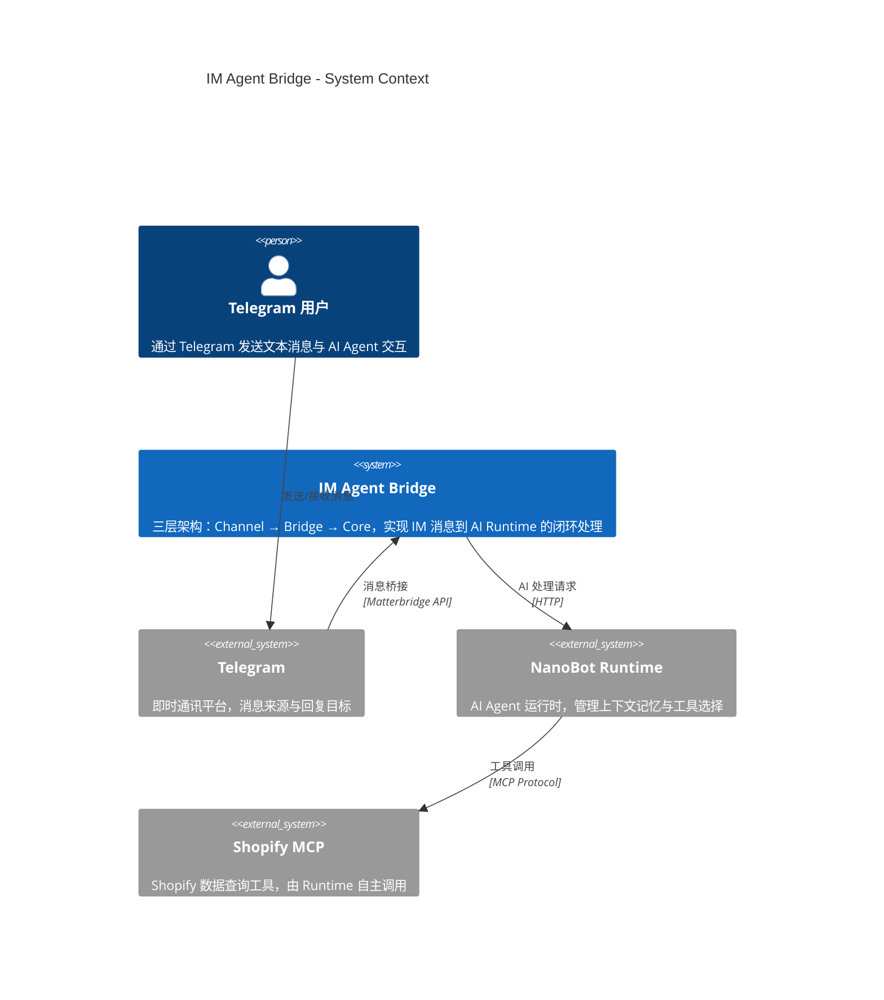
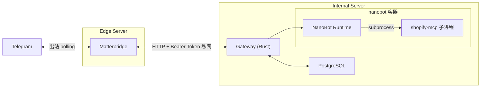

# 系统设计总览 (System Design)

> **Metadata**
> - **Source**: `.context/architecture/source/IM-Agent-Bridge-TAD.md`
> - **Generated At**: `2026-04-13 13:52`
> - **Generator**: `Context-Agent v1.0`

---

## 📌 系统概述

IM Agent Bridge 是一个多 IM AI 接入骨架系统，通过三层架构（Channel → Bridge → Core）将 Telegram 文本消息接入 AI Agent Runtime（NanoBot），支持 Shopify MCP 工具调用，并通过 PostgreSQL 持久化会话、配置与消息状态，实现"消息进 → AI 处理 → 回复出"的完整闭环。

---

## 🎯 质量目标

| 质量属性 | 目标描述 | 量化指标 |
|---------|---------|---------|
| **性能** | 正常场景端到端响应快速 | P95 ≤ 5s |
| **容错性** | 极端场景兜底超时 | Hard Timeout ≤ 15s |
| **可靠性** | DB 不可用时短路熄断，宁可报错不可错乱 | 无数据不一致写入 |
| **安全性** | Bridge ↔ Gateway 内网隐秘通信 | HTTP + Bearer Token（私有网络，MVP）；生产建议升级 HTTPS |
| **可替换性** | Runtime 可替换，不依赖具体实现 | Gateway ↔ Runtime 独立 HTTP 接口 |

---

## 🗺️ 系统上下文 (C4 Level 1)

---

## 🏗️ 核心组件

| 组件 | 层级 | 职责 | 技术栈 |
|------|------|------|--------|
| **Telegram** | Channel Layer | 消息入口与出口，不含业务逻辑 | Telegram Bot API |
| **Matterbridge** | Bridge Layer | Telegram ↔ Gateway 桥接，暴露 API/stream 供 Gateway 轮询 | Matterbridge (Go) |
| **Gateway** | Core Layer | 消息标准化、session 管理、Bot/Channel 解析、Runtime 调用、回写控制、持久化 | Rust |
| **Runtime Adapter** | Core Layer (内部模块) | Gateway 内部模块，协议适配、超长文本截断（4096 字符） | Rust (Gateway 内) |
| **NanoBot** | Core Layer | AI Agent Runtime，管理上下文记忆，基于 MEMORY.md 自主选择 MCP 工具 | NanoBot (Python) |
| **PostgreSQL** | Core Layer | 持久化 session/Bot 配置/Channel 绑定/消息状态/运行时日志 | PostgreSQL |

---

## 💾 数据存储

| 存储类型 | 用途 | 技术选型 | 一致性模型 |
|---------|------|---------|-----------|
| **主数据库** | session 映射、Bot 配置、Channel 绑定、消息事件、运行时日志 | PostgreSQL | 强一致性 |
| **NanoBot 本地存储** | 会话历史 JSONL 文件（按 `state` 索引） | 本地磁盘 (`~/.local/state/nano-bots/`) | 本地一致 |

> MVP 阶段不使用缓存、消息队列或对象存储。

---

## 🔗 关键接口/集成点

| 接口 | 方向 | 协议 | 用途 |
|------|------|------|------|
| `GET {BRIDGE_URL}/api/messages` | Gateway → Matterbridge | HTTP（私有网络） | 轮询 Matterbridge 消息缓冲区 |
| `POST /gateway/inbound` | Gateway 内部适配器 → Gateway | HTTP + Bearer Token（本机） | 入站消息标准化入口 |
| `POST {BRIDGE_URL}/api/message` | Gateway → Matterbridge | HTTP + Bearer Token（私有网络） | 回写消息到 Telegram（wire；SSoT 契约为 `POST /bridge/reply`） |
| `bots.runtime_endpoint` | Gateway → Runtime (via RuntimeAdapter) | HTTP (内网) | AI 处理请求（按 `runtime_type` 分发到对应 Adapter） |
| subprocess stdio | NanoBot → shopify-mcp 子进程 | subprocess (stdio/npx) | Shopify 数据查询（nanobot 容器内部） |

---

## ⚡ NFR/SLO 指标

| 指标类型 | 指标名 | 目标值 | 说明 |
|---------|--------|--------|------|
| **端到端延迟** | P95 响应时间 | ≤ 5s | 正常场景目标 |
| **硬超时** | Gateway → Runtime | ≤ 15s | 极端场景兜底 |
| **MCP 超时** | Runtime → MCP | ≤ 10s | 嵌套在 Runtime 15s 内 |
| **消息长度** | 输入/输出文本 | ≤ 4096 字符 | Telegram 单条消息上限 |
| **限流** | Gateway 入站 | 5 msg/sec/chat_id | Token Bucket 算法 |
| **回写重试** | 回写失败重试 | 最多 3 次 | 指数退避 1s/2s/4s |

---

## 🚀 部署拓扑

> 多服务器部署：Matterbridge 在 Edge Server，Gateway / NanoBot / PostgreSQL / Shopify MCP 在 Internal Server。两台服务器通过私有网络（VPN / 云 VPC）互联。Bridge API 不暴露到公网。

---

## 🔗 外部依赖

| 依赖系统 | 用途 | 协议 | 可用性要求 |
|---------|------|------|-----------|
| **Telegram** | 消息来源与回复目标 | Telegram Bot API | 依赖 Telegram 服务可用性 |
| **NanoBot Runtime** | AI Agent 推理与工具调用 | HTTP | 不可用时返回错误提示 |
| **Shopify MCP** | Shopify 数据查询工具 | MCP Protocol | 不可用时返回"工具暂不可用" |

---

## 📊 关键运行时场景

| 场景 | 描述 | 详见 |
|------|------|------|
| **消息接入主链路** | 用户发消息 → Matterbridge 收到 → Gateway poller 拉流并标准化 → Runtime 处理 → 回写 | `runtime_view.md` 场景 1 |
| **Runtime 异常** | Runtime 超时/失败 → 统一错误回写 | `runtime_view.md` 场景 2 |
| **MCP 调用失败** | MCP 不可达 → Runtime 返回工具失败 → 标准错误回复 | `runtime_view.md` 场景 3 |
| **回写失败** | Gateway 回写 Matterbridge 失败 → 重试 3 次 → 标记 reply_failed | `runtime_view.md` 场景 4 |
| **DB 不可用** | PostgreSQL 不可用 → 短路熄断 → 503 | `runtime_view.md` 场景 5 |

---

## AI 引用指南

当 AI 生成架构相关代码时：
1. 严格遵循三层架构边界：Channel 不含业务 → Bridge 只负责桥接 → Core 负责全部业务逻辑
2. Gateway 是 Core 唯一入口，Runtime 不直接对接 Bridge/Telegram
3. Runtime Adapter 是 Gateway 内部模块，不独立部署
4. 遵循 NFR/SLO 指标约束（P95 ≤ 5s，hard timeout 15s，限流 5 msg/sec/chat_id）
5. DB 不可用时必须短路熄断，禁止无 DB 继续处理
