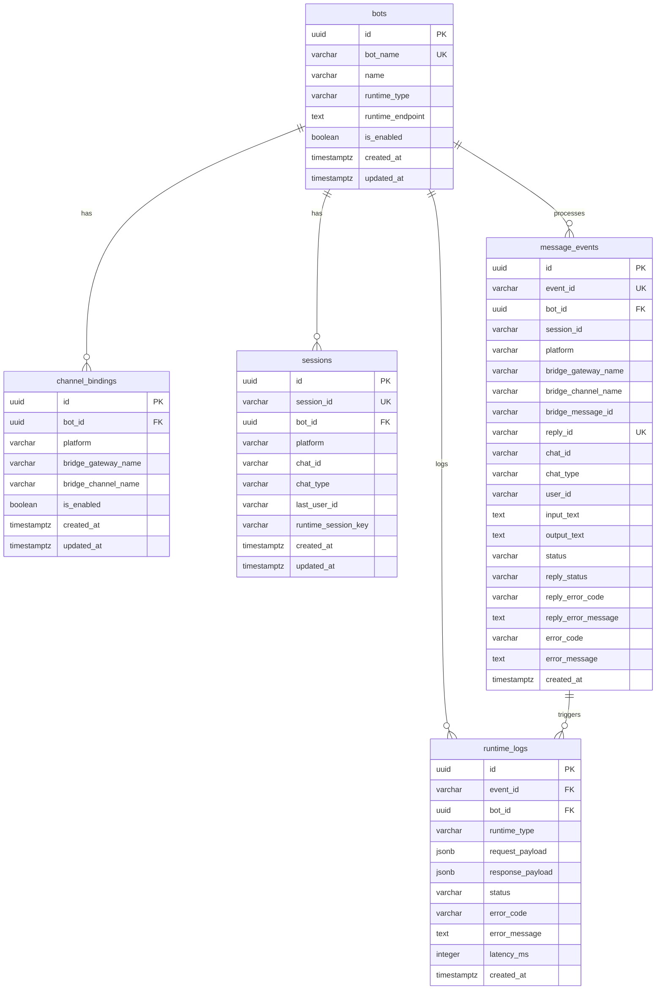

# Schema 设计规范 — IM Agent Bridge

> **Metadata**
> - **Source**: `.context/db/source/IM-Agent-Bridge-TAD.md` (§7, §8)
> - **Generated At**: `2026-04-13 18:17`
> - **Generator**: `Context-Agent v1.0`

---

## 🔑 主键策略

| 场景 | 方案 | 说明 |
|------|------|------|
| 所有核心表 | **UUID** | TAD 原文使用 `id UUID PRIMARY KEY`；全局唯一、去中心化生成 |
| 生成方式 | 应用层生成（Rust `uuid` crate） | Gateway 启动时生成，不依赖 DB 序列 |

> ⚠️ TAD 未指定 UUIDv7；后续若需优化 B-Tree 性能可迁移至 UUIDv7（时间顺序性更好，减少页面分裂）。

---

## 📊 核心实体 ER 图



---

## 📋 表设计规范

### 命名约定

| 元素 | 规范 | 示例 |
|------|------|------|
| 表名 | 小写复数，snake_case | `bots`, `channel_bindings`, `message_events` |
| 列名 | 小写，snake_case | `bot_id`, `created_at`, `runtime_type` |
| 主键 | `id UUID` | 所有表均使用 UUID 主键 |
| 外键 | `{表名单数}_id` | `bot_id → bots(id)` |
| 时间戳 | `{action}_at` | `created_at`, `updated_at` |
| 布尔 | `is_{state}` | `is_enabled` |

### 字段类型指南

| 数据类型 | PostgreSQL 类型 | 本项目使用 |
|---------|----------------|-----------|
| 主键 | `UUID` | 所有表 `id` |
| 文本标识 | `VARCHAR(n)` | `session_id(256)`, `event_id(128)` 等 |
| 状态枚举 | `VARCHAR(32)` | `status`, `chat_type`, `runtime_type` |
| 任意文本 | `TEXT` | `runtime_endpoint`, `error_message` |
| JSON Payload | `JSONB` | `request_payload`, `response_payload` |
| 时间戳 | `TIMESTAMPTZ` | 所有时间字段 |
| 布尔 | `BOOLEAN NOT NULL DEFAULT TRUE` | `is_enabled` |
| 延迟 | `INTEGER` | `latency_ms`（毫秒） |

### 表设计详情

#### `bots` — Bot 基础配置

| 列名 | 类型 | 约束 | 说明 |
|------|------|------|------|
| `id` | UUID | PK | Bot 全局唯一 ID（接口与 DB 中作为 `bot_id` 传递） |
| `bot_name` | VARCHAR(64) | UNIQUE NOT NULL | 人类可读标识符（日志/配置展示用） |
| `name` | VARCHAR(128) | NOT NULL | 显示名称 |
| `runtime_type` | VARCHAR(32) | NOT NULL | 如 `nanobot`，用于 RuntimeAdapter 路由分发 |
| `runtime_endpoint` | TEXT | NOT NULL | Runtime HTTP 接口地址 |
| `runtime_model` | TEXT | NOT NULL DEFAULT `'nanobot'` | Runtime 模型标识（用于适配器请求） |
| `telegram_username` | TEXT | NULL | Telegram bot username（mention 过滤使用，不含 `@`） |
| `require_mention` | BOOLEAN | NOT NULL DEFAULT FALSE | 群聊是否必须显式 mention 才进入主链路 |
| `is_enabled` | BOOLEAN | NOT NULL DEFAULT TRUE | 软禁用 |
| `created_at` | TIMESTAMPTZ | NOT NULL DEFAULT NOW() | - |
| `updated_at` | TIMESTAMPTZ | NOT NULL DEFAULT NOW() | - |

#### `channel_bindings` — Bot ↔ 渠道入口绑定

| 列名 | 类型 | 约束 | 说明 |
|------|------|------|------|
| `id` | UUID | PK | - |
| `bot_id` | UUID | NOT NULL REFERENCES bots(id) | 关联 Bot |
| `platform` | VARCHAR(32) | NOT NULL | 如 `telegram` |
| `bridge_gateway_name` | VARCHAR(128) | NOT NULL | Matterbridge gateway 名称 |
| `bridge_channel_name` | VARCHAR(128) | - | Matterbridge channel 名称（可 NULL） |
| `is_enabled` | BOOLEAN | NOT NULL DEFAULT TRUE | - |
| `created_at` / `updated_at` | TIMESTAMPTZ | NOT NULL DEFAULT NOW() | - |

> **bot_id 解析逻辑（TAD §6.1.1）**：Gateway 按 `platform + bridge_gateway_name + bridge_channel_name` 查此表解析 `bot_id`；降级策略：`channel_name` 为空时退化为 `platform + bridge_gateway_name` 匹配；仍无匹配则拒绝请求并记录绑定缺失错误。
>
> **运维规则**：`matterbridge.toml` 每新增一个 `[[gateway]] name` 必须在此表同步新增一条对应记录（`bridge_gateway_name = gateway.name`），指向目标 `bot_id`。缺少记录将导致该 gateway 下所有入站消息被拒绝（404 找不到绑定）。

#### `sessions` — Session 映射

| 列名 | 类型 | 约束 | 说明 |
|------|------|------|------|
| `id` | UUID | PK | - |
| `session_id` | VARCHAR(256) | UNIQUE NOT NULL | 格式：`telegram:private:{chat_id}` / `telegram:group:{chat_id}` |
| `bot_id` | UUID | NOT NULL REFERENCES bots(id) | - |
| `platform` | VARCHAR(32) | NOT NULL | - |
| `chat_id` | VARCHAR(128) | NOT NULL | - |
| `chat_type` | VARCHAR(32) | NOT NULL | `private` / `group` |
| `last_user_id` | VARCHAR(128) | - | 最近一次发言用户 |
| `runtime_session_key` | VARCHAR(256) | - | NanoBot 特化：直接等于 `session_id` |
| `created_at` / `updated_at` | TIMESTAMPTZ | NOT NULL DEFAULT NOW() | - |

> **`runtime_session_key` 生命周期（TAD §7.3.1）**：首次消息时创建并写入；每次处理更新 `updated_at`；Runtime 返回 `RUNTIME_SESSION_NOT_FOUND` 时清空并重建；PostgreSQL 不可用时短路熔断，不得继续处理。

#### `message_events` — 消息事件 / 处理 / 回写状态

| 列名 | 类型 | 约束 | 说明 |
|------|------|------|------|
| `id` | UUID | PK | - |
| `event_id` | VARCHAR(128) | UNIQUE NOT NULL | 入站事件内部 ID |
| `bot_id` | UUID | NOT NULL REFERENCES bots(id) | - |
| `session_id` | VARCHAR(256) | NOT NULL | - |
| `platform` | VARCHAR(32) | NOT NULL | - |
| `bridge_gateway_name` | VARCHAR(128) | NOT NULL | - |
| `bridge_channel_name` | VARCHAR(128) | - | - |
| `bridge_message_id` | VARCHAR(128) | NOT NULL | 平台原始消息 ID（入站协议字段 `raw_message.message_id` 的持久化名称，幂等键之一） |
| `reply_id` | VARCHAR(128) | UNIQUE NOT NULL | Gateway 生成，回写幂等键 |
| `chat_id` | VARCHAR(128) | NOT NULL | - |
| `chat_type` | VARCHAR(32) | NOT NULL | `private` / `group` |
| `user_id` | VARCHAR(128) | - | 消息发送用户 ID |
| `input_text` | TEXT | - | **截断至 512 字符** |
| `output_text` | TEXT | - | **截断至 512 字符** |
| `status` | VARCHAR(32) | NOT NULL | 处理状态枚举：`pending` \| `processing` \| `done` \| `error` |
| `reply_status` | VARCHAR(32) | - | 回写状态枚举：`success` \| `reply_failed` |
| `reply_error_code` | VARCHAR(64) | - | - |
| `reply_error_message` | TEXT | - | - |
| `error_code` | VARCHAR(64) | - | - |
| `error_message` | TEXT | - | - |
| `created_at` | TIMESTAMPTZ | NOT NULL DEFAULT NOW() | **无 updated_at**，事件不可变 |

> **数据治理（TAD §10.5）**：`input_text` / `output_text` 落库前截断至 512 字符。保留期 **30 天**，过期后自动清理。

#### `runtime_logs` — Runtime 调用日志 / 错误索引

| 列名 | 类型 | 约束 | 说明 |
|------|------|------|------|
| `id` | UUID | PK | - |
| `event_id` | VARCHAR(128) | NOT NULL REFERENCES message_events(event_id) | - |
| `bot_id` | UUID | NOT NULL REFERENCES bots(id) | - |
| `runtime_type` | VARCHAR(32) | NOT NULL | 如 `nanobot` |
| `request_payload` | JSONB | - | **仅 status=error 时写入，且脱敏 PII** |
| `response_payload` | JSONB | - | **仅 status=error 时写入，且脱敏 PII** |
| `status` | VARCHAR(32) | NOT NULL | Runtime 调用结果枚举：`success` \| `error`（`error` 时写入 payload，且必须脱敏 PII） |
| `error_code` | VARCHAR(64) | - | 见 `error_code` 枚举（TAD §9.2）；仅 `status=error` 时有值 |
| `error_message` | TEXT | - | - |
| `latency_ms` | INTEGER | - | Runtime 调用耗时（毫秒） |
| `created_at` | TIMESTAMPTZ | NOT NULL DEFAULT NOW() | - |

> **数据治理（TAD §10.5）**：Payload 仅 error 时写入，写入前必须移除 `user_id`、原文消息等 PII 字段。保留期 **14 天**。

---

## 🔍 索引策略

### 完整索引清单

| 索引名 | 表 | 列 | 类型 | 用途 |
|--------|----|----|------|------|
| `idx_sessions_bot_platform_chat` | sessions | `(bot_id, platform, chat_id)` | B-Tree | 高频：session 查找 |
| `uq_message_events_inbound_dedup` | message_events | `(platform, bridge_gateway_name, COALESCE(bridge_channel_name,''), bridge_message_id)` | UNIQUE B-Tree | 入站幂等去重 |
| `uq_message_events_reply_id` | message_events | `(reply_id)` | UNIQUE B-Tree | 回写幂等 |
| `idx_message_events_session_created` | message_events | `(session_id, created_at)` | B-Tree | 按 session 时间排序 |
| `idx_message_events_created_at` | message_events | `(created_at)` | B-Tree | 30 天保留期清理（按时间范围批量删除） |
| `idx_message_events_bot` | message_events | `(bot_id)` | B-Tree | 按 bot 查询 |
| `idx_channel_bindings_lookup` | channel_bindings | `(platform, bridge_gateway_name, COALESCE(bridge_channel_name,''))` | B-Tree | **主查询路径**：解析 bot_id（TAD §6.1.1）⚠️ §8.3 未列出，见实现决策记录；列集与 `uq_channel_bindings_source` 重叠，其唯一性由 UNIQUE 索引保障 |
| `idx_channel_bindings_bot_platform` | channel_bindings | `(bot_id, platform)` | B-Tree | 反向查询（按 bot 查其渠道） |
| `idx_runtime_logs_event` | runtime_logs | `(event_id)` | B-Tree | 关联事件查询 |
| `idx_runtime_logs_bot_created` | runtime_logs | `(bot_id, created_at)` | B-Tree | 按 bot + 时间查询 |
| `idx_runtime_logs_created_at` | runtime_logs | `(created_at)` | B-Tree | 14 天保留期清理（按时间范围批量删除） |
| `uq_channel_bindings_source` | channel_bindings | `(platform, bridge_gateway_name, COALESCE(bridge_channel_name,''))` | UNIQUE B-Tree | 渠道来源唯一，防止 bot_id 解析歧义（`00002_channel_bindings_unique.sql`） |

### 幂等索引说明

```sql
-- 入站幂等：NULL bridge_channel_name 视为空字符串统一参与去重
CREATE UNIQUE INDEX uq_message_events_inbound_dedup
    ON message_events (platform, bridge_gateway_name, COALESCE(bridge_channel_name, ''), bridge_message_id);

-- 回写幂等：reply_id 由 Gateway 生成，全局唯一
CREATE UNIQUE INDEX uq_message_events_reply_id ON message_events (reply_id);
```

---

## 📦 分区策略

`message_events`（30 天）和 `runtime_logs`（14 天）有明确保留期，**推荐使用 RANGE 分区 + pg_partman** 实现自动清理：

```sql
-- message_events 按天分区（可选，MVP 阶段按需启用）
CREATE TABLE message_events (...) PARTITION BY RANGE (created_at);

SELECT partman.create_parent('public.message_events', 'created_at', 'native', 'daily');
UPDATE partman.part_config
SET retention = '30 days', retention_keep_table = false
WHERE parent_table = 'public.message_events';
```

> MVP 阶段可先用定时任务手工清理：`DELETE FROM message_events WHERE created_at < NOW() - INTERVAL '30 days'`

---

## 📄 JSONB 使用规范

`runtime_logs.request_payload` / `response_payload` 使用 JSONB：

| 场景 | 规范 |
|------|------|
| 写入条件 | 仅 `status = 'error'` 时写入，正常响应不落库 |
| PII 脱敏 | 写入前必须移除 `user_id`、原文消息内容等敏感字段（TAD §10.5） |
| 索引 | 不做 GIN 索引（错误日志不用于 JSON 内容检索） |

---

## ⚠️ 约束规则

| 约束类型 | 表 | 说明 |
|---------|----|----|
| PRIMARY KEY | 全部 | `id UUID` |
| UNIQUE | bots | `bot_name` |
| UNIQUE | channel_bindings | `(platform, bridge_gateway_name, COALESCE(bridge_channel_name,''))` — 同一渠道来源全局唯一，确保来源三元组解析无歧义（DB 实现：`00002_channel_bindings_unique.sql`） |
| UNIQUE | sessions | `session_id` |
| UNIQUE | message_events | `event_id`, `reply_id` |
| FK | channel_bindings | `bot_id → bots(id)` |
| FK | sessions | `bot_id → bots(id)` |
| FK | message_events | `bot_id → bots(id)` |
| FK | runtime_logs | `bot_id → bots(id)`, `event_id → message_events(event_id)` |

---

## AI 引用指南

当 AI 生成数据库相关代码时：
1. 主键使用 UUID（应用层生成，不依赖 DB 序列）
2. `bot_id` 必须通过 `channel_bindings` 表查找解析，不接受外部直接传入
3. 入站幂等键：`(platform, bridge_gateway_name, COALESCE(bridge_channel_name,''), bridge_message_id)`
4. 回写幂等键：`reply_id`（Gateway 生成）
5. `input_text` / `output_text` 落库前截断至 512 字符
6. `runtime_logs` payload 仅 error 时写入，且必须脱敏 PII
