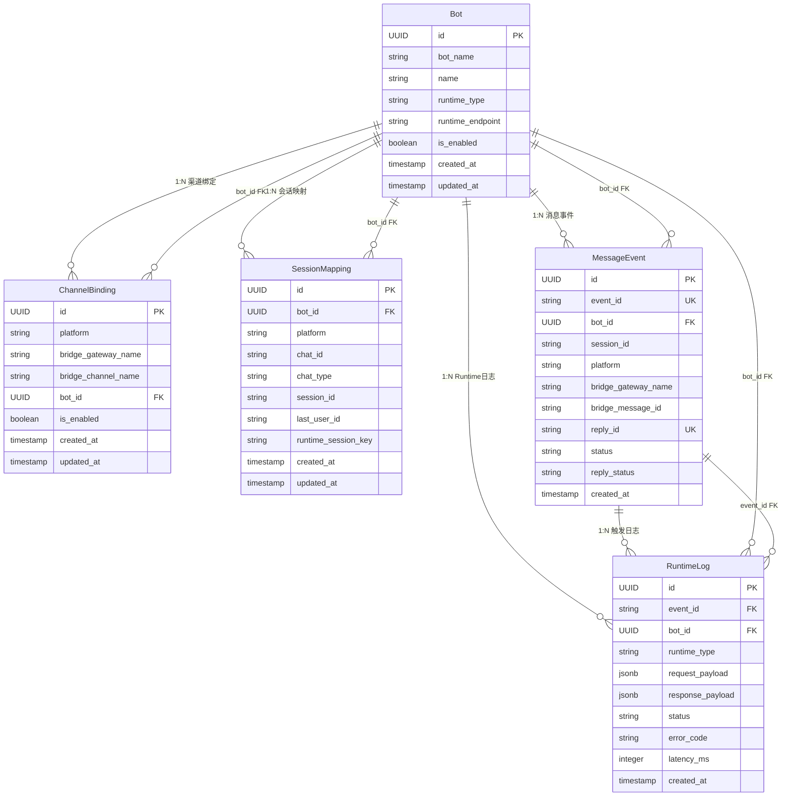

# 领域数据模型 (Domain Data Model)

> **Metadata**
> - **Source**: `.context/domain/source/IM-Agent-Bridge-PRD.md`
> - **Generated At**: `2026-04-13 13:40`
> - **Generator**: `Context-Agent v1.0`

---

## 目的

定义 IM Agent Bridge 系统中的核心领域对象、字段、约束和关系，作为数据库 Schema 设计、API 接口定义和代码实现的参考基准。

> ⚠️ **本文件为领域模型定义**，是数据库 Schema（SSoT/schema/migrations/）和 API 合约（SSoT/api/main.tsp）的设计输入，不替代 SSoT。

---

## 1. StandardMessage（入站标准消息对象）

> 来源：PRD §3.3.2, BR-004

Gateway 将 Bridge 层的原始消息标准化后生成此对象，作为 Runtime 调用的统一输入。

| 字段 | 类型 | 约束 | 说明 |
|------|------|------|------|
| `event_id` | `string (UUID)` | REQUIRED, UNIQUE | 消息事件唯一标识，由 Gateway 生成 |
| `platform` | `string` | REQUIRED | 渠道平台标识（MVP: `"telegram"`） |
| `chat_id` | `string` | REQUIRED | 渠道会话容器标识，用于来源识别与消息回写 |
| `chat_type` | `string (enum)` | REQUIRED, `"private"` \| `"group"` | 会话类型 |
| `user_id` | `string` | REQUIRED | 发送消息的用户标识 |
| `session_id` | `string` | REQUIRED | 上下文归属唯一标识（由 Gateway 生成） |
| `text` | `string` | REQUIRED, max 4096 chars | 消息文本内容（超长消息在此前已被拒绝） |
| `timestamp` | `string (ISO 8601)` | REQUIRED | 消息时间戳 |
| `bot_id` | `string (UUID)` | REQUIRED | Bot 实例标识（由 Gateway 查询 `channel_bindings` 解析） |

### 约束规则

- `bot_id` 不由外部请求直接传入，必须由 Gateway 通过 `channel_bindings` 解析
- `text` 长度超过 4096 字符的消息在标准化前即被拒绝（BR-002）

---

## 2. ChannelBinding（渠道绑定配置）

> 来源：PRD §3.3.2 (L230), BR-004

定义渠道来源标识到 `bot_id` 的映射关系，Gateway 用此表将入站消息关联到正确的 Bot 实例。对应 DB 表：`channel_bindings`。

| 字段 | 类型 | 约束 | 说明 |
|------|------|------|------|
| `id` | `UUID` | PK | 记录主键 |
| `platform` | `string` | REQUIRED, 联合唯一 | 渠道平台（如 `"telegram"`） |
| `bridge_gateway_name` | `string` | REQUIRED, 联合唯一 | Bridge 网关名称 |
| `bridge_channel_name` | `string` | NULLABLE, 联合唯一 | Bridge 渠道名称（可为 NULL，幂等查询使用 COALESCE 处理） |
| `bot_id` | `UUID` | REQUIRED, FK → Bot.id | 关联的 Bot 实例 |
| `is_enabled` | `boolean` | REQUIRED, DEFAULT true | 是否启用（禁用时拒绝处理该渠道的入站消息） |
| `created_at` | `timestamp` | REQUIRED, DEFAULT NOW | 创建时间 |
| `updated_at` | `timestamp` | REQUIRED, DEFAULT NOW | 更新时间 |

### 唯一约束

- `UNIQUE (platform, bridge_gateway_name, COALESCE(bridge_channel_name,''))` — 同一渠道来源全局只能绑定一个 Bot，确保 bot_id 解析无歧义（DB 实现：`00002_channel_bindings_unique.sql`）

### 解析逻辑

```
INPUT: 入站消息的 platform + bridge_gateway_name + bridge_channel_name
QUERY: SELECT bot_id FROM channel_bindings WHERE platform = ? AND bridge_gateway_name = ? AND bridge_channel_name = ?
OUTPUT: bot_id
IF NOT FOUND → 拒绝处理该消息，记录警告日志
```

---

## 3. Bot（Bot 实例配置）

> 来源：PRD §3.6.1, §4.1, BR-032, BR-040

存储每个 Bot 实例的配置信息，通过 `bot_id` 实现逻辑隔离。对应 DB 表：`bots`。

| 字段 | 类型 | 约束 | 说明 |
|------|------|------|------|
| `id` | `UUID` | PK | Bot 实例唯一标识（即 `bot_id`） |
| `bot_name` | `string (VARCHAR 64)` | REQUIRED, UNIQUE | Bot 唯一标识名（机器可读，如 `"my-shop-bot"`） |
| `name` | `string (VARCHAR 128)` | REQUIRED | Bot 名称（人类可读） |
| `runtime_type` | `string (VARCHAR 32)` | REQUIRED | Runtime 类型（当前 MVP 仅支持 `"nanobot"`） |
| `runtime_endpoint` | `string` | REQUIRED | Runtime 适配层调用地址 |
| `runtime_model` | `string` | REQUIRED, DEFAULT `"nanobot"` | Runtime 请求模型标识（如 NanoBot `model` 字段） |
| `telegram_username` | `string` | NULLABLE | Telegram bot username（不含 `@`，用于群聊 mention 过滤） |
| `require_mention` | `boolean` | REQUIRED, DEFAULT false | 是否要求群聊消息显式 `@{telegram_username}` 才进入主链路 |
| `is_enabled` | `boolean` | REQUIRED, DEFAULT true | 是否启用（禁用时拒绝处理该 Bot 的入站消息） |
| `created_at` | `timestamp` | REQUIRED, DEFAULT NOW | 创建时间 |
| `updated_at` | `timestamp` | REQUIRED, DEFAULT NOW | 更新时间 |

### 隔离规则

- 所有 Bot 实例共享同一 PostgreSQL 实例
- 查询时必须携带 `bot_id`（即 `id`）作为过滤条件，确保逻辑隔离（BR-032）
- 未启用 Bot（`is_enabled = false`）的入站消息应被拒绝处理

---

## 4. SessionMapping（Session 映射关系）

> 来源：PRD §3.6.1, BR-010, BR-011, BR-040, BR-042

记录 `chat_id` 到 `session_id` 的映射关系，用于 Session 持久化与查询。

| 字段 | 类型 | 约束 | 说明 |
|------|------|------|------|
| `id` | `UUID` | PK | 记录主键 |
| `bot_id` | `UUID` | REQUIRED, FK → Bot.id | 所属 Bot 实例 |
| `platform` | `string` | REQUIRED | 渠道平台 |
| `chat_id` | `string` | REQUIRED | 渠道会话容器标识 |
| `chat_type` | `string (enum)` | REQUIRED, `"private"` \| `"group"` | 会话类型 |
| `session_id` | `string (VARCHAR 256)` | REQUIRED, UNIQUE | 上下文归属唯一标识 |
| `last_user_id` | `string (VARCHAR 128)` | NULLABLE | 最近一次发消息的用户标识（用于群聊场景追踪） |
| `runtime_session_key` | `string (VARCHAR 256)` | NULLABLE | Runtime 侧的会话 Key（由 Runtime 管理，用于上下文恢复） |
| `created_at` | `timestamp` | REQUIRED, DEFAULT NOW | 首次创建时间 |
| `updated_at` | `timestamp` | REQUIRED, DEFAULT NOW | 最后活跃时间（用于 30 天清理判断） |

### session_id 生成规则

| chat_type | session_id 格式 | 说明 |
|-----------|----------------|------|
| `private` | `telegram:private:{chat_id}` | 私聊独立上下文 |
| `group` | `telegram:group:{chat_id}` | 群聊共享上下文 |

### 映射语义

```
chat_id + chat_type + platform + bot_id  →  session_id
session_id  →  传递给 Runtime 作为上下文归属标识
Runtime 内部根据 session_id 管理对话记忆（非本系统管辖）
```

### 数据生命周期

- 保留期：≤ 30 天（以 `updated_at` 为基准）
- 清理方式：`pg_cron` 定时任务或 Gateway 应用层定期删除（BR-042）
- 清理对象：`updated_at < NOW() - INTERVAL '30 days'` 的记录

---

## 5. MessageEvent（消息事件持久化记录）

> 来源：TAD §8.2, BR-042

Gateway 将每条入站消息的处理状态与回写状态持久化为此记录，用于幂等去重、状态追踪和排障。对应 DB 表：`message_events`。

| 字段 | 类型 | 约束 | 说明 |
|------|------|------|------|
| `id` | `UUID` | PK | 记录主键 |
| `event_id` | `string (VARCHAR 128)` | REQUIRED, UNIQUE | 消息事件唯一标识（对应 StandardMessage.event_id） |
| `bot_id` | `UUID` | REQUIRED, FK → Bot.id | 所属 Bot 实例 |
| `session_id` | `string (VARCHAR 256)` | REQUIRED | 上下文归属标识 |
| `platform` | `string (VARCHAR 32)` | REQUIRED | 渠道平台 |
| `bridge_gateway_name` | `string (VARCHAR 128)` | REQUIRED | Bridge 网关名称（幂等键之一） |
| `bridge_channel_name` | `string (VARCHAR 128)` | NULLABLE | Bridge 渠道名称（幂等键之一，NULL 时使用 `''` 参与计算） |
| `bridge_message_id` | `string (VARCHAR 128)` | REQUIRED | 平台原始消息 ID（幂等键之一） |
| `reply_id` | `string (VARCHAR 128)` | REQUIRED, UNIQUE | 回写幂等唯一标识，确保同一回复不重复写出 |
| `chat_id` | `string (VARCHAR 128)` | REQUIRED | 渠道会话容器标识 |
| `chat_type` | `string (VARCHAR 32)` | REQUIRED | 会话类型（`"private"` \| `"group"`） |
| `user_id` | `string (VARCHAR 128)` | NULLABLE | 发消息用户标识 |
| `input_text` | `text` | NULLABLE | 入站消息文本（截断至 512 字符后落库，仅用于排障，BR-070） |
| `output_text` | `text` | NULLABLE | 回复文本（截断至 512 字符后落库，仅用于排障，BR-070） |
| `status` | `string (VARCHAR 32)` | REQUIRED | 处理状态枚举：`pending` \| `processing` \| `done` \| `error` |
| `reply_status` | `string (VARCHAR 32)` | NULLABLE | 回写状态枚举：`success` \| `reply_failed` |
| `reply_error_code` | `string (VARCHAR 64)` | NULLABLE | 回写失败时的错误码 |
| `reply_error_message` | `text` | NULLABLE | 回写失败时的错误信息 |
| `error_code` | `string (VARCHAR 64)` | NULLABLE | 处理失败时的错误码（对应 cross_cutting_concepts.md 错误码枚举） |
| `error_message` | `text` | NULLABLE | 处理失败时的错误信息 |
| `created_at` | `timestamp` | REQUIRED, DEFAULT NOW | 记录创建时间 |

### 幂等约束

- **入站幂等键**（唯一索引）：`(platform, bridge_gateway_name, COALESCE(bridge_channel_name, ''), bridge_message_id)`
  — 同一来源同一消息只处理一次（BR-042，criterion.md MUST）
- **回写幂等键**（唯一索引）：`reply_id`
  — 同一回复只写出一次（criterion.md MUST）

### 数据生命周期

- `input_text` / `output_text` 落库前截断至 512 字符（BR-070，数据最小化）
- 保留期：30 天，到期后清理（BR-042）

---

## 6. StandardReply（标准回复对象）

> 来源：PRD §3.3.5, BR-003, BR-005

Gateway 将 Runtime 返回结果转换为此对象，用于回写到 Bridge Layer。

| 字段 | 类型 | 约束 | 说明 |
|------|------|------|------|
| `event_id` | `string (UUID)` | REQUIRED | 对应入站消息的 event_id |
| `session_id` | `string` | REQUIRED | 上下文归属标识 |
| `bot_id` | `string (UUID)` | REQUIRED | Bot 实例标识 |
| `text` | `string` | REQUIRED, max 4096 chars | 回复文本（超长时截断并附加截断提示） |
| `status` | `string (enum)` | REQUIRED | `"success"` \| `"error"` \| `"timeout"` |
| `error_message` | `string` | OPTIONAL | 错误场景下的用户可见提示文本 |
| `timestamp` | `string (ISO 8601)` | REQUIRED | 回复时间戳 |

### 约束规则

- `text` 超过 4096 字符时截断至 4096 并附加截断提示（BR-003）
- 仅输出文本，不输出按钮/卡片/图片/富媒体（BR-005）
- 所有错误场景统一转换为 `error_message`

---

## 7. RuntimeLog（Runtime 调用日志）

> 来源：TAD §8.2, BR-071

Gateway 将每次 Runtime 调用的输入、输出、延迟和错误信息持久化为此记录，用于错误追踪和排障。对应 DB 表：`runtime_logs`。

| 字段 | 类型 | 约束 | 说明 |
|------|------|------|------|
| `id` | `UUID` | PK | 记录主键 |
| `event_id` | `string (VARCHAR 128)` | REQUIRED, FK → MessageEvent.event_id | 关联的消息事件（也是分布式追踪的 `trace_id` 锚点） |
| `bot_id` | `UUID` | REQUIRED, FK → Bot.id | 所属 Bot 实例 |
| `runtime_type` | `string (VARCHAR 32)` | REQUIRED | Runtime 类型（当前 MVP 仅支持 `"nanobot"`） |
| `request_payload` | `JSONB` | NULLABLE | **仅 `status=error` 时写入，且必须脱敏 PII**（移除 user_id、原文消息等） |
| `response_payload` | `JSONB` | NULLABLE | **仅 `status=error` 时写入，且必须脱敏 PII** |
| `status` | `string (VARCHAR 32)` | REQUIRED | Runtime 调用结果枚举：`success` \| `error` |
| `error_code` | `string (VARCHAR 64)` | NULLABLE | 错误码（对应 cross_cutting_concepts.md 错误码枚举）；仅 `status=error` 时有值 |
| `error_message` | `text` | NULLABLE | 错误信息；仅 `status=error` 时有值 |
| `latency_ms` | `integer` | NULLABLE | Runtime 调用耗时（毫秒） |
| `created_at` | `timestamp` | REQUIRED, DEFAULT NOW | 记录创建时间 |

### 安全与隐私约束

- `request_payload` / `response_payload` **仅 `status=error` 时写入**，顺序流不写入 Payload（BR-071，数据最小化）
- 写入前必须脱敏：移除 `user_id`、原始消息文本等 PII 字段
- 保留期：**14 天**，到期后清理（BR-042）
- `event_id` 可作为分布式追踪的关联标识，将 `runtime_logs` 与 `message_events` 连接

---

## 实体关系图



---

## 数据流入/流出点

| 数据对象 | 写入方 | 读取方 | 持久化 |
|---------|--------|--------|--------|
| `ChannelBinding` | 系统开发者（配置阶段） | Gateway（消息标准化时查询 bot_id） | PostgreSQL |
| `Bot` | 系统开发者（配置阶段） | Gateway（加载 Bot 配置） | PostgreSQL |
| `MessageEvent` | Gateway（消息处理时写入） | Gateway（幂等检查、状态更新） | PostgreSQL |
| `RuntimeLog` | Gateway（Runtime 调用完成后写入） | Gateway（错误排障、延迟监控） | PostgreSQL |
| `SessionMapping` | Gateway（消息处理时创建/更新） | Gateway（查询 session_id） | PostgreSQL |
| `StandardMessage` | Gateway（运行时生成） | Runtime 适配层 | 内存（不持久化） |
| `StandardReply` | Runtime 适配层 | Gateway → Bridge | 内存（不持久化） |
