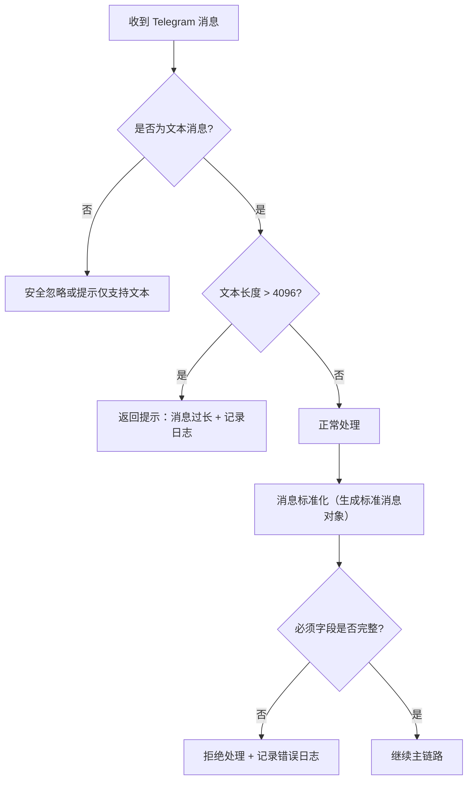
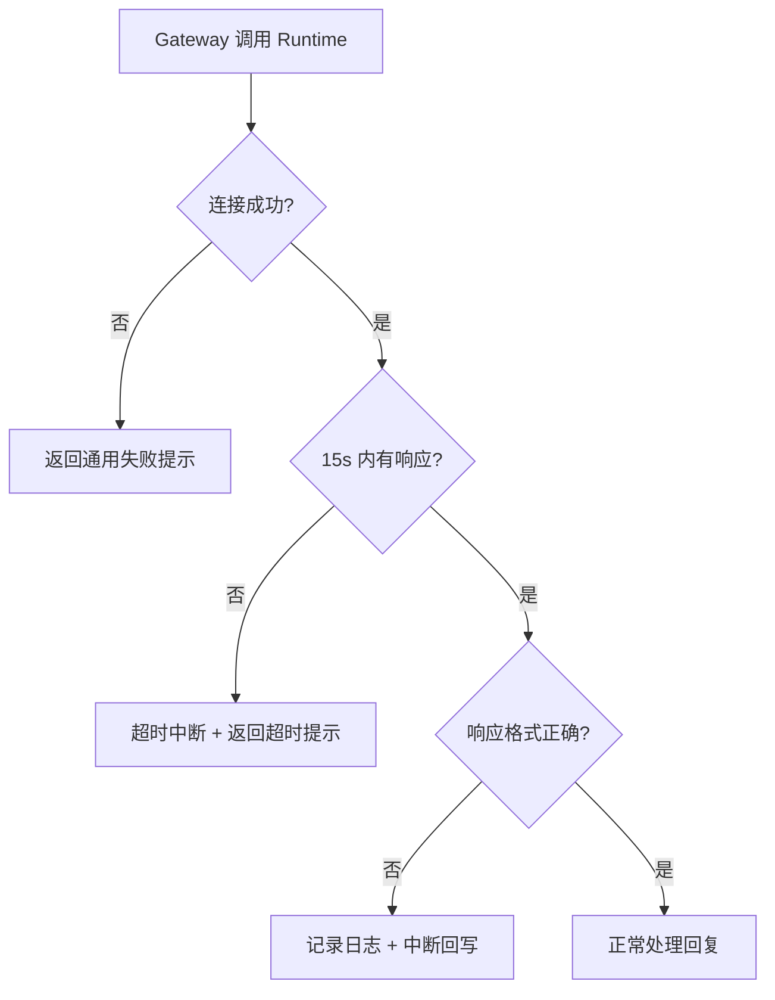
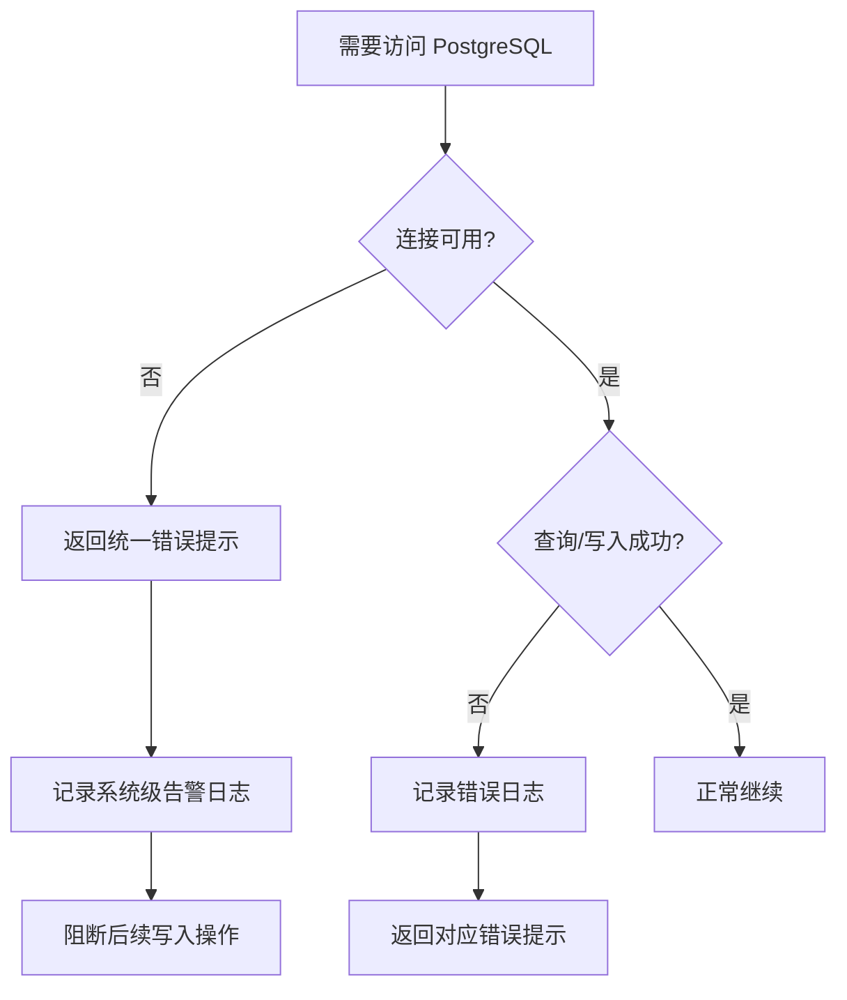

# 异常与边缘情况处理 (Edge Cases & Exception Handling)

> **Metadata**
> - **Source**: `.context/domain/source/IM-Agent-Bridge-PRD.md`
> - **Generated At**: `2026-04-12 23:38`
> - **Generator**: `Context-Agent v1.0`

---

## 1. 消息处理边缘情况

| 异常类型 | 场景 | 处理方式 | BR 引用 |
|---------|------|----------|---------|
| **非文本消息** | 用户发送图片/音频/视频/贴纸/文件 | 不进入主处理链路；提示当前仅支持文本或安全忽略 | BR-001 |
| **入站消息超长** | 文本消息 > 4096 字符 | 不进入主处理链路；返回提示（如"消息过长，请缩短后重试"），记录日志 | BR-002 |
| **回复消息超长** | Runtime 生成回复 > 4096 字符 | 截断至 4096 字符并附加截断提示 | BR-003 |
| **空消息** | 用户发送空文本或仅含空白字符 | 不进入主处理链路，安全忽略 | BR-001 |
| **标准消息字段缺失** | 标准化后缺少必须字段 | 拒绝处理，记录错误日志 | BR-004 |
| **群聊无 @mention** | `chat_type=group` 且 Bot 开启 `require_mention=true`，消息未命中 `@{telegram_username}` | 返回 HTTP 200 + `{"status":"ignored_no_mention"}`，不写 `message_events`、不调用 Runtime、不回写 Bridge | BR-032 |

### 消息处理流程

---

## 2. Session 管理边缘情况

| 异常类型 | 场景 | 处理方式 | BR 引用 |
|---------|------|----------|---------|
| **上下文丢失** | Runtime 侧上下文数据缺失 | 退化为无上下文单轮处理 | BR-014 |
| **群聊语义混淆** | 多人在同一群聊提问导致上下文交叉 | MVP 阶段接受此限制，群聊共享上下文 | BR-013 |
| **跨场景污染** | 同一用户在群聊和私聊分别提问 | 必须视为两个独立 session_id，互不污染 | BR-012 |
| **Session 持久化失败** | PostgreSQL 写入 session 映射失败 | 返回统一错误提示，不允许在失效状态继续写入 | BR-041 |
| **Session 查询延迟** | DB 查询 session 超时 | 视为 DB 不可用，走 BR-041 流程 | BR-041 |

---

## 3. Runtime 异常处理

| 异常类型 | 场景 | 处理方式 | BR 引用 |
|---------|------|----------|---------|
| **Runtime 无响应** | 调用超过 15s 无返回 | 超时中断，返回通用失败提示 | BR-051, BR-060 |
| **Runtime 格式异常** | 返回非标准格式数据 | 记录日志并中断回写，不向用户发送异常数据 | BR-060 |
| **Runtime 服务不可用** | 进程崩溃或连接被拒绝 | 返回明确错误提示（如"系统处理异常，请稍后重试"） | BR-060 |
| **Runtime 接口不兼容** | 适配层版本不匹配 | 在适配层解决，不向 Bridge 外溢 | BR-022 |

### Runtime 异常处理流程

---

## 4. MCP 工具调用异常

| 异常类型 | 场景 | 处理方式 | BR 引用 |
|---------|------|----------|---------|
| **MCP 不可达** | Shopify MCP 服务宕机或网络不通 | 返回"工具暂不可用" | BR-061 |
| **MCP 执行失败** | Shopify API 返回错误（权限、参数等） | 返回用户可理解的失败信息 | BR-061 |
| **MCP 调用超时** | 单次工具调用超过 10s | 超时中断（嵌套在 Runtime 15s 超时内） | BR-052 |
| **MCP 实例配置缺失** | MEMORY.md 未声明或 .env 凭证缺失 | 启动时检测并告警，运行时返回工具不可用 | BR-033 |

---

## 5. 数据库异常

| 异常类型 | 场景 | 处理方式 | BR 引用 |
|---------|------|----------|---------|
| **PostgreSQL 不可达** | 连接池耗尽或服务宿机 | **HTTP 503 短路返回（不继续处理任何业务请求）**，向用户返回“系统暂时不可用，请稍后重试”，记录系统级告警 | BR-041 |
| **持久化写入失败** | Session 或配置写入失败 | 不允许继续写入不一致会话，返回统一错误 | BR-041 |
| **Bot 配置读取失败** | Gateway 从 PostgreSQL 查询 bot_id 失败 | 视为 Bot 不可用，返回错误提示 | BR-040 |
| **channel_bindings 解析失败** | 渠道来源无法匹配到 bot_id | 拒绝处理该消息，记录警告日志 | BR-004 |

### 数据库异常处理流程

---

## 6. 回写异常

| 异常类型 | 场景 | 处理方式 | BR 引用 |
|---------|------|----------|---------|
| **回写失败** | Telegram API 调用失败 | 记录日志并返回失败状态 | BR-062 |
| **会话不存在** | 原 chat_id 已失效或被删除 | 记录错误并停止回写 | BR-062 |
| **桥接通道异常** | Matterbridge 连接中断 | 记录日志，触发重试或人工排查 | BR-062 |
| **渠道断连** | Telegram Bot 连接丢失 | 触发重试或人工排查 | BR-062 |
| **channel 配置失配** | `matterbridge.toml` 中 telegram `inout` 的 `channel` 值与实际 Telegram `chat_id` 不一致（如配置了占位值或 group title 而非数字 chat_id） | E2E 验证确认 Matterbridge 1.26 intra-gateway 路由对来自 `api.*` 的回写消息会广播至同一 gateway 下所有 telegram inout；因此在“每 chat 独立 gateway（单 telegram inout）”模式下，配置失配通常表现为 **误投递到错误 chat**（仍可投递但目标错误），属于高风险配置错误；MUST 通过包含 `reply_id` 的错误日志与 `reply_write_error_total` 指标提供可观测性，以便人工排查 | BR-062, BR-063 |

---

## 7. 安全边缘情况

| 异常类型 | 场景 | 处理方式 | BR 引用 |
|---------|------|----------|---------|
| **未授权请求注入** | 绕过 Bearer Token 认证直接访问 Gateway | 拒绝请求，返回 **401**（Bearer Token 验证失败，无降级路径） | BR-031 |
| **凭证泄露** | 环境变量或日志中暴露凭证 | 凭证不得明文暴露；日志脱敏 | BR-030 |
| **跨 Bot 数据访问** | 请求试图访问其他 bot_id 的数据 | 通过 bot_id 逻辑隔离拒绝 | BR-032 |

---

## 8. 系统响应规范

| 状态 | 用户可见消息 | 内部行为 |
|------|-------------|----------|
| **正常回复** | Runtime 生成的文本回复 | 记录链路日志 |
| **工具不可用** | "工具暂不可用" | 记录 MCP 错误日志 |
| **系统处理失败** | "系统处理异常，请稍后重试" | 记录 Runtime 错误日志 |
| **系统不可用** | "系统暂时不可用，请稍后重试" | 记录 DB 告警日志 |
| **非文本提示** | "当前仅支持文本消息" | 不进入主链路 |
| **消息过长** | "消息过长，请缩短后重试" | 不进入主链路，记录日志 |
| **回写失败** | 用户侧可能无感知（物理限制） | **必须**记录错误日志 + 告警指标；失败状态反馈给 Gateway 内部链路（BR-063） |

---

## 变更日志

| 日期 | 版本 | 变更内容 |
|------|------|----------|
| 2026-04-12 | v1.0 | 从 IM Agent Bridge PRD v1.1 生成初始版本 |
