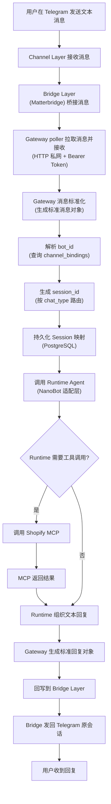
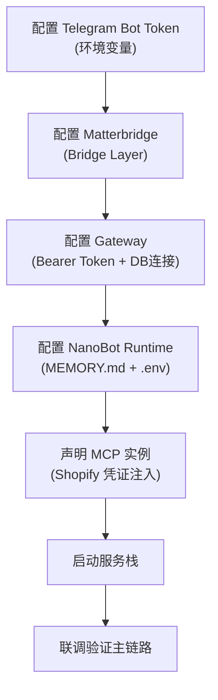
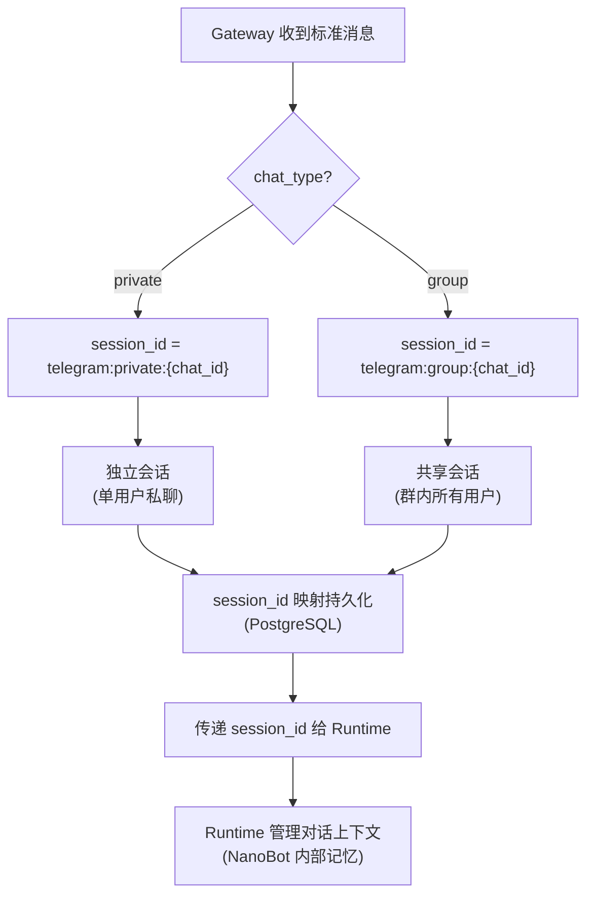

# 用户旅程 (User Journeys)

> **Metadata**
> - **Source**: `.context/domain/source/IM-Agent-Bridge-PRD.md`
> - **Generated At**: `2026-04-12 23:38`
> - **Generator**: `Context-Agent v1.0`

---

## 用户故事层级

| 层级 | 定义 | 估算单位 |
|------|------|----------|
| **Epic** | 通用多 IM AI 接入骨架 | MVP 整体 |
| **Feature** | 按三层架构拆分的功能模块 | 里程碑 M0–M4 |
| **User Story** | 最小可交付价值单元 | 故事点 |
| **Task** | 开发人员的具体工作项 | 工时 |

---

## 🗺️ 核心用户旅程

### Journey 1: 文本消息完整闭环（主链路）

- **角色**: 最终消息发送者（Telegram 用户）
- **目标**: 发送文本消息并收到 AI 回复
- **用户故事**: 作为 Telegram 用户，我希望发送自然语言消息给 Bot 并获取 Shopify 相关信息，以便于快速完成业务查询

### Journey 2: 系统开发者部署与配置

- **角色**: 系统开发者
- **目标**: 完成骨架搭建与Runtime接入
- **用户故事**: 作为系统开发者，我希望通过标准化配置完成多层服务部署，以便于快速验证最小闭环

---

## 👤 用户画像

### Persona 1: 最终消息发送者

| 维度 | 描述 |
|------|------|
| **基础信息** | Telegram 用户，可能是 Shopify 店铺运营者或查询者 |
| **技术能力** | 熟悉 Telegram 操作，无需额外技术知识 |
| **核心动机** | 通过自然语言快速获取 Shopify 店铺信息 |
| **使用场景** | 在 Telegram 私聊或群聊中直接向 Bot 发送问题 |
| **痛点** | 需要快速得到回复，不愿等待过长时间 |

### Persona 2: 系统开发者

| 维度 | 描述 |
|------|------|
| **基础信息** | 后端/全栈开发者，负责骨架搭建 |
| **技术能力** | 熟悉 Rust、Docker、PostgreSQL、API 开发 |
| **核心动机** | 快速验证最小闭环，为后续业务扩展奠定基础 |
| **使用场景** | 本地/远程开发环境，联调各层组件 |
| **痛点** | 各层边界不清晰导致耦合，Runtime 替换成本高 |

---

## ⚠️ 异常流程

| 场景 | 触发条件 | 处理方式 | BR 引用 |
|------|----------|----------|---------|
| Runtime 不可用 | Runtime 无响应或超时(>15s) | 返回明确错误提示，记录日志 | BR-060 |
| MCP 调用失败 | Shopify MCP 不可达或执行失败 | 返回用户可理解的失败信息 | BR-061 |
| 非文本消息 | 用户发送图片/音频/视频等 | 忽略或提示当前仅支持文本 | BR-001 |
| 回复回写失败 | Telegram 回写异常或会话失效 | 记录日志并返回失败状态 | BR-062 |
| 数据库不可用 | PostgreSQL 不可达 | 返回统一错误提示，记录告警日志 | BR-041 |
| 消息超长 | 入站文本 > 4096 字符 | 拒绝处理并返回提示（不进入主链路） | BR-002 |
| 回复超长 | 回复文本 > 4096 字符 | 截断并附加截断提示 | BR-003 |
| 上下文丢失 | Runtime 侧上下文缺失 | 退化为无上下文单轮处理 | BR-014 |

---

## 🔀 Session 路由决策图

---

## 🎯 关键场景映射

| 场景 ID | 名称 | PRD 来源 | 关键 BR |
|---------|------|----------|---------|
| A | Runtime 不可用 | §2.3 | BR-060 |
| B | Shopify MCP 调用失败 | §2.3 | BR-061 |
| C | 非文本消息 | §2.3 | BR-001 |
| D | 回复回写失败 | §2.3 | BR-062 |
| E | 会话上下文延续 | §2.3 | BR-010, BR-011 |
| F | 私聊会话隔离 | §2.3 | BR-010, BR-012 |
| G | 群聊共享会话 | §2.3 | BR-011, BR-013 |
| H | 群聊与私聊并存 | §2.3 | BR-012 |
| I | 数据库不可用 | §2.3 | BR-041 |
