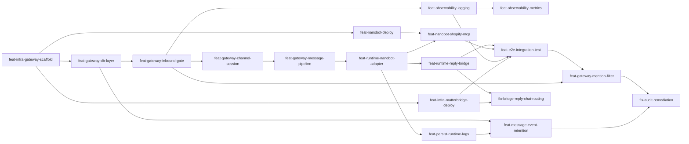

# 提案路线图 (Proposal Roadmap)

> **Metadata**
> - **项目名称**: IM Agent Bridge
> - **项目类型**: 绿地项目
> - **当前阶段**: Phase 6 — 合规补全与债务消减
> - **生成日期**: 2026-04-18
> - **基于文档**: TAD v1.1 + PRD v1.1
> - **任务状态**: Phase 0–5 done | Phase 6 pending

---

> **⚙️ 实施工作流门禁（criterion.md §6 MUST）**
> 每个提案实施完毕后，必须执行 `context-start` 工作流（specflow validate → specflow archive），变更方可标记为 done。提案14 验收须核查 `openspec/changes/archive/` 目录与路线图已标记为完成的提案清单一致（全量核查，不含尚未实施的提案）。

---

## 🗺️ 阶段总览

| 阶段 | 名称 | 目标 | 预计周期 |
|------|------|------|----------|
| Phase 0 | **基础设施** | Gateway Rust 脚手架 + Matterbridge 配置 | 2–3 天 |
| Phase 1 | **Gateway 核心层** | DB 连接 + 入站网关 + Channel 解析 + Session 管理 | 4–5 天 |
| Phase 2 | **消息处理 + Runtime Adapter** | 消息标准化 + NanoBotAdapter + Bridge 回写 | 4–6 天 |
| Phase 3 | **Runtime 部署 + 持久化日志** | NanoBot + Shopify MCP + runtime_logs | 2–3 天 |
| Phase 4 | **可观测性 + E2E 验证** | 结构化日志 + Prometheus 指标 + 端到端联调 | 3–4 天 |
| Phase 5 | **运营增强（Post-MVP）** | 多 Bot @mention 过滤（DB 扩列 + SSoT 同步） | 1 天 |
| Phase 6 | **合规补全与债务消减** | message_events 30 天 TTL 清理 + 审查缺口修复（P-01–P-13） | 2–3 天 |

---

## 🔗 依赖关系图



---

## 📦 提案索引

| # | Change ID | Phase | 优先级 | 预计时间 | 状态 | 前置依赖 |
|---|-----------|-------|--------|----------|------|---------|
| 1 | `feat-infra-gateway-scaffold` | 0 | P0 | 1–2 天 | done | — |
| 2 | `feat-infra-matterbridge-deploy` | 0 | P0 | 1 天 | done | #1 |
| 3 | `feat-gateway-db-layer` | 1 | P0 | 1 天 | done | #1 |
| 4 | `feat-gateway-inbound-gate` | 1 | P0 | 2 天 | done | #3 |
| 5 | `feat-gateway-channel-session` | 1 | P0 | 2 天 | done | #4 |
| 6 | `feat-gateway-message-pipeline` | 2 | P0 | 2 天 | done | #5 |
| 7 | `feat-runtime-nanobot-adapter` | 2 | P0 | 2 天 | done | #6 |
| 8 | `feat-runtime-reply-bridge` | 2 | P0 | 1–2 天 | done | #7 |
| 9 | `feat-nanobot-deploy` | 3 | P0 | 1 天 | done | #1 |
| 10 | `feat-nanobot-shopify-mcp` | 3 | P1 | 1 天 | done | #9, #7 |
| 11 | `feat-persist-runtime-logs` | 3 | P1 | 0.5 天 | done | #7 |
| 12 | `feat-observability-logging` | 4 | P1 | 1 天 | done | #4 |
| 13 | `feat-observability-metrics` | 4 | P2 | 1 天 | done | #12 |
| 14 | `feat-e2e-integration-test` | 4 | P0 | 2 天 | done | #8, #10, #12, #2 |
| 15 | `feat-gateway-mention-filter` | 5 | P1 | 1 天 | done | #4, #14 |
| 16 | `feat-runtime-log-retention` | 4 | P2 | 0.5 天 | done | #11 |
| 17 | `feat-message-event-retention` | 6 | P1 | 0.5 天 | done | #3 |
| 18 | `fix-audit-remediation` | 6 | P1 | 1.5 天 | done | #17, #15 |
| 19 | `fix-bridge-reply-chat-routing` | 6 | P0 | 0.5 天 | done | #8, #2 |

---

## 📦 各 Phase 详情

---

### Phase 0: 基础设施

---

### 提案 1: Gateway Rust 项目初始化

**Change ID:** `feat-infra-gateway-scaffold`
**优先级:** P0 | **预计时间:** 1–2 天 | **状态:** done

**业务目标**:
- 建立 `gateway/` Rust 项目骨架，固定强制技术栈（axum/tokio/sqlx/serde/tracing）
- 项目可编译，`GET /health` 返回 `{"status":"ok"}`
- 环境变量加载（GATEWAY_BEARER_TOKEN、DATABASE_URL、BRIDGE_URL、BRIDGE_BEARER_TOKEN）

**范围边界**:

| 类型 | 内容 |
|------|------|
| ✅ In | `gateway/Cargo.toml`，依赖：axum、sqlx、reqwest、tokio、tracing、serde_json |
| ✅ In | 目录结构：`src/{handlers/, adapters/, db/, models/, errors/, config/}` |
| ✅ In | `GET /health` 端点 |
| ✅ In | `config.rs`：从环境变量加载配置，缺失必要变量时报错退出 |
| ❌ Out | 具体业务逻辑、DB 连接、认证 |
| ❌ Out | 管理后台/Bot 配置界面（已知技术债 TD-002，MVP 通过直接 DB 操作配置） |

**关键任务**:
1. 初始化 Cargo.toml + 全部依赖 (0.5 天)
2. 建立目录结构，各模块占位 (0.5 天)
3. 实现 `/health` 端点 + 编译验证 (0.5 天)
4. 实现 `config.rs` 环境变量加载 (0.25 天)

**验证标准**:

| 验收项 | 验收条件 |
|--------|----------|
| 编译通过 | `cargo build` exit 0 |
| 健康检查 | `GET /health` → 200 + `{"status":"ok"}` |
| 配置校验 | 缺 DATABASE_URL 时启动失败并提示字段名 |

**Gate 场景**:
```gherkin
场景: Gateway 启动健康检查
  Given 已配置全部必要环境变量
  When 启动 Gateway 服务
  Then GET /health 返回 HTTP 200 + {"status":"ok"}
```

**风险缓解**: 应对 `RISK-B005`（后续需求扩展破坏三层骨架）— Gateway 骨架强制三层目录结构（handlers/adapters/db），物理隔离 Bridge/Runtime/DB 职责，阻止越界引用。

**依赖**: 前置: 无 | 被依赖: `feat-gateway-db-layer`, `feat-gateway-inbound-gate`

---

### 提案 2: Matterbridge 部署与配置

**Change ID:** `feat-infra-matterbridge-deploy`
**优先级:** P0 | **预计时间:** 2 天 | **状态:** done

**业务目标**:
- 配置 Matterbridge 作为 Bridge 层，将 Telegram 消息转发到 Gateway `POST /gateway/inbound`
- 配置 Matterbridge API 模式，接收 Gateway 的回写调用（`POST /bridge/reply`）
- Telegram Bot Token 与 Gateway Bearer Token 均通过环境变量注入，不硬编码
- 引入最小适配器 `mb-adapter` 解决 RISK-007（Matterbridge Pull API → Gateway Push 模型）

**部署模型**: Matterbridge 在 **Edge Server**（独立服务器，对出接互联网）；Gateway / NanoBot / PostgreSQL / Shopify MCP 在 **Internal Server**（私有内网）。两台服务器通过私有网络互联。

**范围边界**:

| 类型 | 内容 |
|------|------|
| ✅ In | `deploy/edge-server/docker-compose.yml`（matterbridge 服务：Volume 挂载 `matterbridge.toml`、`.env` 注入、`restart: unless-stopped`） |
| ✅ In | `deploy/edge-server/matterbridge/matterbridge.toml`（Telegram 账户配置 + API 网关配置） |
| ✅ In | Telegram Bot Token 注入（`TELEGRAM_BOT_TOKEN` 环境变量） |
| ✅ In | Gateway inbound URL + Bearer Token 配置（`http://<internal-server-ip>:8080/gateway/inbound`，私有网络 HTTP + Bearer Token） |
| ✅ In | Matterbridge API 监听端口（`:4242`，仅对 Internal Server 私网可达） |
| ✅ In | `deploy/edge-server/.env.example`（`TELEGRAM_BOT_TOKEN` / `GATEWAY_URL` / `GATEWAY_BEARER_TOKEN` / `EDGE_PRIVATE_IP`） |
| ✅ In | `mb-adapter`：轮询 Matterbridge `GET /api/stream` 并推送 `POST /gateway/inbound`；暴露 `POST /bridge/reply` 回写入口 |
| ✅ In | Edge Server 私网绑定变量（`EDGE_PRIVATE_IP`）用于端口映射仅内网可达 |
| ❌ Out | Telegram Webhook 模式（使用 polling，MVP 简化） |
| ❌ Out | 多 Bot 多渠道配置（MVP 单 Bot） |
| ❌ Out | Internal Server 服务编排（Gateway / NanoBot / PostgreSQL 属后续提案） |
| ❌ Out | TLS（私有网络直连，MVP；升级计划见 TD-007） |

> [!NOTE]
> deployment_view.md 详细定义了 Matterbridge 配置格式；Matterbridge API Wiki：https://github.com/42wim/matterbridge/wiki/API。

**关联 Context 资产**:

| Scope | 关联资产 | 关联说明 |
|-------|---------|----------|
| criterion | `.context/criterion.md` | §4 安全约束（凭证环境变量注入） |
| architecture | `.context/architecture/deployment_view.md` | Matterbridge 配置格式、API 端点规范 |
| architecture | `.context/architecture/api_strategy.md` | §1 POST /gateway/inbound 入站接口（Matterbridge 调用方） |

**关键任务**:
1. 创建 `deploy/edge-server/` 目录结构 + `deploy/edge-server/.env.example` (0.25 天)
2. 编写 `deploy/edge-server/matterbridge/matterbridge.toml` 模板（Telegram polling + API gateway 配置） (0.5 天)
3. 实现 `mb-adapter`（Pull → Push 入站适配 + 回写入口转发） (1 天)
4. 验证 mb-adapter 在 Edge Server 启动，并通过私有网络调用 Internal Server 的 `POST /gateway/inbound` (0.25 天)

**验证标准**:

| 验收项 | 验收条件 |
|--------|----------|
| Matterbridge 启动 | matterbridge 容器 health = healthy |
| Telegram 接收 | Telegram 发消息 → Matterbridge 日志收到 |
| 转发 Gateway | mb-adapter → `POST /gateway/inbound` 请求格式正确 |
| 回写接收 | Gateway `POST /bridge/reply` → mb-adapter → Matterbridge `POST /api/message` → Telegram |
| 跨服务器通信 | mb-adapter (Edge Server) → `http://<internal-server-ip>:8080/gateway/inbound`（Bearer Token，私有网络）验证成功 |

**Gate 场景**:
```gherkin
场景: Telegram 消息经 mb-adapter 推送到 Gateway
  Given Matterbridge 已配置 Telegram Bot Token 和 Gateway URL
    And mb-adapter 已启动并监听 Matterbridge API stream
  When 用户在 Telegram 发送文本消息
  Then mb-adapter 调用 POST /gateway/inbound（含正确 Bearer Token）
    And 请求体符合 InboundRequest 格式
```

**风险缓解**: 应对 `RISK-005`（Matterbridge 桥接稳定性）— Docker `restart: unless-stopped` + 健康检查；Matterbridge 崩溃仅影响入站，不波及 Gateway 数据一致性。应对 `TD-007`（无 TLS）— Edge Server 与 Internal Server 必须在同一私有网络（VPN / 云 VPC）内，禁止公网直连。

**依赖**: 前置: `feat-infra-gateway-scaffold` | 被依赖: `feat-e2e-integration-test`

---

### Phase 1: Gateway 核心层

---

### 提案 3: Gateway DB 连接层

**Change ID:** `feat-gateway-db-layer`
**优先级:** P0 | **预计时间:** 1 天 | **状态:** done

**业务目标**:
- sqlx PgPool 初始化（max_connections=100）+ DB 健康检查
- DB 不可用时短路熔断 → 503，并通过 `/bridge/reply` 向用户回写"系统暂时不可用，请稍后重试"（BR-041、BR-063）
- 验证 Goose 迁移（00001_init + 00002_channel_bindings_unique）应用成功

**范围边界**:

| 类型 | 内容 |
|------|------|
| ✅ In | `db/pool.rs`：PgPool 初始化 + health_check() |
| ✅ In | 熔断检查（handler 层，payload 解析后）：DB 不可达 → 调用 `/bridge/reply` 回写用户提示 + 返回 503 + 记录 ERROR 日志 + 递增 `db_unavailable_total` 指标 |
| ✅ In | Goose 迁移验证（CI 或启动时） |
| ✅ In | 确立 bot_id 参数必须贯穿所有 DB 函数签名的设计规范（BR-032 隔离原则落地） |
| ❌ Out | 具体业务查询（由后续提案实现） |
| ❌ Out | `/bridge/reply` 接口实现（由 mb-adapter 相关提案实现；本提案调用该接口，依赖其可用） |
| ❌ Out | 任何 Runtime 调用或业务表写入（DB 不可用时禁止继续处理） |

**关键任务**:
1. `db/pool.rs`：PgPool + health_check (0.5 天)
2. 熔断逻辑实现（handler 层：DB 检查 + Bridge reply 回写 + 503 + ERROR 日志 + 指标）(0.25 天)
3. Goose 迁移 CI 集成 (0.25 天)
4. `scripts/seed_db.sh`：开发环境录入默认 bot 实例与 channel_bindings 映射数据 (0.25 天)
5. `message_events` INSERT 前对 `input_text` / `output_text` 执行 512 字符截断（BR-070）(0.2 天)

**验证标准**:

| 验收项 | 验收条件 |
|--------|----------|
| 连接池 | health_check() → Ok |
| 熔断：返回码 | PG 停止 → HTTP 503 |
| 熔断：用户回写 | PG 停止 → `/bridge/reply` 收到回写请求，`text` = "系统暂时不可用，请稍后重试" |
| 熔断：日志 | 日志包含 ERROR 级别条目，含 `db_unavailable` 字段（权威日志级别：cross_cutting_concepts.md §日志规范） |
| 熔断：指标 | `db_unavailable_total` Counter 每次熔断递增 |
| 迁移 | 5 张表 + 全部索引创建成功 |
| BR-032 规范 | 所有后续 DB 函数签名包含 bot_id 参数（代码审查确认） |
| BR-070 数据最小化 | `message_events` 写入前对 `input_text` / `output_text` 截断至 512 字符 |

**Gate 场景**:
```gherkin
场景: PostgreSQL 不可达时短路熔断并回写用户提示
  Given PostgreSQL 服务不可达
  When Gateway inbound handler 解析到入站 payload（chat_id 可用）
  Then 调用 Bridge /bridge/reply API 向 chat_id 回写文本"系统暂时不可用，请稍后重试"
    And 返回 HTTP 503 Service Unavailable 给 mb-adapter
    And 不得继续处理任何业务请求（不调用 Runtime，不写入任何业务表）
    And 记录 ERROR 级别系统告警日志（含 db_unavailable 字段）
    And 递增 db_unavailable_total 指标
```

**风险缓解**:
- `RISK-004`（PostgreSQL 不可用）— 503 短路熔断防止脏数据写入；用户收到可见提示（BR-041、BR-063）。
- `RISK-006`（凭证泄露）— 启动失败错误输出必须只包含字段名，禁止打印 DATABASE_URL 连接串明文（security_policy.md §敏感数据禁止日志）。

**依赖**: 前置: `feat-infra-gateway-scaffold` | 被依赖: `feat-gateway-inbound-gate`

---

### 提案 4: 入站网关（Bearer Token + 限流）

**Change ID:** `feat-gateway-inbound-gate`
**优先级:** P0 | **预计时间:** 2 天 | **状态:** done

**业务目标**:
- `POST /gateway/inbound` 路由 + Bearer Token 校验（无效 → 401）
- Token Bucket 限流（5 msg/sec/chat_id → 429）
- InboundRequest 反序列化 + 基本字段校验（缺必填 → 400）

**范围边界**:

| 类型 | 内容 |
|------|------|
| ✅ In | axum 路由 + Authorization Bearer middleware |
| ✅ In | Token Bucket 限流器（按 chat_id，LRU 清理过期键） |
| ✅ In | InboundRequest/RawMessage struct（serde Deserialize） |
| ✅ In | 非文本消息类型拦截（message_type ≠ text → 400 + 忽略提示，不进入业务链路）（BR-001） |
| ✅ In | 统一错误响应格式（400/401/429/500/503） |
| ❌ Out | channel_bindings 解析、session_id 生成（feat-gateway-channel-session） |

**关联 Context 资产**:

| Scope | 关联资产 | 关联说明 |
|-------|---------|----------|
| criterion | `.context/criterion.md` | §3.4 Gateway 准则；§4 安全约束 |
| domain | `.context/domain/business_rules.md` | BR-001 非文本拦截；BR-031 Bearer 认证；BR-055 限流 |
| domain | `.context/domain/edge_cases.md` | 限流边界与非文本消息处理 |
| architecture | `.context/architecture/api_strategy.md` | §1 POST /gateway/inbound 契约及错误码 |
| architecture | `.context/architecture/security_policy.md` | Bearer Token 保护与脱敏 |
| architecture | `.context/architecture/cross_cutting_concepts.md` | 限流日志等级；日志禁记敏感字段；入站文本长度约束（:106-109） |
| architecture | `.context/architecture/tech_stack.md` | MVP MUST NOT Redis/缓存层（Token Bucket 内存方案依据） |
| architecture | `.context/architecture/risks_and_debt.md` | RISK-006（Bearer Token 泄露）；RISK-007（工具链能力差距） |

**关键任务**:
1. 验证 `SSoT/api/main.tsp` API 契约（`/gateway/inbound` 端点定义与 InboundRequest 结构一致）,需要修改Makefile文件`make api-compile`和`make api-gen-rs` (0.25 天)
2. Bearer Token middleware（constant-time 比较） (0.5 天)
3. InboundRequest struct + 字段校验 + 非文本类型拦截 (0.5 天)
4. Token Bucket 限流器实现 (0.5 天)
5. 路由注册 + 单元测试 (0.5 天)

**验证标准**:

| 验收项 | 验收条件 |
|--------|----------|
| 认证拒绝 | 无 Authorization → 401 |
| 限流触发 | 1s 内第 6 条相同 chat_id → 429 |
| 字段校验 | 缺 platform → 400 |
| 非文本拦截 | message_type = image → 400 + 忽略提示 |
| 日志脱敏 | 日志及 Tracing 输出中不得包含 GATEWAY_BEARER_TOKEN 明文 |

**Gate 场景**:
```gherkin
场景: Bearer Token 无效时拒绝请求
  Given Gateway 已配置 GATEWAY_BEARER_TOKEN
  When Bridge 发送不携带 Authorization 头的请求
  Then Gateway 返回 HTTP 401 Unauthorized

场景: 限流触发
  Given 同一 chat_id 在 1 秒内已发送 5 条消息
  When 同一 chat_id 发送第 6 条消息
  Then Gateway 返回 HTTP 429 Too Many Requests
    And 该消息不调用 Runtime

场景: 非文本消息拦截
  Given Bridge 发送一条 message_type = "image" 的入站请求
  When Gateway 接收该请求
  Then 返回 HTTP 400 + 忽略提示
    And 不写入 message_events
    And 不调用 Runtime
```

**风险缓解**: 应对 `RISK-006`（Bearer Token 泄露）— Token 仅通过环境变量注入，从不写入日志（tracing filter 屏蔽 GATEWAY_BEARER_TOKEN），脉冲骨架内没有明文 Token。

> ⚠️ **可拆解提示**：5 个 In 范围项、5 个关键任务、2 天。如需并行交付，可按“契约验证 → Token+限流实现 → 非文本过滤+验收”拆为 3 个小提案（谜 `feat-gateway-inbound-gate-{contract,impl,verify}`）。单人顺序交付时保持当前原子粒度更高效。

**依赖**: 前置: `feat-gateway-db-layer` | 被依赖: `feat-gateway-channel-session`, `feat-observability-logging`

---

### 提案 5: Channel 解析 + Session 管理

**Change ID:** `feat-gateway-channel-session`
**优先级:** P0 | **预计时间:** 2 天 | **状态:** done

**业务目标**:
- channel_bindings → bot_id 解析（精确匹配 → 降级匹配 → 404）
- session_id 生成规则（`telegram:private:{chat_id}` / `telegram:group:{chat_id}`）
- sessions 表 upsert + 入站幂等去重（重复 → 200 + `ignored_duplicate`）

**范围边界**:

| 类型 | 内容 |
|------|------|
| ✅ In | channel_bindings 查询（COALESCE 降级匹配） |
| ✅ In | session_id 生成函数（私聊/群聊规则） |
| ✅ In | sessions upsert（session_id UNIQUE） |
| ✅ In | 所有 DB 查询携带 bot_id 过滤条件（BR-032） |
| ❌ Out | 入站幂等去重（uq_message_events_inbound_dedup，迟至 feat-gateway-message-pipeline 与 INSERT 同提案，防职责割裂） |
| ❌ Out | message_events INSERT（feat-gateway-message-pipeline） |
| ❌ Out | 群聊中按 User 粒度拆分会话（已知技术债 TD-006，MVP 群聊共享上下文） |

**风险缓解**: 应对 `RISK-B004`（Session 设计过重致 MVP 膨胀）— 仅实现 `telegram:private/group:{chat_id}` 轻量规则，不引入用户级粒度。应对 `RISK-B006`（群聊共享上下文语义混淆）— MVP 群聊共享上下文已在 TD-006 标注为已知设计决策，不是缺陷（待群聊按用户拆分时升级）。

**关键任务**:
1. `db/channel_bindings.rs`：精确 + 降级查询（携带 bot_id 过滤，BR-032） (0.5 天)
2. `session::generate_session_id()` (0.25 天)
3. `db/sessions.rs`：upsert（携带 bot_id 条件，BR-032） (0.25 天)
4. 单元测试 (0.5 天)

**验证标准**:

| 验收项 | 验收条件 |
|--------|----------|
| bot_id 解析 | 精确 + 降级 + 缺失 3 种场景通过 |
| session_id | 私聊 = `telegram:private:{id}` |
| BR-032 | 所有查询携带 bot_id 条件（无全表访问） |

**Gate 场景**:
```gherkin
场景: channel_bindings 降级匹配 bot_id
  Given 数据库中无精确渠道记录，但有宽泛网关级别匹配
  When Gateway 收到该渠道的消息
  Then 降级解析出正确的 bot_id
    And session_id = "telegram:private:{chat_id}"
```

**依赖**: 前置: `feat-gateway-inbound-gate` | 被依赖: `feat-gateway-message-pipeline`

---

### Phase 2: 消息处理 + Runtime Adapter

---

### 提案 6: 消息标准化 + message_events 状态机

**Change ID:** `feat-gateway-message-pipeline`
**优先级:** P0 | **预计时间:** 2 天 | **状态:** done

**业务目标**:
- 构建 StandardMessage（event_id=UUID v4，全字段填充）
- 入站 4096 字符校验（超过 → 400 + 提示，记录日志）
- message_events 状态机写入（pending→processing→done/error），input_text 截断 512 字符

**范围边界**:

| 类型 | 内容 |
|------|------|
| ✅ In | StandardMessage struct + 构建函数 |
| ✅ In | 入站 4096 字符校验 |
| ✅ In | 入站幂等去重（uq_message_events_inbound_dedup，重复 → ignored_duplicate，不继续处理）（从 P6 迁入） |
| ✅ In | message_events INSERT（status=pending）+ 状态更新函数 |
| ✅ In | input_text 截断至 512 字符存储 |
| ✅ In | 所有 DB 操作携带 bot_id 过滤条件（BR-032） |
| ❌ Out | Runtime 调用（feat-runtime-nanobot-adapter） |
| ❌ Out | message_events 30 天历史数据自动清理定时任务（已知技术债 TD-005） |

**关键任务**:
1. StandardMessage struct + event_id(UUID) 生成 (0.5 天)
2. 4096 字符校验（chars().count()） (0.25 天)
3. `db/message_events.rs`：幂等去重检查（uq_message_events_inbound_dedup）+ INSERT（携带 bot_id，BR-032）+ status 更新 (0.75 天)
4. 集成到 inbound 流程 + 单元测试 (0.5 天)

**验证标准**:

| 验收项 | 验收条件 |
|--------|----------|
| 超长消息拒绝 | 5000 字符 → 400 + 提示 |
| 状态机 | pending→processing→done 流转正确 |
| 截断 | input_text 超 512 字符部分不存储 |
| 幂等去重 | 重复消息 → `{"status":"ignored_duplicate"}` 且不写 message_events |
| BR-032 | 所有 INSERT/SELECT 携带 bot_id 条件 |

**Gate 场景**:
```gherkin
场景: 入站超长消息拒绝
  Given 用户发送 5000 字符文本
  When Gateway 接收该消息
  Then 返回 "消息过长，请缩短后重试"
    And 记录日志（含原始消息长度）

场景: 入站重复消息幂等去重
  Given 相同幂等键已处理过（相同 platform/bridge_gateway_name/bridge_channel_name/bridge_message_id）
  When 相同消息再次到达 Gateway
  Then 返回 HTTP 200 + {"status":"ignored_duplicate"}
    And 不重新写入 message_events
    And 不调用 Runtime
```

**依赖**: 前置: `feat-gateway-channel-session` | 被依赖: `feat-runtime-nanobot-adapter`

---

### 提案 7: NanoBotAdapter 实现

**Change ID:** `feat-runtime-nanobot-adapter`
**优先级:** P0 | **预计时间:** 2 天 | **状态:** done

**业务目标**:
- RuntimeAdapter trait + NanoBotAdapter（Strategy Pattern，按 runtime_type 分发）
- 严格协议：session_id 必传、messages 严格 1 条、不传 stream、15s hard timeout
- 统一 StandardReply 输出，回复超长截断至 4096 字符 + 截断提示

**范围边界**:

| 类型 | 内容 |
|------|------|
| ✅ In | `RuntimeAdapter` trait + `NanoBotAdapter` |
| ✅ In | `bots.runtime_model` 字段（Goose 迁移 00004，`NOT NULL DEFAULT 'nanobot'`） |
| ✅ In | reqwest（15s timeout），session_id 必传，model 取 `bots.runtime_model`，messages=[{role:user,content}] 严格 1 条 |
| ✅ In | 响应解析：`choices[0].message.content` |
| ✅ In | error_code 映射（RUNTIME_TIMEOUT/UNAVAILABLE/BAD_RESPONSE/SESSION_NOT_FOUND） |
| ✅ In | Session-not-found 处置：清空 `sessions.runtime_session_key` 并重建（触发条件需先完成 tasks 3.2 探针确认） |
| ✅ In | 回复 4096 字符截断 + 截断提示 |
| ❌ Out | MCP 选择/路由（NanoBot 自主处理，Gateway MUST NOT 介入） |
| ❌ Out | Gateway → Runtime 安全认证机制（已知技术债 TD-001，MVP 阶段内网无认证） |

**关键任务**:
1. 验证 `SSoT/api/main.tsp` API 契约（`/runtime/process` 端点与 RuntimeProcessRequest 结构一致） (0.25 天)
2. 执行 Goose 迁移 `SSoT/schema/migrations/00004_bots_runtime_model.sql`，为 `bots` 表添加 `runtime_model TEXT NOT NULL DEFAULT 'nanobot'` (0.1 天)
3. `adapters/runtime.rs`：trait + error enum (0.5 天)
4. `adapters/nanobot.rs`：reqwest 客户端 + 请求构建（从 bot config 读取 `runtime_model` 作为 `model` 字段）+ 响应解析 (0.5 天)
5. error_code 映射 + 4096 截断函数 (0.25 天)
6. 单元测试（mock NanoBot server） (0.75 天)

**验证标准**:

| 验收项 | 验收条件 |
|--------|----------|
| session_id 必传 | 请求中 session_id 字段存在 |
| 15s 超时 | 超时 → RUNTIME_TIMEOUT |
| 4096 截断 | 超长回复截断并附加提示 |
| session-not-found 处置 | 触发 RUNTIME_SESSION_NOT_FOUND → 清空并重建 `runtime_session_key`；探针产物可复现触发条件 |
| messages 严格 1 条 | 请求体 `messages` 数组长度 = 1，无 `stream` 字段 |
| model 必传且匹配 | 请求体 `model` = `bots.runtime_model` 读取值 |
| 连接不可达 | endpoint 不通 → RUNTIME_UNAVAILABLE |
| 响应格式异常 | `choices[0]` 缺失 → RUNTIME_BAD_RESPONSE，不向用户透出原始错误 |

**关联 Context 资产**:

| 资产文件 | 关联理由 |
|---------|---------|
| `.context/criterion.md` | §3.4 Gateway MUST NOT 介入 MCP；§3.5 session_id 必传、超长截断约束 |
| `.context/domain/business_rules.md` | BR-003（4096 截断）、BR-022（Runtime 可替换）、BR-051（15s timeout）、BR-060（不可用提示） |
| `.context/domain/domain_model.md` | Bot 实体当前结构（本次迁移将新增 `runtime_model` 字段，当前文档尚未含该字段，需在实现后同步更新资产） |
| `.context/domain/edge_cases.md` | Runtime 异常 / Session 不存在场景的处理规则 |
| `.context/domain/user_journeys.md` | 消息处理完整闭环链路 |
| `.context/architecture/api_strategy.md` | NanoBotAdapter 协议适配（请求/响应示例、session_id/model 约束） |
| `.context/architecture/runtime_view.md` | 超时预算链路与消息处理状态机 |
| `.context/architecture/cross_cutting_concepts.md` | 统一错误码规范、限流策略 |
| `.context/db/schema_design.md` | `bots` 表当前结构（本次迁移将新增 `runtime_model` 列，当前文档尚未含该字段，需在实现后同步更新资产） |
| `.context/architecture/security_policy.md` | Gateway↔Runtime 无认证（TD-001）安全约束；凭证日志脱敏规范 |
| `.context/architecture/risks_and_debt.md` | RISK-001/RISK-002/TD-001/TD-004 风险权威定义 |
| `.context/domain/risks_and_debt.md` | RISK-B001/RISK-B002 域级风险权威定义 |
| `.context/db/migrations_and_ssot.md` | Goose 迁移规范，Expand-Contract 安全变更 |
| `.context/domain/testing_strategy.md` | BDD Gherkin 场景验收格式 |

**Gate 场景**:
```gherkin
场景: Runtime 无响应超时
  Given Gateway 调用 Runtime Agent 超过 15s 无响应
  Then 系统返回 "抱歉，当前无法处理您的请求，请稍后再试。"
    And error_code = RUNTIME_TIMEOUT

场景: Runtime 会话失效自动重建
  Given Runtime 返回 error_code = RUNTIME_SESSION_NOT_FOUND
  When Gateway 收到该响应
  Then 清空 sessions.runtime_session_key 并重建后重试一次
    And 重试请求仍满足 session_id 必传且 messages 数组长度 = 1
```

> 时序约束说明（Phase 2/3）：`feat-runtime-nanobot-adapter` 的协议与错误码处理先在 Phase 2 完成；Phase 3 的 Runtime 部署与日志落地以本提案输出的适配行为为前置，E2E 验收按“Phase 2 适配正确性 -> Phase 3 部署稳定性”顺序执行。

**风险缓解**: 应对 `RISK-001`（Runtime 单点故障）— 15s hard timeout + error_code 映射确保 Gateway 可隔离 Runtime 故障；应对 `RISK-007`（TAD 与三方工具能力差距）— 严格实现 NanoBot 协议约束（session_id 必传、messages 严格 1 条、不传 stream）；应对 `RISK-B001`（Runtime 候选能力不完全匹配）— RuntimeAdapter trait 需有与 NanoBot 第一条消息测试入知，发现不匹配立即选型升级；已知技术债 TD-003/TD-004 在 Out 范围标注。

> ⚠️ **可拆解提示**：5 个 In 范围项、5 个关键任务、2 天。如需并行交付，可按“契约验证 → NanoBot协议实现 → 超时/映射验收”拆为 3 个小提案。单人顺序交付时保持当前原子粒度更高效。

**依赖**: 前置: `feat-gateway-message-pipeline`, `feat-gateway-channel-session` | 被依赖: `feat-runtime-reply-bridge`, `feat-persist-runtime-logs`

---

### 提案 8: Bridge 回写链路

**Change ID:** `feat-runtime-reply-bridge`
**优先级:** P0 | **预计时间:** 1–2 天 | **状态:** done

**业务目标**:
- `POST /bridge/reply` 调用（Bearer Token，reply_id 幂等）
- 3 次指数退避重试（1s/2s/4s），409 视为成功
- 3 次失败后标记 reply_failed，更新 message_events.reply_status

**范围边界**:

| 类型 | 内容 |
|------|------|
| ✅ In | `bridge_client.rs`：POST /bridge/reply + Bearer Token（`BRIDGE_URL` 为回写目标地址，`BRIDGE_BEARER_TOKEN` 为调用 Bridge 时携带的鉴权 Token，均从环境变量读取，由 `feat-infra-gateway-scaffold` 的 `config.rs` 统一声明） |
| ✅ In | 3 次指数退避（1s→2s→4s，tokio::time::sleep） |
| ✅ In | 409 → 视为成功（不重试） |
| ✅ In | 最终失败 → reply_failed 标记 + 错误日志 |
| ✅ In | message_events.reply_status 更新（success/reply_failed） |
| ✅ In | message_events.output_text 写入时截断至 512 字符再落库（BR-070 数据最小化） |
| ❌ Out | 超过 3 次重试 |

**关键任务**:
1. 验证 `SSoT/api/main.tsp` API 契约（`/bridge/reply` 端点与 ReplyRequest 结构一致） (0.25 天)
2. `bridge_client.rs`：ReplyRequest + POST (0.5 天)
3. 指数退避重试逻辑 (0.5 天)
4. 409 语义处理 + reply_status 更新 (0.25 天)
5. output_text 512 字符截断函数 + 落库前调用 (0.25 天)
6. 单元测试 (0.25 天)

**验证标准**:

| 验收项 | 验收条件 |
|--------|----------|
| 可重试错误退避 | 初始调用 + 3 次重试（等待 1s/2s/4s，共 4 次尝试）均失败后标记 reply_failed |
| 不可重试错误立即失败 | HTTP 400 / 401 → 立即 reply_failed，不重试 |
| 409 成功 | 409 → reply_status=success |
| 回写成功 | reply_status=success 更新正确 |
| output_text 截断 | 超 512 字符的回复内容不全量存储 |

**Gate 场景**:
```gherkin
场景: 回写 4 次尝试耗尽后标记 reply_failed
  Given Bridge 返回可重试错误
  When 初始调用 + 3 次重试（等待 1s/2s/4s）均失败
  Then message_events.reply_status = "reply_failed"
    And 记录错误日志（含 reply_id）
```

> ⚠️ **可拆解提示**：6 个 In 范围项、6 个关键任务、1–2 天。如需并行交付，可按“回写客户端实现 → 重试+409 处理 → 状态更新验收”拆为 3 个小提案。单人顺序交付时保持当前原子粒度更高效。

**依赖**: 前置: `feat-runtime-nanobot-adapter` | 被依赖: `feat-e2e-integration-test`

---

### Phase 3: Runtime 部署 + 持久化日志

---

### 提案 9: NanoBot 服务部署

**Change ID:** `feat-nanobot-deploy`
**优先级:** P0 | **预计时间:** 1 天 | **状态:** done

**业务目标**:
- NanoBot Docker 容器配置（Python 3.10+ + Node.js，pip install nanobot-ai[api]，nanobot serve → :8900）
- health check（GET /health → `{"status":"ok"}`）
- `config.json`（volume 挂载 `./nanobot-data:/home/nanobot/.nanobot`）作为单一配置源，`providers` 节配置 LLM，secret 用 `${VAR}` 引用 `.env`

**范围边界**:

| 类型 | 内容 |
|------|------|
| ✅ In | Dockerfile（Python 3.10+ + Node.js，pip install nanobot-ai[api]，CMD nanobot serve） |
| ✅ In | `deploy/internal-server/nanobot/docker-compose.yml`（健康检查、volume 挂载 `./nanobot-data:/home/nanobot/.nanobot`、`restart: unless-stopped`、`env_file: .env`、端口绑定 `127.0.0.1:8900:8900`、日志轮转 `logging`） |
| ✅ In | `deploy/internal-server/nanobot/config.json.example`（NanoBot 完整配置模板骨架：`providers` LLM 节 + 空 `tools.mcpServers`，secret 用 `${VAR}` 语法） |
| ✅ In | `deploy/internal-server/nanobot/.env.example`（`LLM_API_KEY` 及其他被 `config.json` 引用的 secret） |
| ❌ Out | `tools.mcpServers` Shopify MCP 配置（feat-nanobot-shopify-mcp 处理） |
| ❌ Out | MEMORY.md 内容（feat-nanobot-shopify-mcp 处理） |

> [!NOTE]
> tech_stack.md 标注 NanoBot 启动命令需以 HKUDS/nanobot 最新官方文档为准（`pip install nanobot-ai[api]` + `nanobot serve`）。

**关键任务**:
1. `Dockerfile`：Python 3.10+ + Node.js + `pip install nanobot-ai[api]` + CMD nanobot serve (0.5 天)
2. `deploy/internal-server/nanobot/docker-compose.yml`（健康检查、volume 挂载、`restart: unless-stopped`、端口绑定 `127.0.0.1:8900:8900`、`env_file: .env`、日志轮转 `logging`） (0.25 天)
3. `config.json.example` 带 LLM providers 骨架（secret 用 `${LLM_API_KEY}` 语法）+ `.env.example` (0.25 天)
4. 验证 NanoBot 启动正常：GET /health → `{"status":"ok"}` (0.25 天)

**验证标准**:

| 验收项 | 验收条件 |
|--------|----------|
| 容器启动 | nanobot health = healthy |
| health 端点 | GET /health → `{"status":"ok"}` |
| API 响应 | POST /v1/chat/completions（含 `session_id`、`messages` 严格 1 条）返回 200；`stream:true` 返回 400 |

**风险缓解**:
- `RISK-002`（NanoBot 本地状态丢失）— volume 挂载 `./nanobot-data:/home/nanobot/.nanobot` 持久化对话记忆；挂载路径须以实际运行验证（RISK-007：TAD 记录 `~/.local/state/nano-bots/`，HKUDS/nanobot 实际为 `~/.nanobot/`）
- `RISK-001`（Runtime 单点故障）— `restart: unless-stopped` 提供容器级自动恢复；healthcheck 检测存活状态
- `RISK-006`（凭证泄露）— secret 以 `${VAR}` 引用 `.env`，禁止硬编码；`config.json` 加入 `.gitignore`
- `RISK-007`（工具能力差距）— 实施时须验证 NanoBot 实际配置/状态路径，如与假设不符需修订 volume 挂载点

**关联 Context 资产**:
- `.context/criterion.md`（§3.6 Runtime 约束；§3.7 MCP 禁止入库；§4 凭证管理）
- `.context/architecture/tech_stack.md`（NanoBot Python 3.10+；`nanobot-ai[api]`；Node.js 运行时）
- `.context/architecture/deployment_view.md`（Internal Server 部署拓扑；volume 路径；config.json 规范）
- `.context/architecture/security_policy.md`（凭证禁止硬编码；端口暴露策略）
- `.context/architecture/risks_and_debt.md`（RISK-001/002/006/007）
- `.context/architecture/api_strategy.md`（§3.2 NanoBotAdapter 接口约束：session_id/messages=1/禁 streaming）

**依赖**: 前置: `feat-infra-gateway-scaffold` | 被依赖: `feat-nanobot-shopify-mcp`

---

### 提案 10: Shopify MCP 实例配置

**Change ID:** `feat-nanobot-shopify-mcp`
**优先级:** P1 | **预计时间:** 1 天 | **状态:** done

**业务目标**:
- 在 `deploy/internal-server/nanobot/config.json.example` 中声明多店铺 shopify-mcp 子进程（`tools.mcpServers` 多个具名条目，每店铺一个）
- MEMORY.md 格式样板（TAD §9.4.1），声明可用 MCP Server；放置于 NanoBot Workspace 的 `memory/MEMORY.md` 由 NanoBot 原生加载
- Shopify 凭证作为 `args` 内联 `${VAR}` 引用，真实值仅在 `.env`/Secret 注入；PostgreSQL 不存 MCP 配置（MUST NOT）

**范围边界**:

| 类型 | 内容 |
|------|------|
| ✅ In | `deploy/internal-server/nanobot/config.json.example`（`tools.mcpServers` 多店铺模板，每店铺一个具名条目，凭证作为 `args` 内联） |
| ✅ In | MEMORY.md 格式样板（MCP Server 声明格式，放置于 `memory/MEMORY.md`） |
| ✅ In | Shopify 凭证以 `${VAR}` 语法内联于 `config.json` 的 `args`；真实凭证值写入 `nanobot/.env`（gitignore）；禁止硬编码进代码仓库 |
| ✅ In | NanoBot→MCP 10s 超时配置（BR-052），MCP 不可达/凭证缺失时 NanoBot 返回用户友好降级提示 |
| ✅ In | MCP 工具访问允许列表配置（MEMORY.md 中声明允许工具集合）（BR-034，RISK-B003） |
| ✅ In | MCP 工具调用审计日志（NanoBot stdout/文件输出，禁止入库）（BR-034） |
| ❌ Out | PostgreSQL 中存储 MCP 配置（criterion.md §3.7 MUST NOT） |

**关键任务**:
1. 编写 `config.json.example`：`tools.mcpServers` 多店铺模板（具名如 `shopify-store1`，凭证作为 `args` 传入）+ `toolTimeout: 10` (0.25 天)
2. MEMORY.md 格式样板编写（MCP Server 声明，含 url/name/tools，工具允许列表——BR-034） (0.25 天)
3. 验证凭证初始化：将实际 `config.json` 写入 `./nanobot-data/`，确认 shopify-mcp 子进程正常启动 (0.25 天)
4. MCP 调用超时验证（BR-052）+ NanoBot 降级提示验证；**凭证缺失场景告警验证**（edge_cases.md §4） (0.25 天)
5. MCP 工具调用审计日志验证（NanoBot 日志可见，无入库，日志不含 client_secret 明文）（BR-034，RISK-B003） (0.25 天)

**验证标准**:

| 验收项 | 验收条件 |
|--------|----------|
| shopify-mcp 子进程启动 | NanoBot 启动时，`config.json` 中每个 `mcpServers` 条目对应的 shopify-mcp 子进程正常运行 |
| MEMORY.md 加载 | NanoBot 启动时读取 `memory/MEMORY.md` MCP 实例列表（需提供明确的日志关键字或调试端点证据，如 grep "Loaded memory/MEMORY.md"） |
| 凭证隔离 | PostgreSQL 无 MCP 配置/凭证字段（查询 information_schema 确认无 mcp_* 表） |
| BR-052 超时 | MCP 调用超过 10s → NanoBot 返回降级提示，不挂起 Gateway |
| 凭证缺失安全降级 | `.env` 中 Shopify 凭证缺失 → 子进程启动失败告警，不影响主服务拉起，调用时返回工具不可用 |
| BR-034 工具限制 | MEMORY.md 工具允许列表已声明，超出列表的工具不可调用（RISK-B003 封阀） |
| BR-034 审计日志 | MCP 工具调用可见于 NanoBot 日志，无数据入库，审计日志不含 client_secret 明文 |

**风险缓解**: 应对 `RISK-003`（Shopify MCP 可用性依赖）— BR-052 10s 超时 + 降级提示验证；凭证缺失安全失败（不挂起主服务）；BR-034 工具允许列表封锁 MCP 暴露范围；应对 `RISK-006`（凭证泄露）— `${VAR}` 注入且日志脱敏；应对 `RISK-007` — 提供由于版本差异引发的验证逃逸缓冲；应对 `RISK-001` — 明确子进程崩溃不拖垮 Runtime 主服务。

> ⚠️ **可拆解提示**：6 个 In 范围项、5 个关键任务、1 天。如需并行交付，可按"MCP容器+凭证 → MEMORY.md+工具限制 → 超时+审计验收"拆为 3 个小提案。单人顺序交付时保持当前原子粒度更高效。

**关联 Context 资产**:
- `.context/criterion.md`（§3.6 Runtime 约束；§3.7 MCP 禁止入库；§4 凭证管理）
- `.context/architecture/tech_stack.md`（NanoBot Python 3.10+；`nanobot-ai[api]`；Node.js 运行时；shopify-mcp npx 模式）
- `.context/architecture/deployment_view.md`（Internal Server 部署拓扑；volume 路径；config.json 规范）
- `.context/architecture/security_policy.md`（凭证禁止硬编码；端口暴露策略）
- `.context/architecture/risks_and_debt.md`（RISK-001/002/003/006/007）
- `.context/domain/risks_and_debt.md`（RISK-B003）
- `.context/domain/business_rules.md`（BR-030/033/034/052/061 业务规则集）
- `.context/domain/user_journeys.md`（Journey 1/2 Runtime↔MCP 路径依赖验证）
- `.context/architecture/cross_cutting_concepts.md`（日志/指标/错误码/敏感信息禁入日志）
- `.context/architecture/runtime_view.md`（MCP 超时预算与失败场景）
- `.context/domain/testing_strategy.md`（BDD 验收格式与 P0 场景校验规则）
- `.context/db/security_hardening.md`（Gateway 访问 PG 唯一策略验证 / 密钥不入库检查）
- `.context/domain/edge_cases.md`（MCP 配置缺失/MEMORY.md 缺失边缘场景）
- *注：.context/legacy/legacy_system_analysis.md 在本仓库缺失，因此不在列。*

**依赖**: 前置: `feat-nanobot-deploy`, `feat-runtime-nanobot-adapter` | 被依赖: `feat-e2e-integration-test`

---

### 提案 11: runtime_logs 持久化

**Change ID:** `feat-persist-runtime-logs`
**优先级:** P1 | **预计时间:** 0.5 天 | **状态:** done

**业务目标**:
- runtime_logs 仅在 status=error 时写入，payload 脱敏 PII（移除 user_id、原文消息内容）
- 记录 latency_ms（Runtime 调用耗时）

**范围边界**:

| 类型 | 内容 |
|------|------|
| ✅ In | `db/runtime_logs.rs`：条件 INSERT（仅 error） |
| ✅ In | PII 脱敏函数（移除 user_id、input_text 原文） |
| ✅ In | latency_ms 记录 |
| ✅ In | runtime_logs 写入失败不阻断主链路（独立隔离） |
| ❌ Out | 正常调用日志写入（不写入） |
| ❌ Out | 14 天过期数据定期清理任务（TD-005，由 `feat-runtime-log-retention` 承接，见 security_policy.md §82-88） |

**关键任务**:
1. `db/runtime_logs.rs`：条件 INSERT 函数（仅 status=error 时写入） (0.25 天)
2. PII 脹敏函数（移除 user_id、input_text 原文）+ 单元测试 (0.25 天)
3. latency_ms 计时逻辑集成到 NanoBotAdapter 调用链 (0.25 天)

**验证标准**:

| 验收项 | 验收条件 |
|--------|----------|
| 条件写入 | 正常调用不写 runtime_logs |
| 脱敏 | request_payload 中无 user_id、原始消息内容 |
| latency_ms | 记录 Runtime 调用耗时 |
| 写入失败不阻断 | runtime_logs 写入失败时，用户侧回写流程仍完成，`tracing::warn!` 出现于日志 |

**关联 Context 资产**:
- `.context/criterion.md`（§4 数据治理：runtime_logs 仅 error 写入且脱敏 PII；§3.7 DB 持久化 MUST）
- `.context/db/schema_design.md`（runtime_logs 表结构：latency_ms、request_payload JSONB、response_payload JSONB）
- `.context/architecture/runtime_view.md`（场景 1/2：Gateway → Runtime 调用链路与错误处理流程）
- `.context/architecture/security_policy.md`（runtime_logs 14 天生命周期限制；PII 数据处置策略）
- `.context/architecture/cross_cutting_concepts.md`（latency_ms 与可观测指标体系对齐）
- `.context/domain/business_rules.md`（BR-070 消息数据最小化；BR-071 PII 脱敏 SHOULD；BR-063 错误可见性 MUST）
- `.context/domain/edge_cases.md`（DB 不可用、日志写入失败边缘场景口径）
- `.context/architecture/risks_and_debt.md`（TD-005 数据保留清理债务；RISK-004 PG 不可用影响）
- `.context/db/security_hardening.md`（runtime_logs 脱敏与 14 天保留期安全约束）
- `.context/domain/testing_strategy.md`（BDD 验收格式权威模板）

**依赖**: 前置: `feat-runtime-nanobot-adapter` | 被依赖: 无

---

### Phase 4: 可观测性 + E2E 验证

---

### 提案 12: 结构化日志

**Change ID:** `feat-observability-logging`
**优先级:** P1 | **预计时间:** 1 天 | **状态:** done

**业务目标**:
- tracing subscriber 配置（JSON 格式，INFO/WARN/ERROR 级别）
- 敏感字段脱敏规则：所有高敏感凭证（Bearer Token、Telegram Bot Token、Shopify client_secret、PostgreSQL 密码/DATABASE_URL 等）禁止以任何级别输出明文
- 覆盖 Gateway 侧 8 类 TAD §11.1 必选事件：消息接入 / 标准化完成 / session命中 / Runtime调用 / 回写结果 / 错误 / 被限流请求 / DB不可用；附加埋点：Bearer Token 认证 / Channel 解析；MCP 调用日志归属 Runtime 侧实现

**范围边界**:

| 类型 | 内容 |
|------|------|
| ✅ In | tracing-subscriber JSON 格式配置 |
| ✅ In | 脱敏 filter（屏蔽所有高敏感凭证：GATEWAY_BEARER_TOKEN / BRIDGE_BEARER_TOKEN / TELEGRAM_BOT_TOKEN / SHOPIFY_CLIENT_SECRET / DATABASE_URL / POSTGRES_PASSWORD） |
| ✅ In | event_id（即 trace_id）贯穿主链路各 span |
| ✅ In | Gateway 侧 8 类 TAD §11.1 必选事件（消息接入/标准化完成/session命中/Runtime调用/回写结果/错误/被限流请求/DB不可用）＋附加埋点（Bearer Token认证/Channel解析） |
| ❌ Out | 分布式追踪（Jaeger，MVP 不引入） |
| ❌ Out | MCP 调用日志（发生在 Runtime 内部，由 Runtime 侧 change 负责） |

**关键任务**:
1. tracing-subscriber 依赖引入 + JSON 格式化配置 (0.25 天)
2. 脱敏 filter 层（屏蔽全部高敏感凭证键名，集中定义 SENSITIVE_FIELDS 常量） (0.25 天)
3. Gateway 侧 8 类 TAD 必选事件 span/event 埋点（消息接入/标准化完成/session命中/Runtime调用/回写结果/错误/被限流请求/DB不可用）＋附加埋点（Bearer Token认证/Channel解析） (0.5 天)

**验证标准**:

| 验收项 | 验收条件 |
|--------|----------|
| JSON 格式 | 日志输出为 JSON 结构（jq 可解析） |
| 脱敏 | 日志中无任何高敏感凭证明文（Bearer Token / Bot Token / Shopify secret / PG 密码均需逐项断言） |
| event_id | Gateway 侧 8 类 TAD 必选事件均携带 event_id；MCP 调用由 Runtime 侧独立 change 实现并携带相同 event_id |

**关联 Context 资产**:

| 资产路径 | 关联说明 |
|---------|----------|
| `.context/criterion.md §4（:192-:199）` | 密钥管理/数据治理 MUST 约束（密钥禁止硬编码，禁止明文日志） |
| `.context/architecture/cross_cutting_concepts.md §11.1/§11.3` | TAD 日志必覆盖事件集 + trace_id 规范 |
| `.context/architecture/security_policy.md §敏感数据处理（:65-:75）` | 高敏感凭证禁止日志分类定义 |
| `.context/architecture/tech_stack.md §核心依赖（:91）` | tracing SHOULD 依赖 |
| `.context/architecture/risks_and_debt.md（:84）` | RISK-006 Bearer Token 泄露：本提案直接缓解 |
| `.context/architecture/runtime_view.md（:41-45）` | 证明 MCP 调用发生在 Runtime 内部，是 Out 范围的论据源 |
| `.context/domain/business_rules.md（BR-030/:169、BR-063/:359）` | 凭证禁止明文暴露 + 日志异常不得阻断主流程 |

**依赖**: 前置: `feat-gateway-inbound-gate` | 被依赖: `feat-observability-metrics`, `feat-e2e-integration-test`

---

### 提案 13: Prometheus 指标

**Change ID:** `feat-observability-metrics`
**优先级:** P2 | **预计时间:** 1 天 | **状态:** done

**业务目标**:
- 暴露 TAD §11.2 定义的 11 个 Counter 指标：`messages_received_total`、`messages_replied_total`、`runtime_call_success_total`、`runtime_call_timeout_total`、`mcp_call_success_total`、`mcp_call_error_total`、`reply_write_success_total`、`reply_write_error_total`、`rate_limited_total`、`db_unavailable_total`、`runtime_log_write_failures_total`
- 其中 `mcp_call_success_total` / `mcp_call_error_total` 在 Gateway 侧**仅预定义注册**（初始值 0），不保证递增；MCP 调用发生在 Runtime 内部（`runtime_view.md`），Gateway 无法观测，后续由 Runtime 侧独立 change 承接有效计数
- `GET /metrics` 端点（`prometheus-client` crate），与 `/health` 同策略：同端口 `:8080`、不经 Bearer Token middleware、仅部署在 Internal Server 私有内网内（Gateway `:8080` 禁止公网暴露，`deployment_view.md` :291）

**范围边界**:

| 类型 | 内容 |
|------|------|
| ✅ In | `prometheus-client` Counter 定义（全部 11 个 TAD §11.2 Counter）+ 业务链路埋点 |
| ✅ In | `GET /metrics` 端点（同端口、无鉴权、仅内网） |
| ❌ Out | Grafana dashboard、`postgres_exporter`（运维级） |
| ❌ Out | MCP Counter 有效递增（Gateway 无法观测 Runtime 内部 MCP 调用；MCP 指标由后续 Runtime change 承接） |

**安全约束**:
- `/metrics` 不经 Bearer Token 校验（与 `/health` 一致）；合规依据：`criterion.md` :109 的 MUST "接收 Bridge 入站消息并校验 Bearer Token" 适用于业务入站端点 `POST /gateway/inbound`，不适用于运维/健康检查端点
- `/metrics` 的网络隔离由部署拓扑保证：Gateway 端口 `:8080` 仅在 Internal Server 私有内网监听（`deployment_view.md` :291 "Gateway 禁止公网暴露"）
- 指标标签不包含敏感信息（不暴露 Bearer Token / chat_id / user_id 等）

**关键任务**:
1. `prometheus-client` Counter 定义（11 个 TAD §11.2 Counter，全部为 Counter 类型） (0.5 天)
2. 业务链路埋点（inbound/runtime/reply/rate_limit/db 路径增量递增） (0.25 天)
3. `GET /metrics` 端点注册 + 验证 (0.25 天)

**验证标准**:

| 验收项 | 验收条件 |
|--------|----------|
| /metrics 可访问 | `GET /metrics` → 200 + Prometheus exposition format（`text/plain`） |
| 全指标注册 | `/metrics` 输出包含全部 11 个指标名（含 `# TYPE` 注释行） |
| 入站递增 | 发送入站消息后 `messages_received_total` 递增 |
| 回写成功递增 | 完整处理消息后 `messages_replied_total` + `reply_write_success_total` + `runtime_call_success_total` 各递增 |
| 限流递增 | 触发 429 限流后 `rate_limited_total` 递增 |
| DB 不可用递增 | 模拟 PG 不可用后 `db_unavailable_total` 递增 |
| Runtime 超时递增 | 模拟 Runtime 超时后 `runtime_call_timeout_total` 递增 |
| 回写失败递增 | 模拟回写失败后 `reply_write_error_total` 递增 |
| MCP Counter 存在但为 0 | `mcp_call_success_total` / `mcp_call_error_total` 已注册，值为 0（Gateway 不埋点） |

**关联 Context 资产**:

| Scope | 资产路径 | 关联说明 |
|-------|---------|----------|
| criterion | `.context/criterion.md` | §3.4 Gateway MUST（:109）；§4 安全约束（:192-199） |
| architecture | `.context/architecture/cross_cutting_concepts.md` | §11.2 指标监控（:32-46）：TAD 权威 Counter 定义 |
| architecture | `.context/architecture/deployment_view.md` | §部署约束（:291）：Gateway 禁止公网暴露 |
| architecture | `.context/architecture/security_policy.md` | API 安全（:99-109）：内网白名单 |
| architecture | `.context/architecture/risks_and_debt.md` | RISK-003（:48）、RISK-004（:60）：指标用于风险缓解告警 |
| domain | `.context/domain/risks_and_debt.md` | PD-004（:177）：可观测性基础设施债务 |
| domain | `.context/domain/business_rules.md` | BR-063（:359）：错误可见性原则 |
| domain | `.context/domain/edge_cases.md` | DB 不可用/限流/超时等边缘场景（:85+） |
| db | `.context/db/observability.md` | TAD 指标与告警联动（:14-24）；采集集成（:163） |

**风险**:

| 风险 ID | 触发条件 | 缓解（本提案贡献） |
|---------|---------|-------------------|
| RISK-004 | PG 不可用全面熄断 | `db_unavailable_total` 实时告警指标 |
| RISK-003 | Shopify MCP 可用性波动 | `mcp_call_error_total` 预定义（待 Runtime change 递增） |
| PD-004 | 无可观测性基础设施 | 本提案偿还指标采集部分（与 `feat-observability-logging` 共同偿还） |
| NEW | `/metrics` 无鉴权被非预期访问 | 部署拓扑保证仅内网可达（:291）；指标标签不含敏感信息 |

**依赖**: 前置: `feat-observability-logging` | 被依赖: `feat-e2e-integration-test`（下游验收）

---

### 提案 14: 端到端集成验证

**Change ID:** `feat-e2e-integration-test`
**优先级:** P0 | **预计时间:** 2 天 | **状态:** done

**业务目标**:
- 验证完整主链路：Telegram → Matterbridge → Gateway → NanoBot → Shopify MCP → 回写
- 覆盖 testing_strategy.md 所有 P0 BDD 场景（模块 1–8）
- 验证关键异常场景：Runtime 超时、DB 不可用、限流触发

**关联 Context 资产**:

| Scope | 资产路径 | 关联说明 |
|-------|---------|----------|
| domain | `.context/domain/user_journeys.md` | 主链路闭环业务价值与用户旅程定义 |
| domain | `.context/domain/testing_strategy.md` | P0 BDD 场景（模块 1–8）权威来源；DoD 定义 |
| domain | `.context/domain/edge_cases.md` | 异常注入场景依据（PG 不可用、Runtime 超时、MCP 故障） |
| architecture | `.context/architecture/security_policy.md` | 敏感数据/内网暴露约束（Bearer Token、日志脱敏、禁止公网） |
| architecture | `.context/architecture/risks_and_debt.md` | RISK-001–007 风险清单 |
| architecture | `.context/architecture/cross_cutting_concepts.md` | trace_id、指标、脱敏要求 |
| architecture | `.context/architecture/deployment_view.md` | Docker Compose 拓扑；部署约束（禁止公网暴露） |
| architecture | `.context/architecture/runtime_view.md` | 主链路数据流与关键决策点权威来源（Gateway → RuntimeAdapter → NanoBot → 回写） |
| domain | `.context/domain/business_rules.md` | BR-001–BR-071 全量规则权威来源（spec/tasks 大量引用 BR-xxx） |

**风险清单**:

| 风险ID | 触发条件 | 影响 | 缓解 |
|--------|---------|------|------|
| RISK-001 | NanoBot 进程崩溃/资源耗尽 | 所有消息处理中断（高风险） | 15s hard timeout 兜底验证；4.1 停止 NanoBot 场景覆盖；Docker restart policy 核对 |
| RISK-002 | NanoBot 本地状态丢失 | 容器重建后会话上下文丢失（中风险） | 核查 Docker Volume 挂载持久化；4.3 重启 NanoBot 场景验证 SESSION_NOT_FOUND 处理 |
| RISK-003 | Shopify MCP 服务不可达 | Runtime 无法调用工具，联调不稳定 | 测试店铺凭证就绪；注入 MCP 故障验证“工具暂不可用”路径 |
| RISK-004 | PostgreSQL 不可用 | Gateway 全面宕机（503） | 注入 DB 停止场景验证 503 熔断；db_unavailable_total 指标核对 |
| RISK-005 | Matterbridge 崩溃/断连 | 入站消息不可达/回写中断 | health check 验证；建议补重启恢复用例 |
| RISK-006 | Bearer Token 泄露/日志泄露 | 可伪造入站消息，凭证暴露 | 401 拦截验证；日志脱敏核查；禁止公网暴露核对 |
| RISK-007 | 设计与第三方工具能力差距 | 联调失败/返工 | 本提案是发现偏差的 Gate；偏差需记录并归档 |

**范围边界**:

| 类型 | 内容 |
|------|------|
| ✅ In | Docker Compose 一键启动 + 完整主链路联调 |
| ✅ In | BDD P0 场景验证（文本接入、bot_id 解析、幂等、限流、DB 熔断、回写失败） |
| ✅ In | 异常场景注入测试（停止 NanoBot / 停止 PG / 注入 MCP 网络故障） |
| ✅ In | BDD P0 补充场景：非文本忽略、入站超长拒绝（BR-002）、回写幂等 reply_id（BR-062）、超长回复截断（BR-003） |
| ✅ In | 安全边界验证：Bearer Token 拦截 401（BR-031）、日志脱敏核查、端口/网络暴露核对 |
| ❌ Out | 自动化 E2E 测试框架（MVP 手动联调 + 简单脚本） |

**关键任务**:
1. 完整环境拉起验证（docker compose up + 全服务 health check） (0.25 天)
2. 主链路 BDD P0 场景手动执行（模块 1–8：文本接入/bot_id/幂等/限流/DB熔断/回写失败） (1 天)
3. 异常场景注入测试（停止 NanoBot → 15s 超时提示；停止 PG → 503；MCP 网络故障 → "工具暂不可用"） (0.5 天)
4. P95 响应时间验证（≤ 5s 端到端） (0.25 天)

**验证标准**:

| 验收项 | 验收条件 |
|--------|----------|
| 主链路 | 文本消息 → Telegram 收到 AI 回复 |
| 幂等 | 重复入站（相同幂等键）→ HTTP 200 + `{status:'ignored_duplicate'}` 且 `message_events` 无新增行 |
| DB 熔断 | PG 停止 → 503 |
| 限流 | 第 6 条 → 429 |
| Runtime 超时 | NanoBot 停止 → 错误提示回写 |
| MCP 故障 | MCP 网络注入 → "工具暂不可用"，不暴露技术细节 |
| specflow 门禁 | `openspec/changes/archive/` 目录与路线图已标记为完成的提案清单一致（全量核查，不含尚未实施的提案） |

**Gate 场景**:
```gherkin
场景: 文本消息完整闭环
  Given 系统完整部署（Telegram Bot + Matterbridge + Gateway + NanoBot + Shopify MCP）
  When 用户在 Telegram 发送文本消息
  Then 用户在 Telegram 收到 AI 回复
    And message_events.reply_status = "success"
    And 端到端响应时间 P95 ≤ 5s
```

**依赖**: 前置: `feat-runtime-reply-bridge`, `feat-nanobot-shopify-mcp`, `feat-observability-logging`, `feat-observability-metrics`, `feat-persist-runtime-logs`, `feat-infra-matterbridge-deploy` | 被依赖: 无

### BR 全量覆盖矩阵（显式可复核）

| BR 编号 | 对应提案/实现点 |
|--------|----------------|
| BR-001 | `feat-gateway-inbound-gate` 非文本拦截 |
| BR-002 | `feat-gateway-message-pipeline` 入站超长拒绝 |
| BR-003 | `feat-runtime-nanobot-adapter` 出站 4096 截断 |
| BR-031 | `feat-gateway-inbound-gate` Bearer 认证 |
| BR-032 | `feat-gateway-channel-session` + DB 查询携带 bot_id |
| BR-041 | `feat-gateway-db-layer` DB 熔断 503 |
| BR-042 | `feat-gateway-message-pipeline` 入站幂等 + `feat-runtime-reply-bridge` 回写幂等 |
| BR-052 | `feat-nanobot-shopify-mcp` MCP 10s 超时 |
| BR-055 | `feat-gateway-inbound-gate` chat_id 限流 |
| BR-062 | `feat-runtime-reply-bridge` 回写重试与 409 成功语义 |
| BR-063 | 异常场景可见提示与日志（E2E 注入验证） |
| BR-070 | `feat-gateway-db-layer`/`feat-runtime-reply-bridge` 512 字落库截断 |

---

### 提案 15: runtime_logs 14 天过期数据清理（TD-005 承接）

**Change ID:** `feat-runtime-log-retention`
**优先级:** P2 | **预计时间:** 0.5 天 | **状态:** done

**业务目标**:
- 满足 security_policy.md §82-88 及 criterion.md §4 数据治理：`runtime_logs` 行在写入 14 天后自动清理
- 防止过期错误日志长期存储导致合规风险和存储膨胀

**范围边界**:

| 类型 | 内容 |
|------|------|
| ✔️ In | `runtime_logs` 过期行清理（基于 `created_at` + 14 天 TTL） |
| ✔️ In | pg_cron 定时任务（修改deploy/postgres的数据库配置）+或等效的定时清理脚本/运维 Job配置 |
| ✔️ In | `runtime_logs.created_at` 索引确认（详见 schema_design.md §索引） |
| ❌ Out | 其他表的数据保留清理 |
| ❌ Out | 实时逐行 TTL（批量定时清理足够） |

**关键任务**:
1. 确认 `runtime_logs.created_at` 存在 B-Tree 索引（或补建）(0.1 天)
2. 配置 pg_cron 或清理脚本：`DELETE FROM runtime_logs WHERE created_at < NOW() - INTERVAL '14 days'`（分批 LIMIT 防表级锁） (0.25 天)
3. 验证：插入测试行→模拟 14 天后清理任务执行→确认行被删除 (0.15 天)

**验证标准**:

| 验收项 | 验收条件 |
|--------|----------|
| 清理执行 | 清理任务运行后，`runtime_logs` 中无 `created_at < NOW() - 14 days` 的行 |
| 正常行保留 | 14 天内的行不受影响 |
| 无锁风险 | 批量删除不产生表级锁（DELETE + LIMIT 分批或 pg_cron 低峰期执行） |

**关联 Context 资产**:
- `.context/architecture/security_policy.md`（§82-88：runtime_logs 14 天生命周期约束）
- `.context/criterion.md`（§4 数据治理：数据最小化与保留期合规）
- `.context/db/schema_design.md`（runtime_logs 表结构与索引）

**依赖**: 前置: `feat-persist-runtime-logs` | 被依赖: 无

---

### Phase 5: 运营增强（Post-MVP）

---

### 提案 16: 多 Bot @mention 过滤

**Change ID:** `feat-gateway-mention-filter`
**优先级:** P1 | **预计时间:** 1 天 | **状态:** done

**业务目标**:
- 群聊降噪：只有 `@{bot_username}` 触发才进入 Runtime，避免群内每条闲聊都消耗 LLM token
- 多租户安全：每个 `bots` 记录独立配置 `telegram_username` 与 `require_mention`，与 `channel_bindings` 的 bot_id 解析自然贯通（BR-032）
- 私聊不受限（保持 1:1 对话直响）

**背景**:
联调过程中发现默认行为是"群聊全量响应"。评估了三条路线：
1. ~~Matterbridge `MessageMatchRegex` 正则过滤~~（粒度粗、无 DB 多租户灵活性）
2. ~~NanoBot 系统提示词自判 `<SKIP>`~~（依赖 LLM 推理，仍会消耗 token）
3. **Gateway 侧 + DB 配置**（本提案）— 粒度细、多租户友好、零 LLM 成本

MVP 曾考虑 env 变量 (`TELEGRAM_MENTION_FILTER`) 作为单 bot 捷径，但与 BR-032 "所有 bot 相关配置走 DB" 的规范冲突，最终走本提案正式路径。

**范围边界**:

| 类型 | 内容 |
|------|------|
| ✅ In | Goose 迁移：`bots` 表新增 `telegram_username TEXT NULL` + `require_mention BOOLEAN NOT NULL DEFAULT FALSE` |
| ✅ In | `SSoT/schema/domain_model.md` 与 `.context/domain/domain_model.md` 同步 Bot 实体新字段 |
| ✅ In | `db/bots.rs` Bot struct 暴露新字段；`bots::get_by_id` 返回新字段 |
| ✅ In | Gateway inbound handler：`platform=telegram && chat_type=group && require_mention=true` 时检查文本是否包含 `@{telegram_username}`（大小写不敏感），不含则返回 `200 + {"status":"ignored_no_mention"}`，**不写 message_events、不调 runtime** |
| ✅ In | `InboundStatus` 新增 `IgnoredNoMention` 枚举；`SSoT/api/main.tsp` 同步 |
| ✅ In | 单元测试：私聊不过滤、群聊有 @ 通过、群聊无 @ 忽略、大小写不敏感、`require_mention=false` 退化为当前行为 |
| ❌ Out | 非 Telegram 平台的 mention 语法（后续扩展） |
| ❌ Out | 多个 username 别名匹配（单字段单值，保持简单） |
| ❌ Out | 在 `channel_bindings` 级别按渠道覆盖 `require_mention`（MVP 粒度在 bot 级） |
| ❌ Out | 其他 `chat_type`：仅 `chat_type=group` 适用过滤；`chat_type=private` 及未来类型不受影响 |
| ❌ Out | 回归边界：空文本（BR-001）/超长消息（BR-002）封帛行为 MUST NOT 被本提案改变 |

**关联 Context 资产**:

| Scope | 关联资产 | 关联说明 |
|-------|---------|----------|
| criterion | `.context/criterion.md` | §3.2 非文本/可忽略输入规则；§4 MUST/MUST NOT 对照（本提案的 `ignored_no_mention` 属 200 正常语义，非错误） |
| domain | `.context/domain/business_rules.md` | BR-032 bot_id 隔离；BR-001 可忽略输入；BR-010 私聊独立路由；BR-012 私聊/群聊隔离；BR-031 Bearer；BR-055 限流顺序约束 |
| domain | `.context/domain/domain_model.md` | Bot 实体字段扩展 |
| domain | `.context/domain/edge_cases.md` | 群聊无 @ 消息归类 `ignored_no_mention` |
| domain | `.context/domain/user_journeys.md` | 群聊用户旅程中启动 @ 触发 Bot 的正常流程 |
| domain | `.context/domain/testing_strategy.md` | 单元/集成测试分层要求；7 场景对应该文档定义的层次领域 |
| domain | `.context/domain/risks_and_debt.md` | RISK-B007（新增，过滤规则引发漏响应）待归档前登记 |
| architecture | `.context/architecture/api_strategy.md` | InboundResponse 新增 `ignored_no_mention` 状态 |
| architecture | `.context/architecture/security_policy.md` | 日志脱敏策略：MUST NOT 记录 `telegram_username` 明文 |
| architecture | `.context/architecture/cross_cutting_concepts.md` | 可观测性、日志规范、统一错误响应格式 |
| architecture | `.context/architecture/runtime_view.md` | Gateway → Runtime 调用链路；Mention 过滤在入口层不影响 Runtime 触发路径 |
| architecture | `.context/architecture/risks_and_debt.md` | RISK-006（Bearer Token 泄露）不进入本提案范围；RISK-B002（Runtime/Bridge 边界混淆）不被本提案 Gateway 层设计引入 |
| db | `.context/db/schema_design.md` | bots 表新列 |
| db | `.context/db/migrations_and_ssot.md` | Expand-Contract 安全迁移：先加列（NULL + 默认 false）→ 部署代码 → 写入数据 |

**关键任务**:
1. **Task 0（归档前门禁）**：在 `.context/domain/risks_and_debt.md` 登记 `RISK-B007` 条目（若已存在则核对字段完整） (0.05 天)
2. 撰写 Goose 迁移 `00005_bots_mention_filter.sql`（ADD COLUMN IF NOT EXISTS；NULL/默认值保证向后兼容） (0.2 天)
3. 同步 SSoT `schema/domain_model.md` / `api/main.tsp`（`InboundStatus` 枚举扩展） (0.2 天)
4. `db/bots.rs` Bot struct + 查询字段补齐 (0.1 天)
5. `handlers/inbound.rs` 中实现过滤：加载 bot 后判断，日志打 `inbound skipped: group_no_mention` (0.2 天)
6. 单元测试（7 场景：5 基础 + 2 顺序约束）+ 手动联调验证（Telegram 群聊 @ / 无 @ 各发一条） (0.3 天)

**验证标准**:

| 验收项 | 验收条件 |
|--------|----------|
| 迁移 | `bots` 表含 `telegram_username` / `require_mention` 字段，现有行不被破坏 |
| 私聊直通 | `chat_type=private` 不触发过滤，即使 `require_mention=true` 也走全量链路 |
| 群聊 @ 触发 | `@CBECOpsBot hi` → inbound 接受 → runtime → 回写 |
| 群聊无 @ 忽略 | 群内普通消息 → `200 + {"status":"ignored_no_mention"}`；`message_events` 无新增；NanoBot 不被调用 |
| 大小写不敏感 | `@cbecopsbot` / `@CBECOpsBot` 均可触发 |
| BR-032 | 新字段读取始终通过 `bots::get_by_id(bot_id)`，禁止全表扫 |
| 退化兼容 | 未显式开启 `require_mention=true` 的 bot 保持当前"全量响应"行为（零停机升级） |
| 顺序约束 | 群聊闲聊（1 秒内 10 条、均无 @）不耗尽 `chat_id` 令牌桶；随后 1 条 `@CBECOpsBot` 消息正常 `accepted`（Mention 在 BR-055 前执行） |
| SSoT/codegen | `SSoT/api/main.tsp` `InboundStatus` union 为三值；`tsp compile` + `openapi-generator-rs` 产物同步 |
| 低敏感分类 | `telegram_username` 归类为低敏感字段（与 bot_name 同级），本提案不新增专门脱敏断言验收行 |

**Gate 场景**:
```gherkin
场景: 群聊未 @ 机器人的消息被忽略
  Given Bot A 配置 telegram_username="CBECOpsBot" 且 require_mention=true
    And channel_bindings 映射当前群聊到 Bot A
  When 用户在群内发送纯文本 "今天天气不错"（不含 @CBECOpsBot）
  Then Gateway 返回 HTTP 200 + {"status":"ignored_no_mention"}
    And 不写入 message_events
    And 不调用 Runtime
    And 不触发任何 Bridge 回写

场景: 群聊 @ 机器人消息正常处理
  Given Bot A 配置 telegram_username="CBECOpsBot" 且 require_mention=true
  When 用户发送 "@CBECOpsBot 查询订单 123"
  Then Gateway 接受并进入完整 runtime 处理链路
    And message_events 记录一条 pending 事件
```

**风险缓解**:
- `RISK-B007`（新增，过滤规则引发漏响应）— 默认 `require_mention=false` 保证现有群不受影响；开启需运营显式 UPDATE + 灰度单群先验证。**需在 `.context/domain/risks_and_debt.md` 登记该新风险条目后提案方可归档**
- 数据治理（`telegram_username` 字段）— 非敏感字段（username 非 secret），但日志/错误响应 MUST NOT 记录明文（与 `RISK-006` Bearer Token 泄露的敏感凭证保护策略独立，不复用该编号）
- `RISK-B002`（Runtime/Bridge 边界混淆）— 本提案的过滤逻辑全部在 Gateway 层执行，不跨越 Runtime/Bridge 边界，不引入新的边界混淆面；**本提案显式豁免 RISK-B002**
- 与 `feat-runtime-reply-bridge` 的 `ignored_duplicate` 语义正交，不冲突
- **执行顺序约束（回应评审 Q1/Q2）**：`handlers/inbound.rs` 判定顺序固定为 `Bearer → 字段校验 → 空文本校验（BR-001）→ Mention 过滤 → Token Bucket 限流（BR-055）→ message_events / Runtime`。Mention 过滤置于限流之前，避免群聊闲聊耗尽 `chat_id` 令牌桶导致真正 @ 消息被 429 短路

**依赖**: 前置: `feat-gateway-inbound-gate`（handler 架构）、`feat-e2e-integration-test`（确认主链路稳定后再加过滤降噪） | 被依赖: 无

---

### Phase 6: 合规补全与债务消减

---

### 提案 17: message_events 30 天过期数据清理

**Change ID:** `feat-message-event-retention`
**优先级:** P1 | **预计时间:** 0.5 天 | **状态:** done

**业务目标**:
- 满足 `security_policy.md` 及 `criterion.md §4` 数据治理要求：`message_events` 行在写入 30 天后自动清理
- 防止消息事件日志长期积累导致存储膨胀和合规风险（审查报告缺口 P-01：全量路线图审查发现的 CRITICAL 级硬合规空白）

**范围边界**:

| 类型 | 内容 |
|------|------|
| ✅ In | `message_events` 过期行清理（基于 `created_at` + 30 天 TTL） |
| ✅ In | pg_cron 定时任务（复用 `feat-runtime-log-retention` 已落地的 pg_cron 基础设施；若目标环境不支持则走等效脚本方案） |
| ✅ In | `message_events.created_at` 索引确认（详见 `schema_design.md §索引`；若不存在则补建 `CREATE INDEX CONCURRENTLY`） |
| ❌ Out | 其他表的数据保留清理（`runtime_logs` 清理由 `feat-runtime-log-retention` 承接） |
| ❌ Out | 实时逐行 TTL（批量定时清理足够） |
| ❌ Out | `sessions` 表清理（TD-004，独立后续提案 `feat-session-cleanup` 承接，由 `fix-audit-remediation` 登记消减路径） |

**关键任务**:
1. 确认 `message_events.created_at` 存在 B-Tree 索引（或补建 `CREATE INDEX CONCURRENTLY idx_message_events_created_at ON message_events (created_at)`）(0.1 天)
2. 配置 pg_cron 或清理脚本：`DELETE FROM message_events WHERE created_at < NOW() - INTERVAL '30 days'`（分批 LIMIT 防表级锁，与 `feat-runtime-log-retention` 实现模式一致）(0.25 天)
3. 验证：插入测试行 → 模拟 30 天后清理任务执行 → 确认行被删除，正常行保留 (0.15 天)

**验证标准**:

| 验收项 | 验收条件 |
|--------|----------|
| 清理执行 | 清理任务运行后，`message_events` 中无 `created_at < NOW() - 30 days` 的行 |
| 正常行保留 | 30 天内的行不受影响 |
| 无锁风险 | 批量删除不产生表级锁（DELETE + LIMIT 分批或 pg_cron 低峰期执行） |
| 索引存在 | `\d message_events` 或 `information_schema` 查询确认 `created_at` 有索引 |

**关联 Context 资产**:
- `.context/architecture/security_policy.md`（message_events 30 天生命周期约束）
- `.context/criterion.md`（§4 数据治理：数据最小化与保留期合规）
- `.context/db/schema_design.md`（message_events 表结构与索引）
- `.context/db/migrations_and_ssot.md`（Goose 迁移规范；索引补建使用 `CREATE INDEX CONCURRENTLY`）

**依赖**: 前置: `feat-gateway-db-layer` | 被依赖: `fix-audit-remediation`

---

### 提案 18: 路线图审查缺口修复

**Change ID:** `fix-audit-remediation`
**优先级:** P1 | **预计时间:** 1.5 天 | **状态:** done

**业务目标**:
- 系统性修复 2026-04-18 全量路线图审查报告（P-02 至 P-13）发现的规范合规缺口
- 修正现有提案中的依赖声明不一致、验收缺口、技术债未追踪等问题
- 所有修订均为文档/配置性修改，无核心业务逻辑变更，不影响已归档提案的 archive 状态

**范围边界**:

| 类型 | 内容 | 对应审查问题 |
|------|------|------------|
| ✅ In | `feat-gateway-db-layer` 提案：补充 BR-070 显式任务（`message_events` 512 字截断）+ 验收项 | P-02 |
| ✅ In | `feat-e2e-integration-test` 提案：`前置` 字段补充 `feat-observability-metrics`, `feat-persist-runtime-logs` | P-03 |
| ✅ In | `feat-gateway-mention-filter` 提案：关键任务补充 Task 0「归档前在 `domain/risks_and_debt.md` 登记 RISK-B007」；并同步审查结论：`telegram_username` 为低敏感（与 bot_name 同级），无需额外脱敏断言 | P-04, P-11 |
| ✅ In | `feat-runtime-nanobot-adapter` 提案：`前置` 字段补充 `feat-gateway-channel-session`；新增 RUNTIME_SESSION_NOT_FOUND Gherkin 场景；补注 Phase 2/3 端到端验收时序说明 | P-08, P-09, P-12 |
| ✅ In | `openspec/config.yaml`：`Architecture Patterns` 节 Counter 列表从 10 项更新为 11 项（补充 `runtime_log_write_failures_total`） | P-10 |
| ✅ In | `feat-nanobot-shopify-mcp` 提案：删除「⚠️ 可拆解提示」注释块（决策维持单提案） | P-13 |
| ✅ In | `.context/architecture/risks_and_debt.md`：更新 TD-005（数据保留清理依赖手动）消减路径——`runtime_logs` 清理由 `feat-runtime-log-retention` 承接（done）、`message_events` 清理由 `feat-message-event-retention` 承接（done）、`sessions` 清理由独立后续提案 `feat-session-cleanup` 承接（pending）；更新 TD-007（Bridge↔Gateway TLS 升级）消减路径——独立后续提案 `feat-bridge-tls-upgrade` | P-05, P-06 |
| ✅ In | `.context/domain/risks_and_debt.md`：新增 RISK-B007 条目（`feat-gateway-mention-filter` 风险缓解节要求归档前登记） | P-04 前置 |
| ✅ In | `openspec/proposal-roadmap.md` 索引表：新增 `fix-bridge-reply-chat-routing`（#19）并保持历史提案编号连续可追溯 | 索引一致性 |
| ✅ In | `feat-e2e-integration-test` 验收节：新增「BR 全量覆盖矩阵」验收项（自包含，显式 BR-xxx → 提案映射表嵌入验收节，不依赖外部审查报告） | P-15（BR 盲区） |
| ❌ Out | `feat-bridge-tls-upgrade` 实施（仅本次登记消减路径，实施为后续独立提案） | — |
| ❌ Out | `feat-session-cleanup` 实施（仅本次登记 TD-005 sessions 子项消减路径，实施为后续独立提案） | — |
| ❌ Out | `feat-gateway-inbound-gate` 实际拆分（P-07 为设计建议，该提案已 done；建议记录于下轮同类提案的原子性指导）| P-07 |

**关键任务**:
1. **[P-02]** `feat-gateway-db-layer` 提案修订：关键任务节新增「`message_events` INSERT 前对 `input_text`/`output_text` 截断至 512 字符（BR-070）」；验收表新增对应行（0.2 天）
2. **[P-03]** `feat-e2e-integration-test` 提案修订：`依赖` 字段 `前置` 追加 `feat-observability-metrics`, `feat-persist-runtime-logs`（0.1 天）
3. **[P-04 + P-11]** `feat-gateway-mention-filter` 提案修订：关键任务新增 Task 0；同步 `telegram_username` 低敏感分类结论（移除“需脱敏断言行”的审查口径）（0.1 天）
4. **[P-08 + P-09 + P-12]** `feat-runtime-nanobot-adapter` 提案修订：`依赖` 前置字段补充 `feat-gateway-channel-session`；补充 RUNTIME_SESSION_NOT_FOUND Gherkin 场景；验收注备注 Phase 2/3 时序约束（0.2 天）
5. **[P-10]** `openspec/config.yaml` 修订：`Architecture Patterns` 节 Counter 列表更新为 11 项（0.1 天）
6. **[P-13]** `feat-nanobot-shopify-mcp` 提案修订：删除「⚠️ 可拆解提示」注释块（0.05 天）
7. **[P-05 + P-06]** `.context/architecture/risks_and_debt.md` 修订：TD-005 消减路径细化（按表分列：runtime_logs→done / message_events→done / sessions→feat-session-cleanup）+ TD-007 消减路径登记（0.2 天）
8. **[P-04 前置]** `.context/domain/risks_and_debt.md` 修订：新增 RISK-B007 条目（0.1 天）
9. **[BR 盲区]** `feat-e2e-integration-test` 验收节新增 BR 全量覆盖矩阵验收项（0.1 天）
10. specflow validate + archive（`fix-audit-remediation`）(0.1 天)

**验证标准**:

| 验收项 | 验收条件 |
|--------|----------|
| P-02 BR-070 | `feat-gateway-db-layer` 提案含「512 字截断」显式任务 + 验收项 |
| P-03 依赖链 | `feat-e2e-integration-test` 前置列表含 `feat-observability-metrics` 和 `feat-persist-runtime-logs` |
| P-04 RISK-B007 | `domain/risks_and_debt.md` 存在 RISK-B007 条目；`feat-gateway-mention-filter` 关键任务含 Task 0 |
| P-08 依赖 | `feat-runtime-nanobot-adapter` 前置含 `feat-gateway-channel-session` |
| P-09 时序 | `feat-runtime-nanobot-adapter` 验收节含 Phase 2/3 时序约束说明 |
| P-10 Counter | `config.yaml` Counter 列表为 11 项（含 `runtime_log_write_failures_total`） |
| P-11 分类 | `telegram_username` 确认为低敏感（与 bot_name 同级），无需额外脱敏断言 |
| P-12 Gherkin | `feat-runtime-nanobot-adapter` 含 RUNTIME_SESSION_NOT_FOUND Gherkin 场景 |
| P-05/P-06 债务 | `architecture/risks_and_debt.md` 中 TD-005 消减路径已按表细化（runtime_logs/message_events/sessions）、TD-007 已标注消减路径 |
| 索引一致 | 路线图索引行数 = 19（含 `fix-bridge-reply-chat-routing` #19） |
| BR 盲区 | `feat-e2e-integration-test` 验收节含 BR 全量覆盖矩阵验收项 |
| specflow gate | `specflow validate fix-audit-remediation --strict` 通过 + `specflow archive` 成功 |

**关联 Context 资产**:
- `openspec/proposal-roadmap.md`（本次修订的所有提案文件）
- `.context/architecture/risks_and_debt.md`（TD-005/TD-007 消减登记）
- `.context/domain/risks_and_debt.md`（RISK-B007 新增登记）
- `openspec/config.yaml`（Counter 列表同步）
- `.context/criterion.md §6`（specflow gate 门禁）
- `.context/domain/business_rules.md`（BR-070 标准来源）

**风险缓解**:
- 所有修订为文档/配置修改，无代码逻辑变更，变更风险极低
- TD-007（TLS 升级）和 TD-005（sessions 清理子项）仅登记消减路径，不触发实施，不影响已 done 提案的 archive 状态
- `feat-gateway-inbound-gate`（P-07）原子性问题记录为设计指导，不强制拆分已 done 的提案

**依赖**: 前置: `feat-message-event-retention`, `feat-gateway-mention-filter` | 被依赖: 无

---

### 提案 19: Bridge 回写按 chat 定向路由修复

**Change ID:** `fix-bridge-reply-chat-routing`
**优先级:** P0 | **预计时间:** 0.5 天 | **状态:** done

**业务目标**:
- 修复同一 Telegram gateway 下多 `inout`（群聊 + 私聊）共存时，群聊触发回复被误投递到私聊的问题。
- 确保 Gateway 回写到 Matterbridge 时严格按来源 `chat_id` 定向，不允许 gateway 级广播。
- 保证私聊与群聊回写链路隔离，符合 BR-010/BR-012 的会话隔离语义。

**范围边界**:

| 类型 | 内容 |
|------|------|
| ✅ In | `gateway/src/bridge_client.rs`：`POST /api/message` payload 增加 `channel` 字段并绑定 `chat_id` |
| ✅ In | 回写映射函数 `to_matterbridge_message` 补充 channel 定向逻辑 |
| ✅ In | 单元测试：断言回写请求体包含 `gateway + channel + text`，避免回归 |
| ✅ In | E2E 验证：群聊触发只回群聊，私聊触发只回私聊 |
| ✅ In | `openspec/specs/bridge-reply/spec.md`：wire payload 说明修正为含 `channel` 字段；新增 channel 定向路由 Requirement |
| ✅ In | `.context/architecture/api_strategy.md`：§2.2 偏差注同步 `channel: chat_id`，消除与代码的 SSoT 裂缝 |
| ❌ Out | Matterbridge 部署拓扑调整（容器、端口、网络） |
| ❌ Out | mention 过滤策略变更（`feat-gateway-mention-filter`） |
| ❌ Out | Runtime 侧会话模型改造 |

**关键任务**:
1. 在 `MatterbridgeMessage` 增加 `channel` 字段，值取 `BridgeReplyPayload.chat_id`（0.1 天）
2. 更新 `/api/message` 回写请求构造与注释，明确禁止 gateway 级广播（0.1 天）
3. 补充/修改 wiremock 测试，强约束请求体包含 `channel`（0.15 天）
4. 执行联调回归：群聊消息不得投递到私聊；私聊消息不得投递到群聊（0.15 天）

**验证标准**:

| 验收项 | 验收条件 |
|--------|----------|
| 回写定向 | `POST /api/message` 请求体包含 `channel = chat_id` |
| 群聊隔离 | 群聊触发后，只有对应群收到 Bot 回复，私聊不收到 |
| 私聊隔离 | 私聊触发后，只有对应私聊收到 Bot 回复，群聊不收到 |
| 回归安全 | 既有回写重试与 409 幂等语义不变 |
| OpenSpec Gate | `specflow validate fix-bridge-reply-chat-routing --strict` 通过后方可 archive |

**Gate 场景**:
```gherkin
场景: 同一 gateway 多 inout 下回写按 channel 定向
  Given Matterbridge gateway 同时配置一个群聊 inout 与一个私聊 inout
  When 用户在群聊中 @bot 发送文本消息
  Then Gateway 调用 POST /api/message 时请求体包含 channel=群聊chat_id
    And 群聊收到回复
    And 私聊不得收到该回复
```

**关联 Context 资产**:
- `.context/domain/business_rules.md`（BR-010 私聊 session 规则，BR-012 私聊/群聊隔离）
- `.context/architecture/deployment_view.md`（Matterbridge gateway/inout 路由模型）
- `.context/domain/testing_strategy.md`（E2E 场景验收格式）
- `.context/architecture/api_strategy.md`（§2.2 wire payload 契约；channel 字段更新归属本提案）
- `.context/domain/edge_cases.md`（§6 回写异常边界场景，含 channel 配置失配导致静默丢消息场景）
- `.context/architecture/cross_cutting_concepts.md`（回写指数退避重试策略锚定，本提案声明不变）
- `.context/criterion.md`（§3-§4 MUST/MUST NOT 回写与安全直接约束回写客户端）
- `.context/architecture/security_policy.md`（Bearer Token 认证与日志脱敏硬约束）
- `.context/architecture/risks_and_debt.md`（RISK-005/006/007 与回写链路直接相关）
- `.context/domain/risks_and_debt.md`（RISK-B006 权威来源）
- `.context/architecture/runtime_view.md`（回写失败与重试场景运行时权威描述）

**风险缓解**:
- 缓解 `RISK-B006`（群聊上下文与路由混淆）在回写链路的误投递表现。
- 防止多渠道并存时出现“消息串线”导致用户体验与业务数据污染。
- 关联 `RISK-005`（Matterbridge 桥接稳定性）：保持指数退避重试与 `reply_write_error_total` 可观测性，回写失败不静默。
- 关联 `RISK-006`（Bearer Token 泄露）：回写日志不得包含 Token；tasks.md §5.2 已有确认项。
- 关联 `RISK-007`（TAD 与第三方工具能力差距）：本提案将 wire payload 偏差正式写入权威资产，是对该风险的直接消减。

**依赖**: 前置: `feat-runtime-reply-bridge`, `feat-infra-matterbridge-deploy` | 被依赖: 无

---

> 💡 创建单个提案时使用：`/context-openspec proposal <change-id>`
> 💡 提案总数: 19 | Phase 数量: 7（Phase 0–6）
